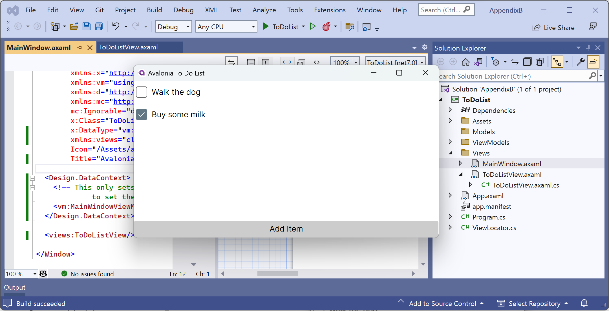
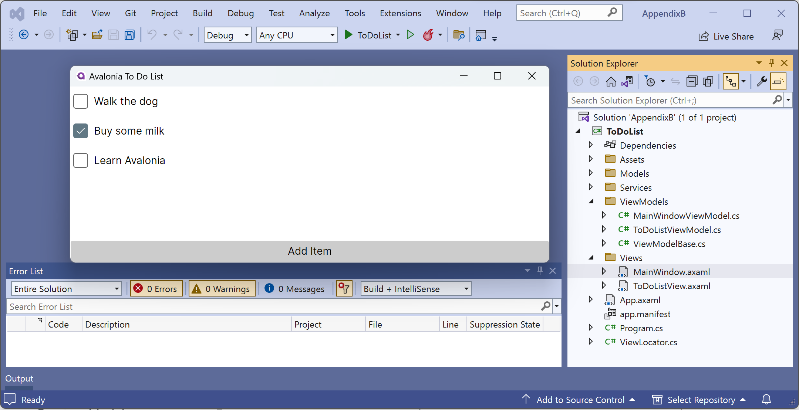

**Avalonia 11 tutorial**

This page contains a tutorial based on the official [ToDo List tutorial](https://docs.avaloniaui.net/docs/next/tutorials/todo-list-app/) 
from Avalonia 11's documentation but with the issues fixed. Avalonia 11 has only just been released so its not surprising that the documentation is a little rough. ;-)

This tutorial contains step-by-step instructions and screenshots using Visual Studio 2022 version 17.6.4 on Windows. It currently has no explanations and minimal steps to complete a working ToDo List app for desktop. I plan to add explanations and switch to the full cross-platform project template that supports desktop, mobile, and web later.

- [Introduction to the ToDo List app](#introduction-to-the-todo-list-app)
- [Install the Avalonia extension](#install-the-avalonia-extension)
- [Create a New Project](#create-a-new-project)
- [Create a New View](#create-a-new-view)
- [Main Window Content](#main-window-content)
- [Create a Model](#create-a-model)
- [Create a Fake Data Service](#create-a-fake-data-service)
- [Create a View Model](#create-a-view-model)
- [Data Binding](#data-binding)
- [Add a Data Context](#add-a-data-context)

# Introduction to the ToDo List app

In this tutorial you will create a simple to do list application using Avalonia UI and the Model View View-Model (MVVM) pattern with binding to the to do list (collection) data.

The final app will look like *Figure B.1*:


*Figure B.1: Avalonia ToDo List app*

# Install the Avalonia extension

1. In Visual Studio 2022, navigate to **Extensions** | **Manage Extensions**.
2. In the **Search box**, type `Avalonia`.
3. Select the **Avalonia for Visual Studio** extension and then click **Download**.
4. Follow the instructions (you will need to close Visual Studio while the VSIX installation runs).

# Create a New Project

> The original tutorial does not provide the new project template names.

1. In Visual Studio 2022, navigate to **File** | **New Project**.
2. In the **Create a new project** dialog box, in the **Search for templates** box, enter `avalonia`.
3. Select **Avalonia .NET MVVM App (AvaloniaUI)** and then click the **Next** button, as shown in *Figure B.2*:


*Figure B.2: Selecting the Avalonia .NET MVVM App (AvaloniaUI) project template*

4. In the **Configure your new project** dialog box, for the **Project name** enter `ToDoList`, for the **Location** select the `C:\apps-services-net8\` folder, for the **Solution name** enter `AppendixB`, and then click the **Next** button, as shown in *Figure B.3*:


*Figure B.3: Configuring your new project name and location*

> The original tutorial does not specify which MVVM Toolkit to use in the latest version (although it did in the older version). You must select **ReactiveUI** because this tutorial uses some of its features later.

5. In the **Additional information** dialog box, for **Framework** select **.NET 7.0 (Standard Term Support)** (you will be able to select **.NET 8.0 (Long Term Support)** soon after November 2023), for **MVVM Toolkit** select **ReactiveUI**, for **Avalonia Version** select **11.0.0**, select the **Use Compiled Bindings** check box, clear the Remove View Locator check box, and then click the **Next** button, as shown in *Figure B.4*:


*Figure B.4: Providing additional information*

6. Note the `MainWindow.axaml` file is open but the designer is stuck loading, as shown in *Figure B.5*:


*Figure B.5: Designer stuck loading*

7. Navigate to **Build** | **Build ToDoList**.
8. After a few moments, note the designer finishes loading and shows a preview of the app, as shown in *Figure B.6*:


*Figure B.6: Designer showing a preview of the app*

# Create a New View

1. In **Solution Explorer**, right-click the `Views` folder.
2. Click **Add** | **New Item**.
3. In the **Add New Item** dialog box, in **C# Items**, select **Avalonia**, and then select **Avalonia UserControl (AvaloniaUI)**.
4. For **Name** enter `ToDoListView` and then click the **Add** button.
5. In the `ToDoListView.axaml` file, modify the contents to replace the `Welcome to Avalonia!` with a `<DockPanel>`, as shown in the following markup:
```xml
<UserControl xmlns="https://github.com/avaloniaui"
             xmlns:x="http://schemas.microsoft.com/winfx/2006/xaml"
             xmlns:d="http://schemas.microsoft.com/expression/blend/2008"
             xmlns:mc="http://schemas.openxmlformats.org/markup-compatibility/2006"
             mc:Ignorable="d" d:DesignWidth="250" d:DesignHeight="450"
             x:Class="ToDoList.Views.ToDoListView">
  <DockPanel>
    <Button DockPanel.Dock="Bottom"
            HorizontalAlignment="Stretch"
            HorizontalContentAlignment="Center">
        Add Item
    </Button>
    <StackPanel>
      <CheckBox Margin="4">Walk the dog</CheckBox>
      <CheckBox Margin="4">Buy some milk</CheckBox>
    </StackPanel>
  </DockPanel>
</UserControl>
```

6. Save the changes to the `.axaml` file.
7. Build the project. Note the designer updates to show the new user interface, as shown in *Figure B.7*:


*Figure B.7: Designer showing a preview of the user control*

# Main Window Content

1. In the `Views` folder, in `MainWindow.axaml`, in the `<Window>` element, add a namespace declaration, as shown in the following markup: `xmlns:views="clr-namespace:ToDoList.Views"`.
2. In the `<Window>` element, change the title to `Avalonia To Do List`.
3. Remove the <Design.DataContext> element completely.
4. Replace the `<TextBlock>` with `<views:ToDoListView/>`.

The complete file should now look like this:
```xml
<Window xmlns="https://github.com/avaloniaui"
        xmlns:x="http://schemas.microsoft.com/winfx/2006/xaml"
        xmlns:vm="using:ToDoList.ViewModels"
        xmlns:d="http://schemas.microsoft.com/expression/blend/2008"
        xmlns:mc="http://schemas.openxmlformats.org/markup-compatibility/2006"
        mc:Ignorable="d" d:DesignWidth="800" d:DesignHeight="450"
        x:Class="ToDoList.Views.MainWindow"
        x:DataType="vm:MainWindowViewModel"
        xmlns:views="clr-namespace:ToDoList.Views"
        Icon="/Assets/avalonia-logo.ico"
        Title="Avalonia To Do List">

  <views:ToDoListView />

</Window>
```

4. Save the changes to the file.
5. Build and start the project. Note the main window now contains the user control with two check boxes, as shown in *Figure B.8*:



*Figure B.8: Running app with user control in main window*

# Create a Model

> The original tutorial changes the folder name to `DataModel` but I don't like that so I haven't. I also use the more modern file-scoped namespace declaration and I changed the `String` to `string` so `System` does not need to be imported.

1. In the `Models` folder, add a new class named `ToDoItem.cs`.
2. Modify the contents, as shown in the following code:

```cs
namespace ToDoList.Models;

public class ToDoItem
{
  public string Description { get; set; } = string.Empty;
  public bool IsChecked { get; set; }
}
```

# Create a Fake Data Service

1. In the project, add a new folder named `Services`.
2. In the `Services` folder, add a new class file named `ToDoListService.cs`.
3. Modify the contents, as shown in the following code:

```cs
using System.Collections.Generic; // To use IEnumerable<T>.
using ToDoList.Models; // To use ToDoItem.

namespace ToDoList.Services;

public class ToDoListService
{
  public IEnumerable<ToDoItem> GetItems() => new ToDoItem[]
  {
    new() { Description = "Walk the dog" },
    new() { Description = "Buy some milk" },
    new() { Description = "Learn Avalonia", IsChecked = true },
  };
}
```

# Create a View Model

1. In the `ViewModels` folder, add a new class file named `ToDoListViewModel.cs`.
2. Modify the contents, as shown in the following code:

```cs
using System.Collections.Generic; // To use IEnumerable<T>.
using System.Collections.ObjectModel; // To use ObservableCollection<T>.
using ToDoList.Models; // To use ToDoItem.

namespace ToDoList.ViewModels;

public class ToDoListViewModel : ViewModelBase
{
  public ToDoListViewModel(IEnumerable<ToDoItem> items)
  {
    ListItems = new ObservableCollection<ToDoItem>(items);
  }

  public ObservableCollection<ToDoItem> ListItems { get; }
}
```

3. In the `ViewModels` folder, in `MainWindowViewModel.cs`, modify the statements, as shown in the following code:

```cs
using ToDoList.Services; // To use ToDoListService.

namespace ToDoList.ViewModels;

public class MainWindowViewModel : ViewModelBase
{
  public MainWindowViewModel()
  {
    ToDoListService service = new();
    ToDoList = new ToDoListViewModel(service.GetItems());
  }

  public ToDoListViewModel ToDoList { get; }
}
```

# Data Binding

> **Warning!** In the [original tutorial](https://docs.avaloniaui.net/docs/next/tutorials/todo-list-app/wiring-up-the-views), Steps 1 and 2 are missing, and I think because the project template selects **Use Compiled Bindings** by default, you would get a compile error saying: `Error AVLN:0004 Cannot parse a compiled binding without an explicit x:DataType directive to give a starting data type for bindings.`. To fix this, we must import the view models namespace and then add the `x:DataType` attribute to the `<ItemsControl>`.

1. In the `Views` folder, in `ToDoListView.axaml`, import the namespace for working with your view models, as shown in the following markup:

```xml
<UserControl ...
             xmlns:vm="clr-namespace:ToDoList.ViewModels"
             ...
```

2. In the `<DockPanel>`, replace the `<StackPanel>` with an `<ItemsControl>`, as shown in the following markup:

```xml
<ItemsControl ItemsSource="{Binding ListItems}" x:DataType="vm:ToDoListViewModel">
  <ItemsControl.ItemTemplate>
    <DataTemplate>
      <CheckBox Margin="4"
                IsChecked="{Binding IsChecked}"
                Content="{Binding Description}"/>
    </DataTemplate>
  </ItemsControl.ItemTemplate>
</ItemsControl>
```
3. Save the changes to the file.
4. Build the project.

# Add a Data Context

1. In the `Views` folder, in `MainWindowView.axaml`, in `<views:ToDoListView />`, add a `DataContext` attribute, as shown in the following markup:

```xml
<views:ToDoListView DataContext="{Binding ToDoList}" />
```

2. Save the changes.
3. Build and run the app and note the data binding works, showing the three items from the fake service, as shown in Figure B.9:



*Figure B.9: Running app with user control in main window*

**To be continued...**
