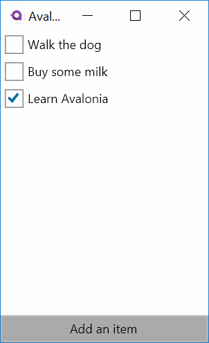
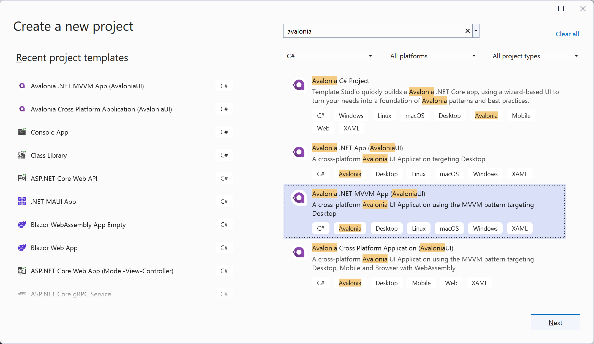
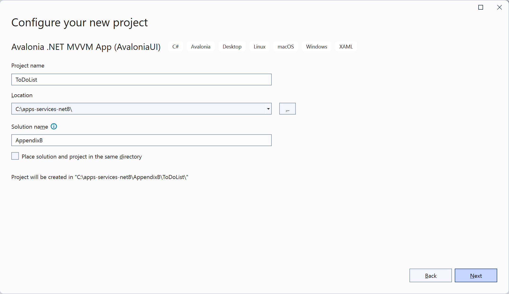
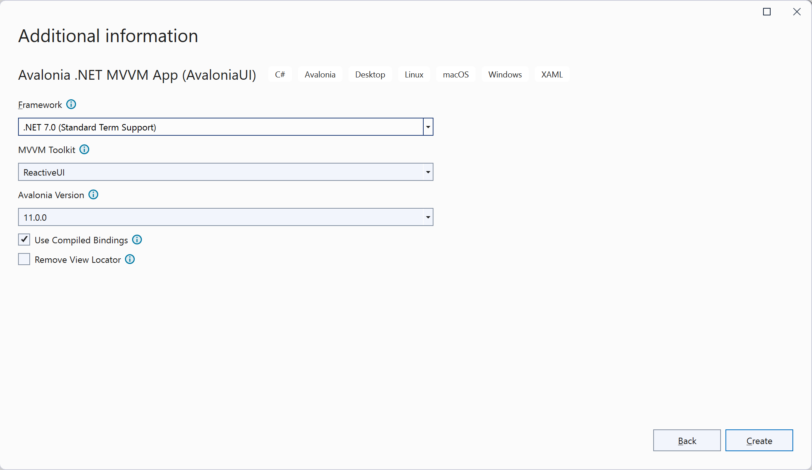
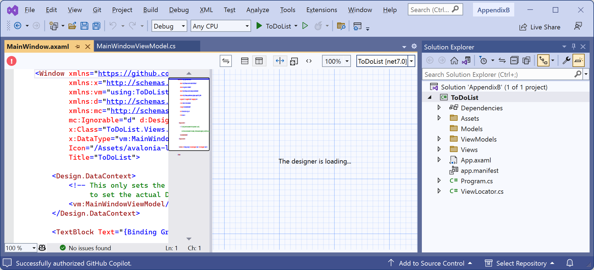
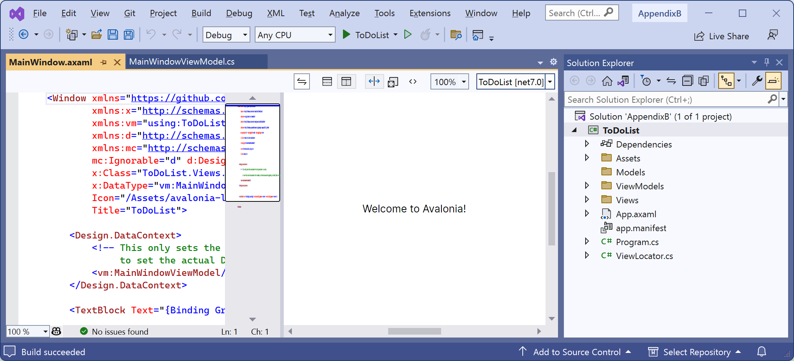
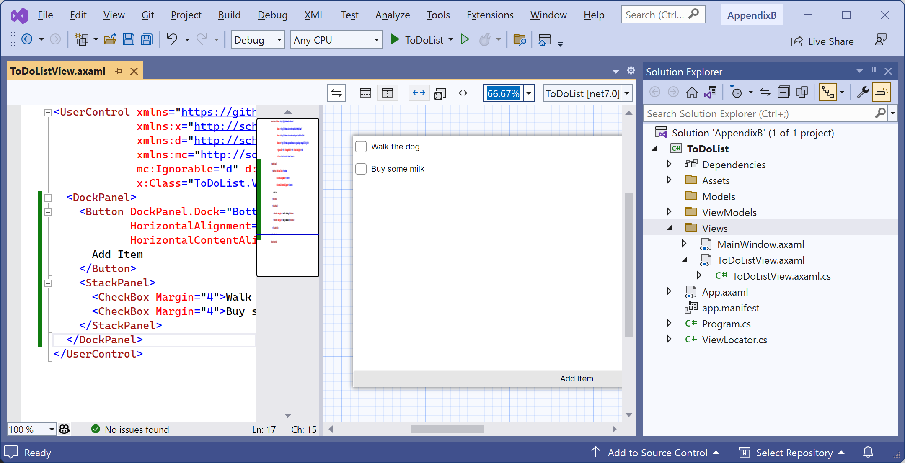

**Avalonia 11**

This page contains a tutorial based on the [ToDo List tutorial for Avalonia 11](https://docs.avaloniaui.net/docs/next/tutorials/todo-list-app/) 
from Avalonia 11's documentation but with the issues fixed.

This tutorial contains instructions for you to use Microsoft Visual Studio 2022 on Windows.

- [Introduction to the ToDo List app](#introduction-to-the-todo-list-app)
- [Install the Avalonia extension](#install-the-avalonia-extension)
- [Create a New Project](#create-a-new-project)
- [Create a New View](#create-a-new-view)


# Introduction to the ToDo List app

In this tutorial you will create a simple to do list application using Avalonia UI and the Model View View-Model (MVVM) pattern with binding to the to do list (collection) data.

The final app will look like *Figure B.1*:



*Figure B.1: Avalonia ToDo List app*

# Install the Avalonia extension

1. In Visual Studio 2022, navigate to **Extensions** | **Manage Extensions**.
2. In the **Search box**, type `Avalonia`.
3. Select the **Avalonia for Visual Studio** extension and then click **Download**.
4. Follow the instructions (you will need to close Visual Studio while the VSIX installation runs).

# Create a New Project

1. In Visual Studio 2022, navigate to **File** | **New Project**.
2. In the **Create a new project** dialog box, in the **Search for templates** box, enter `avalonia`.
3. Select **Avalonia .NET MVVM App (AvaloniaUI)** and then click the **Next** button, as shown in *Figure B.2*:



*Figure B.2: Selecting the Avalonia .NET MVVM App (AvaloniaUI) project template*

4. In the **Configure your new project** dialog box, for the **Project name** enter `ToDoList`, for the **Location** select the `C:\apps-services-net8\` folder, for the **Solution name** enter `AppendixB`, and then click the **Next** button, as shown in *Figure B.3*:



*Figure B.3: Configuring your new project name and location*

5. In the **Additional information** dialog box, for **Framework** select **.NET 8.0 (Long Term Support)**, for **MVVM Toolkit** select **ReactiveUI**, for **Avalonia Version** select **11.0.0**, select the **Use Compiled Bindings** check box, clear the Remove View Locator check box, and then click the **Next** button, as shown in *Figure B.4*:



*Figure B.4: Providing additional information*

1. Note the `MainWindow.axaml` file is open but the designer is stuck loading, as shown in *Figure B.5*:



*Figure B.5: Designer stuck loading*

7. Navigate to **Build** | **Build ToDoList**.
8. After a few moments, note the designer finishes loading and shows a preview of the app, as shown in *Figure B.6*:



*Figure B.6: Designer showing a preview of the app*

# Create a New View

1. In **Solution Explorer**, right-click the `Views` folder.
2. Click **Add** | **New Item**.
3. In the **Add New Item** dialog box, in **C# Items**, select **Avalonia**, and then select **Avalonia UserControl (AvaloniaUI)**.
4. For **Name** enter `ToDoListView` and then click the **Add** button.
5. In the `ToDoListView.axaml` file, modify the contents to replace the `Welcome to Avalonia!` with a `<DockPanel>`, as shown in the following markup:
```xml
<UserControl xmlns="https://github.com/avaloniaui"
             xmlns:x="http://schemas.microsoft.com/winfx/2006/xaml"
             xmlns:d="http://schemas.microsoft.com/expression/blend/2008"
             xmlns:mc="http://schemas.openxmlformats.org/markup-compatibility/2006"
             mc:Ignorable="d" d:DesignWidth="250" d:DesignHeight="450"
             x:Class="ToDoList.Views.ToDoListView">
  <DockPanel>
    <Button DockPanel.Dock="Bottom"
            HorizontalAlignment="Stretch"
            HorizontalContentAlignment="Center">
        Add Item
    </Button>
    <StackPanel>
      <CheckBox Margin="4">Walk the dog</CheckBox>
      <CheckBox Margin="4">Buy some milk</CheckBox>
    </StackPanel>
  </DockPanel>
</UserControl>
```

6. Save the changes to the `.axaml` file.
7. Build the project and note the designer updates to show the new user interface, as shown in *Figure B.7*:



*Figure B.7: Designer showing a preview of the user control*


