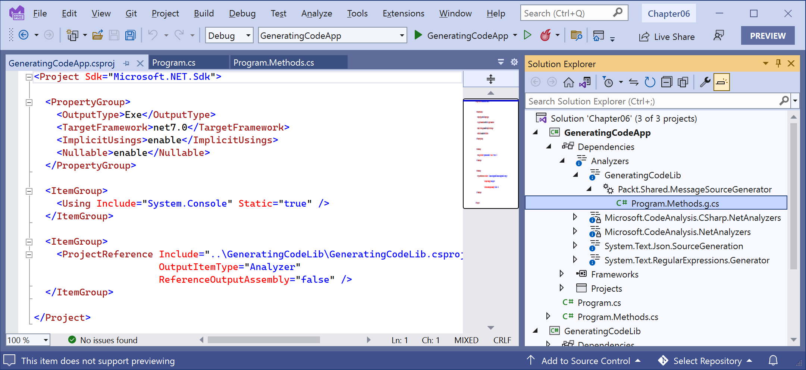

**Observing and Modifying Code Execution Dynamically**

This online-only section is about some common types that are included with .NET for performing code reflection and applying and reading attributes; working with expression trees; and creating source generators.

- [Using an analyzer to write better code](#using-an-analyzer-to-write-better-code)
  - [Suppressing warnings](#suppressing-warnings)
  - [Fixing the code](#fixing-the-code)
  - [Understanding common StyleCop recommendations](#understanding-common-stylecop-recommendations)
- [Working with reflection and attributes](#working-with-reflection-and-attributes)
  - [Versioning of assemblies](#versioning-of-assemblies)
  - [Reading assembly metadata](#reading-assembly-metadata)
  - [Creating custom attributes](#creating-custom-attributes)
  - [Understanding compiler-generated types and members](#understanding-compiler-generated-types-and-members)
- [Making a type or member obsolete](#making-a-type-or-member-obsolete)
- [Dynamically loading assemblies and executing methods](#dynamically-loading-assemblies-and-executing-methods)
  - [Doing more with reflection](#doing-more-with-reflection)
- [Working with expression trees](#working-with-expression-trees)
  - [Understanding components of expression trees](#understanding-components-of-expression-trees)
  - [Executing the simplest expression tree](#executing-the-simplest-expression-tree)
- [Creating source generators](#creating-source-generators)
  - [Implementing the simplest source generator](#implementing-the-simplest-source-generator)
  - [Enabling source generators for Visual Studio Code](#enabling-source-generators-for-visual-studio-code)
  - [Reviewing the generated file](#reviewing-the-generated-file)
  - [Doing more with source generators](#doing-more-with-source-generators)
- [Practicing and exploring](#practicing-and-exploring)
  - [Exercise 1C.1 – Test your knowledge](#exercise-1c1--test-your-knowledge)
  - [Exercise 1C.2 – Explore topics](#exercise-1c2--explore-topics)
- [Summary](#summary)

# Using an analyzer to write better code

.NET analyzers find potential issues and suggest fixes for them. StyleCop is a commonly used analyzer for helping you write better C# code.

Let's see it in action:

1.	Use your preferred code editor to create a **Console App** / `console` project named `CodeAnalyzing` in a `Chapter01` solution/workspace.
2.	In the `CodeAnalyzing` project, add a package reference for `StyleCop.Analyzers`.
3.	Add a JSON file to your project named `stylecop.json` for controlling StyleCop settings.
4.	Modify its contents, as shown in the following markup:
```json
{
  "$schema": "https://raw.githubusercontent.com/DotNetAnalyzers/StyleCopAnalyzers/master/StyleCop.Analyzers/StyleCop.Analyzers/Settings/stylecop.schema.json",
  "settings": {

  }
}
```
The `$schema` entry enables IntelliSense while editing the `stylecop.json` file in your code editor.

5.	Move the insertion point inside the settings section and press *Ctrl + Space*, and note the IntelliSense showing valid subsections of settings, as shown in Figure 1C.1:

 
*Figure 1C.1: stylecop.json IntelliSense showing valid subsections of settings*

6.	In the `CodeAnalyzing` project file, add entries to configure the file named `stylecop.json` to not be included in published deployments, and to enable it as an additional file for processing during development, as shown highlighted in the following markup:
```xml
<Project Sdk="Microsoft.NET.Sdk">

  <PropertyGroup>
    <OutputType>Exe</OutputType>
    <TargetFramework>net8.0</TargetFramework>
    <ImplicitUsings>enable</ImplicitUsings>
    <Nullable>enable</Nullable>
  </PropertyGroup>

  <ItemGroup>
    <PackageReference Include="StyleCop.Analyzers" Version="1.2.0-*">
      <PrivateAssets>all</PrivateAssets>
      <IncludeAssets>runtime; build; native; contentfiles; analyzers</IncludeAssets>
    </PackageReference>
  </ItemGroup>

  <ItemGroup>
    <None Remove="stylecop.json" />
  </ItemGroup>

  <ItemGroup>
    <AdditionalFiles Include="stylecop.json" />
  </ItemGroup>

</Project>
```

> At the time of writing, the `StyleCop.Analyzers` package is in preview. I have set the version to `1.2.0-*` to make sure that as soon as a newer preview version is released, it will upgrade automatically. Once a stable version is available, I recommend fixing the version.

7.	In `Program.cs`, delete the existing statements and then add some statements to explicitly define the `Program` class with its `Main` method, as shown in the following code:
```cs
using System.Diagnostics;

namespace CodeAnalyzing;

class Program
{
  static void Main(string[] args)
  {
    Debug.WriteLine("Hello, Debugger!");
  }
}
```

8.	Build the `CodeAnalyzing` project.
9.	You will see warnings for everything it thinks is wrong, as shown in *Figure 1C.2*:

 
*Figure 1C.2: StyleCop code analyzer warnings*

For example, it wants using directives to be put within the namespace declaration, as shown in the following output:
```
C:\apps-services-net7\Chapter01\CodeAnalyzing\Program.cs(1,1): warning SA1200: Using directive should appear within a namespace declaration [C:\apps-services-net7\Chapter01\CodeAnalyzing\CodeAnalyzing.csproj]
```

## Suppressing warnings

To suppress a warning, you have several options, including adding code and setting configuration.

To suppress a warning using an attribute, add an assembly-level attribute, as shown in the following code:
```cs
[assembly:SuppressMessage("StyleCop.CSharp.OrderingRules", "SA1200:UsingDirectivesMustBePlacedWithinNamespace", Justification = "Reviewed.")]
```

To suppress a warning using a directive, add `#pragma` statements around the statement that is causing the warning, as shown in the following code:
```cs
#pragma warning disable SA1200 // UsingDirectivesMustBePlacedWithinNamespace
using System.Diagnostics;
#pragma warning restore SA1200 // UsingDirectivesMustBePlacedWithinNamespace
```

Let's suppress the warning by modifying the `stylecop.json` file:
1.	In `stylecop.json`, add a configuration option to set `using` statements to be allowable outside a namespace, as shown highlighted in the following markup:
```json
{
  "$schema": "https://raw.githubusercontent.com/DotNetAnalyzers/StyleCopAnalyzers/master/StyleCop.Analyzers/StyleCop.Analyzers/Settings/stylecop.schema.json",
  "settings": {
    "orderingRules": {
      "usingDirectivesPlacement": "outsideNamespace"
    }
  }
}
```

2.	Build the project and note that warning `SA1200` has disappeared.
3.	In `stylecop.json`, set the `using` directives placement to preserve, which allows using statements both inside and outside a namespace, as shown highlighted in the following markup:
```json
"orderingRules": {
  "usingDirectivesPlacement": "preserve"
}
```

## Fixing the code

Now, let's fix all the other warnings:

1.	In `CodeAnalyzing.csproj`, add an element to automatically generate an XML file for documentation and add an element to treat warnings as errors, as shown highlighted in the following markup:
```xml
<Project Sdk="Microsoft.NET.Sdk">

  <PropertyGroup>
    <OutputType>Exe</OutputType>
    <TargetFramework>net8.0</TargetFramework>
    <ImplicitUsings>enable</ImplicitUsings>
    <Nullable>enable</Nullable>

    <GenerateDocumentationFile>true</GenerateDocumentationFile>
    <TreatWarningsAsErrors>true</TreatWarningsAsErrors>

  </PropertyGroup>
```

2.	In `stylecop.json`, add a configuration option to provide values for documentation for the company name and copyright text, as shown highlighted in the following markup:
```json
{
  "$schema": "https://raw.githubusercontent.com/DotNetAnalyzers/StyleCopAnalyzers/master/StyleCop.Analyzers/StyleCop.Analyzers/Settings/stylecop.schema.json",
  "settings": {
    "orderingRules": {
      "usingDirectivesPlacement": "preserve"
    },
    "documentationRules": {
      "companyName": "Packt",
      "copyrightText": "Copyright (c) Packt. All rights reserved."
    }
  }
}
```

3.	In `Program.cs`, add comments for a file header with company and copyright text, move the `using System;` declaration inside the namespace, and set explicit access modifiers and XML comments for the class and method, as shown in the following code:
```cs
// <copyright file="Program.cs" company="Packt">
// Copyright (c) Packt. All rights reserved.
// </copyright>
namespace CodeAnalyzing;

using System.Diagnostics;

/// <summary>
/// The main class for this console app.
/// </summary>
public class Program
{
  /// <summary>
  /// The main entry point for this console app.
  /// </summary>
  /// <param name="args">
  /// A string array of arguments passed to the console app.
  /// </param>
  public static void Main(string[] args)
  {
    Debug.WriteLine("Hello, Debugger!");
  }
}
```

4.	Build the project.
5.	Expand the `bin/Debug/net8.0` folder (remember to **Show All Files** if you are using Visual Studio 2022) and note the autogenerated file named `CodeAnalyzing.xml`, as shown in the following markup:
```xml
<?xml version="1.0"?>
<doc>
    <assembly>
        <name>CodeAnalyzing</name>
    </assembly>
    <members>
        <member name="T:CodeAnalyzing.Program">
            <summary>
            The main class for this console app.
            </summary>
        </member>
        <member name="M:CodeAnalyzing.Program.Main(System.String[])">
            <summary>
            The main entry point for this console app.
            </summary>
            <param name="args">
            A string array of arguments passed to the console app.
            </param>
        </member>
    </members>
</doc>
```

The `CodeAnalyzing.xml` file can then be processed by a tool like DocFX to convert it into documentation files, as shown at the following link: https://www.jamescroft.co.uk/building-net-project-docs-with-docfx-on-github-pages/ 

## Understanding common StyleCop recommendations

Inside a code file, you should order the contents as shown in the following list:
1.	External alias directives
2.	Using directives
3.	Namespaces
4.	Delegates
5.	Enums
6.	Interfaces
7.	Structs
8.	Classes

Within a class, record, struct, or interface, you should order the contents as shown in the following list:

1.	Fields
2.	Constructors
3.	Destructors (finalizers)
4.	Delegates
5.	Events
6.	Enums
7.	Interfaces
8.	Properties
9.	Indexers
10.	Methods
11.	Structs
12.	Nested classes and records

> **Good Practice**: You can learn about all the StyleCop rules at the following link: https://github.com/DotNetAnalyzers/StyleCopAnalyzers/blob/master/DOCUMENTATION.md.

# Working with reflection and attributes

**Reflection** is a programming feature that allows code to understand and manipulate itself. 

> **Warning!** Reflection prevents the use of Ahead-of-Time (AOT) native compilation. If you want to use AOT, avoid reflection.

An assembly is made up of up to four parts:

- **Assembly metadata and manifest**: Name, assembly, and file version, referenced assemblies, and so on.
- **Type metadata**: Information about the types, their members, and so on.
- **IL code**: Implementation of methods, properties, constructors, and so on.
- **Embedded resources** (optional): Images, strings, JavaScript, and so on.

The metadata comprises items of information about your code. The metadata is generated automatically from your code (for example, information about the types and members) or applied to your code using attributes.

Attributes can be applied at multiple levels: to assemblies, to types, and to their members, as shown in the following code:
```cs
// an assembly-level attribute
[assembly: AssemblyTitle("Working with reflection and attributes")]

// a type-level attribute
[Serializable] 
public class Person
{
  // a member-level attribute 
  [Obsolete("Deprecated: use Run instead.")] 
  public void Walk()
  {
...
```

Attribute-based programming is used a lot in app models like ASP.NET Core to enable features like routing, security, and caching.

## Versioning of assemblies

Version numbers in .NET are a combination of three numbers, with two optional additions. If you follow the rules of semantic versioning, the three numbers denote the following:
- **Major**: Breaking changes.
- **Minor**: Non-breaking changes, including new features, and often bug fixes.
- **Patch**: Non-breaking bug fixes.

Optionally, a version can include these:

- **Prerelease**: Unsupported preview releases.
- **Build number**: Nightly builds.

> **Good Practice**: Follow the rules of semantic versioning, as described at the following link: http://semver.org.

## Reading assembly metadata

Let's explore working with attributes:
1.	Use your preferred code editor to add a new **Console App** / `console` project named `WorkingWithReflection` to the `Chapter01` solution/workspace.
    - In Visual Studio 2022, set the startup project to the current selection.
    - In Visual Studio Code, select `WorkingWithReflection` as the active OmniSharp project.
2.	In the project file, statically and globally import the `Console` class, as shown in the following markup:
```xml
<ItemGroup>
  <Using Include="System.Console" Static="true" />
</ItemGroup>
```

3.	In `Program.cs`, import the namespace for reflection, and add statements to get the console app's assembly, output its name and location, and get all assembly-level attributes and output their types, as shown in the following code:
```cs
using System.Reflection; // Assembly

WriteLine("Assembly metadata:");
Assembly? assembly = Assembly.GetEntryAssembly();

if (assembly is null)
{
  WriteLine("Failed to get entry assembly.");
  return;
}

WriteLine($"  Full name: {assembly.FullName}"); 
WriteLine($"  Location: {assembly.Location}");
WriteLine($"  Entry point: {assembly.EntryPoint?.Name}");

IEnumerable<Attribute> attributes = assembly.GetCustomAttributes(); 
WriteLine($"  Assembly-level attributes:");
foreach (Attribute a in attributes)
{
  WriteLine($"   {a.GetType()}");
}
```

4.	Run the code and view the result, as shown in the following output:
```
Assembly metadata:
  Full name: WorkingWithReflection, Version=1.0.0.0, Culture=neutral, PublicKeyToken=null
  Location: C:\apps-services-net8\Chapter01\WorkingWithReflection\bin\Debug\net8.0\WorkingWithReflection.dll
  Entry point: <Main>$
  Assembly-level attributes:
    System.Runtime.CompilerServices.CompilationRelaxationsAttribute
    System.Runtime.CompilerServices.RuntimeCompatibilityAttribute
    System.Diagnostics.DebuggableAttribute
    System.Runtime.Versioning.TargetFrameworkAttribute
    System.Reflection.AssemblyCompanyAttribute
    System.Reflection.AssemblyConfigurationAttribute
    System.Reflection.AssemblyFileVersionAttribute
    System.Reflection.AssemblyInformationalVersionAttribute
    System.Reflection.AssemblyProductAttribute
    System.Reflection.AssemblyTitleAttribute
```

Note that because the full name of an assembly must uniquely identify the assembly, it is a combination of the following:
- **Name**, for example, `WorkingWithReflection`
- **Version**, for example, `1.0.0.0`
- **Culture**, for example, `neutral`
- **Public key token**, although this can be `null`

Now that we know some of the attributes decorating the assembly, we can ask for them specifically.
5.	Add statements to get the `AssemblyInformationalVersionAttribute` and `AssemblyCompanyAttribute` classes and then output their values, as shown in the following code:
```cs
AssemblyInformationalVersionAttribute? version = assembly
  .GetCustomAttribute<AssemblyInformationalVersionAttribute>();

WriteLine($"  Version: {version?.InformationalVersion}");

AssemblyCompanyAttribute? company = assembly
  .GetCustomAttribute<AssemblyCompanyAttribute>();

WriteLine($"  Company: {company?.Company}");
```

6.	Run the code and view the result, as shown in the following output:
```
  Version: 1.0.0
  Company: WorkingWithReflection
```

Hmmm, unless you set the version, it defaults to 1.0.0, and unless you set the company, it defaults to the name of the assembly. Let's explicitly set this information. The legacy .NET Framework way to set these values was to add attributes in the C# source code file, as shown in the following code:
```cs
[assembly: AssemblyCompany("Packt Publishing")] 
[assembly: AssemblyInformationalVersion("1.3.0")]
```

The Roslyn compiler used by .NET sets these attributes automatically, so we can't use the old way. Instead, they must be set in the project file.

7.	Edit the `WorkingWithReflection.csproj` project file to add elements for version and company, as shown highlighted in the following markup:
```xml
<Project Sdk="Microsoft.NET.Sdk">

  <PropertyGroup>
    <OutputType>Exe</OutputType>
    <TargetFramework>net8.0</TargetFramework>
    <Nullable>enable</Nullable>
    <ImplicitUsings>enable</ImplicitUsings>

    <Version>8.0.1</Version>
    <Company>Packt Publishing</Company>

  </PropertyGroup>
```

8.	Run the code and view the result, as shown in the following partial output:
```
Assembly metadata:
  Full name: WorkingWithReflection, Version=8.0.1.0, Culture=neutral, PublicKeyToken=null
  ...
  Version: 8.0.1
  Company: Packt Publishing
```

## Creating custom attributes

You can define your own attributes by inheriting from the Attribute class:
1.	Add a class file to your project named `CoderAttribute.cs`.
2.	In `CoderAttribute.cs`, delete any existing statements and then define an attribute class that can decorate either classes or methods with two properties to store the name of a coder and the date they last modified some code, as shown in the following code:
```cs
namespace Packt.Shared;

[AttributeUsage(AllowMultiple = true,
  AttributeTargets.Class | AttributeTargets.Method)]
public class CoderAttribute : Attribute
{
  public string Coder { get; set; }
  public DateTime LastModified { get; set; }

  public CoderAttribute(string coder, string lastModified)
  {
    Coder = coder;
    LastModified = DateTime.Parse(lastModified);
  }
}
```

3.	Add a class file to your project named `Animal.cs`.
4.	In `Animal.cs`, delete any existing statements and then add a class with a method, and decorate the method with the `Coder` attribute with data about two coders, as shown in the following code:
```cs
namespace Packt.Shared;

public class Animal
{
  [Coder("Mark Price", "22 August 2022")]
  [Coder("Johnni Rasmussen", "13 September 2022")] 
  public void Speak()
  {
    WriteLine("Woof...");
  }
}
```

5.	In `Program.cs`, import namespaces for working with your custom attribute, as shown in the following code:
```cs
using Packt.Shared; // CoderAttribute
```

6.	In `Program.cs`, add code to get the types in the current assembly, enumerate their members, read any Coder attributes on those members, and output the information, as shown in the following code:
```cs
WriteLine();
WriteLine($"* Types:");
Type[] types = assembly.GetTypes();

foreach (Type type in types)
{
  WriteLine();
  WriteLine($"Type: {type.FullName}"); 
  MemberInfo[] members = type.GetMembers();

  foreach (MemberInfo member in members)
  {
    WriteLine("{0}: {1} ({2})",
      member.MemberType, member.Name,
      member.DeclaringType?.Name);

    IOrderedEnumerable<CoderAttribute> coders = 
      member.GetCustomAttributes<CoderAttribute>()
      .OrderByDescending(c => c.LastModified);

    foreach (CoderAttribute coder in coders)
    {
      WriteLine("-> Modified by {0} on {1}",
        coder.Coder, coder.LastModified.ToShortDateString());
    }
  }
}
```

7.	Run the code and view the result, as shown in the following partial output:
```
* Types:
...
Type: Packt.Shared.Animal
Method: Speak (Animal)
-> Modified by Johnni Rasmussen on 13/09/2022
-> Modified by Mark Price on 22/08/2022
Method: GetType (Object)
Method: ToString (Object)
Method: Equals (Object)
Method: GetHashCode (Object)
Constructor: .ctor (Program)
...
Type: Program+<>c
Method: GetType (Object)
Method: ToString (Object)
Method: Equals (Object)
Method: GetHashCode (Object)
Constructor: .ctor (<>c)
Field: <>9 (<>c)
Field: <>9__0_0 (<>c)
```

## Understanding compiler-generated types and members

What is the `Program+<>c` type and its strangely named fields?

It is a compiler-generated display class. `<>` indicates compiler-generated and `c` indicates a display class. They are undocumented implementation details of the compiler and could change at any time. You can ignore them, so as an optional challenge, add statements to your console app to filter compiler-generated types by skipping types decorated with `CompilerGeneratedAttribute`.

**Hint**: Import the namespace for working with compiler-generated code, as shown in the following code:
```cs
using System.Runtime.CompilerServices; // CompilerGeneratedAttribute
```

# Making a type or member obsolete

Over time, you might decide to refactor your types and their members while maintaining backward compatibility. To encourage developers who use your types to use the newer implementations, you can decorate the old types and members with the `[Obsolete]` attribute.

Let's see an example:
1.	In `Animal.cs`, add a new method and mark the old method as obsolete, as shown highlighted in the following code:
```cs
[Coder("Mark Price", "22 August 2023")]
[Coder("Johnni Rasmussen", "13 September 2023")]
[Obsolete($"use {nameof(SpeakBetter)} instead.")]
public void Speak()
{
  WriteLine("Woof...");
}

public void SpeakBetter()
{
  WriteLine("Wooooooooof...");
}
```

2.	In `Program.cs`, modify the statements to detect obsolete methods, as shown highlighted in the following code:
```cs
foreach (MemberInfo member in members)
{
  ObsoleteAttribute? obsolete =
    member.GetCustomAttribute<ObsoleteAttribute>();

  WriteLine("{0}: {1} ({2}) {3}",
    member.MemberType, member.Name,
    member.DeclaringType?.Name, 
    obsolete is null ? "" : $"Obsolete! {obsolete.Message}");
```

> Note the addition of the `{3}` placeholder in the call to `WriteLine` to output if the member is obsolete!

3.	Run the code and view the result, as shown in the following output:
```
Type: Packt.Shared.Animal
Method: Speak (Animal) Obsolete! use SpeakBetter instead.
-> Modified by Johnni Rasmussen on 13/09/2023
-> Modified by Mark Price on 22/08/2023
Method: SpeakBetter (Animal)
Method: GetType (Object)
Method: ToString (Object)
Method: Equals (Object)
Method: GetHashCode (Object)
Constructor: .ctor (Animal)
```

# Dynamically loading assemblies and executing methods

Normally, if a .NET project needs to execute in another .NET assembly, you reference the package or project, and then at compile time, the compiler knows the assemblies that will be loaded into the memory of the calling codebase during start up at runtime. But sometimes you may not know the assemblies that you need to call until runtime. For example, a word processor does not need to have the functionality the perform a mail merge loaded all the time. The mail merge feature could be implemented as a separate assembly that is only loaded into memory when it is activated by the user. Another example would be an application that allows custom plugins, perhaps even created by other developers.

You can dynamically load a set of assemblies into an `AssemblyLoadContext`, execute methods in them, and then unload the `AssemblyLoadContext`, which unloads the assemblies too. A side effect of this is reduced memory usage.

In .NET 7, the overhead of using reflection to invoke a member of a type, like calling a method or setting or getting a property, was made up to four times faster when it is done more than once on the same member.

Let's see how to dynamically load an assembly and then instantiate a class and interact with its members:

1.	Use your preferred code editor to add a new **Class Library** / `classlib` project named `DynamicLoadAndExecute.Library` to the `Chapter01` solution/workspace.
2.	In the project file, treat warnings as errors, statically and globally import the `Console` class, and globally import the namespace for working with reflection, as shown highlighted in the following markup:
```xml
<Project Sdk="Microsoft.NET.Sdk">

  <PropertyGroup>
    <TargetFramework>net8.0</TargetFramework>
    <ImplicitUsings>enable</ImplicitUsings>
    <Nullable>enable</Nullable>
    <TreatWarningsAsErrors>true</TreatWarningsAsErrors>
  </PropertyGroup>

  <ItemGroup>
    <Using Include="System.Reflection" />
    <Using Include="System.Console" Static="true" />
  </ItemGroup>

</Project>
```

3.	Rename `Class1.cs` to `Dog.cs`.
4.	In `Dog.cs`, define a `Dog` class with a `Speak` method that writes a simple message to the console based on a `string` parameter passed to the method, as shown in the following code:
```cs
namespace DynamicLoadAndExecute.Library;

public class Dog
{
  public void Speak(string? name)
  {
    WriteLine($"{name} says Woof!");
  }
}
```

5.	Use your preferred code editor to add a new **Console App** / `console` project named `DynamicLoadAndExecute.Console` to the `Chapter01` solution/workspace.
6.	In the project file, treat warnings as errors, statically and globally import the `Console` class, and globally import the namespace for working with reflection, as shown highlighted in the following markup:
```xml
<Project Sdk="Microsoft.NET.Sdk">

  <PropertyGroup>
    <OutputType>Exe</OutputType>
    <TargetFramework>net8.0</TargetFramework>
    <ImplicitUsings>enable</ImplicitUsings>
    <Nullable>enable</Nullable>
    <TreatWarningsAsErrors>true</TreatWarningsAsErrors>
  </PropertyGroup>

  <ItemGroup>
    <Using Include="System.Reflection" />
    <Using Include="System.Console" Static="true" />
  </ItemGroup>

</Project>
```

7.	Build the `DynamicLoadAndExecute.Library` project to create the assembly in its `bin` folder structure.
8.	Build the `DynamicLoadAndExecute.Console` project to create its `bin` folder structure.
9.	Copy the three files from the `DynamicLoadAndExecute.Library` project's `bin\Debug\net8.0` folder to the equivalent folder in the `DynamicLoadAndExecute.Console` project, as shown in the following list:
    - `DynamicLoadAndExecute.Library.deps.json`
    - `DynamicLoadAndExecute.Library.dll`
    - `DynamicLoadAndExecute.Library.pdb`
10.	In the `DynamicLoadAndExecute.Console` project, add a new class file named `Program.Helpers.cs` and modify its contents to define a method to output information about an assembly and its types, as shown in the following code:
```cs
partial class Program
{
  static void OutputAssemblyInfo(Assembly a)
  {
    WriteLine("FullName: {0}", a.FullName);
    WriteLine("Location: {0}", Path.GetDirectoryName(a.Location));
    WriteLine("IsCollectible: {0}", a.IsCollectible);
    WriteLine("Defined types:");

    foreach (TypeInfo info in a.DefinedTypes)
    {
      if (!info.Name.EndsWith("Attribute"))
      {
        WriteLine("  Name: {0}, Members: {1}", 
          info.Name, info.GetMembers().Count());
      }
    }
    WriteLine();
  }
}
```

11.	In the `DynamicLoadAndExecute.Console` project, add a new class file named `DemoAssemblyLoadContext.cs`, and modify its contents to load a named assembly into the current context at runtime using an assembly dependency resolver, as shown in the following code:
```cs
using System.Runtime.Loader; // AssemblyDependencyResolver

internal class DemoAssemblyLoadContext : AssemblyLoadContext
{
  private AssemblyDependencyResolver _resolver;

  public DemoAssemblyLoadContext(string mainAssemblyToLoadPath)
    : base(isCollectible: true)
  {
    _resolver = new AssemblyDependencyResolver(mainAssemblyToLoadPath);
  }
}
```

12.	In `Program.cs`, delete the existing statements. Then, use the load context class to load the class library and output information about it, and then dynamically create an instance of the Dog class and call its Speak method, as shown in the following code:
```cs
Assembly? thisAssembly = Assembly.GetEntryAssembly();

if (thisAssembly is null)
{
  WriteLine("Could not get the entry assembly.");
  return;
}

OutputAssemblyInfo(thisAssembly);

WriteLine("Creating load context for:\n  {0}\n", 
  Path.GetFileName(thisAssembly.Location));

DemoAssemblyLoadContext loadContext = new(thisAssembly.Location);

string assemblyPath = Path.Combine(
  Path.GetDirectoryName(thisAssembly.Location) ?? "", 
  "DynamicLoadAndExecute.Library.dll");

WriteLine("Loading:\n  {0}\n",
  Path.GetFileName(assemblyPath));

Assembly dogAssembly = loadContext.LoadFromAssemblyPath(assemblyPath);

OutputAssemblyInfo(dogAssembly);

Type? dogType = dogAssembly.GetType("DynamicLoadAndExecute.Library.Dog");

if (dogType is null)
{
  WriteLine("Could not get the Dog type.");
  return;
}

MethodInfo? method = dogType.GetMethod("Speak");

if (method != null)
{
  object? dog = Activator.CreateInstance(dogType);

  for (int i = 0; i < 10; i++)
  {
    method.Invoke(dog, new object[] { "Fido" });
  }
}

WriteLine();
WriteLine("Unloading context and assemblies.");
loadContext.Unload();
```

13.	Start the console app and note the results, as shown in the following output:
```
FullName: DynamicLoadAndExecute.Console, Version=1.0.0.0, Culture=neutral, PublicKeyToken=null
Location: C:\apps-services-net8\Chapter01\DynamicLoadAndExecute.Console\bin\Debug\net8.0
IsCollectible: False
Defined types:
  Name: DemoAssemblyLoadContext, Members: 29
  Name: Program, Members: 5

Creating load context for:
  DynamicLoadAndExecute.Console.dll

Loading:
  DynamicLoadAndExecute.Library.dll

FullName: DynamicLoadAndExecute.Library, Version=1.0.0.0, Culture=neutral, PublicKeyToken=null
Location: C:\apps-services-net8\Chapter01\DynamicLoadAndExecute.Console\bin\Debug\net8.0
IsCollectible: True
Defined types:
  Name: Dog, Members: 6

Fido says Woof!
Fido says Woof!
Fido says Woof!
Fido says Woof!
Fido says Woof!
Fido says Woof!
Fido says Woof!
Fido says Woof!
Fido says Woof!
Fido says Woof!

Unloading context and assemblies.
```

Note that the entry assembly (the console app) is not collectible, meaning that it cannot be removed from memory, but the dynamically loaded class library is collectible.

## Doing more with reflection

This is just a taster of what can be achieved with reflection. Reflection can also do the following:
- Inspect assembly contents using MetadataLoadContext: https://docs.microsoft.com/en-us/dotnet/standard/assembly/inspect-contents-using-metadataloadcontext
- Dynamically generate new code and assemblies: https://docs.microsoft.com/en-us/dotnet/api/system.reflection.emit.assemblybuilder

# Working with expression trees

Expression trees represent code as a structure that you can examine or execute. Expression trees are immutable so you cannot change one, but you can create a copy with the changes you want. 

If you compare expression trees to functions, then although functions have flexibility in the parameter values passed to the function, the structure of the function, what it does with those values and how, is fixed. Expression trees provide a structure that can dynamically change, so what and how a function is implemented can be dynamically changed at runtime. Expression trees are also used to represent an expression in an abstract way, so instead of being expressed using C# code, the expression is expressed as a data structure in memory. This then allows that data structure to be expressed in other ways, using other languages.

When you write a LINQ expression for the EF Core database provider, it is represented by an expression tree that is then translated into an SQL statement. But even the simplest C# statement can be represented as an expression tree. 

Let's look at a simple example, adding two numbers:
```cs
int three = 1 + 2;
```

This statement would be represented as the tree in Figure 1C.3:


*Figure 1C.3: An expression tree of a simple statement adding two numbers*

## Understanding components of expression trees

The `System.Linq.Expressions` namespace contains types for representing the components of an expression tree. For example:

Type|Description
---|---
BinaryExpression|An expression with a binary operator.
BlockExpression|A block containing a sequence of expressions where variables can be defined.
CatchBlock|A catch statement in a try block.
ConditionalExpression|An expression that has a conditional operator.
LambdaExpression|A lambda expression.
MemberAssignment|Assigning to a field or property.
MemberExpression|Accessing a field or property.
MethodCallExpression|A call to a method.
NewExpression|A call to a constructor.

Only expression trees that represent lambda expressions can be executed.

## Executing the simplest expression tree

Let's see how to construct, compile, and execute an expression tree:
1.	Use your preferred code editor to add a new **Console App** / `console` project named `WorkingWithExpressionTrees` to the `Chapter01` solution/workspace.
2.	In the project file, statically and globally import the `Console` class, as shown in the following markup:
```xml
<ItemGroup>
  <Using Include="System.Console" Static="true" />
</ItemGroup>
```

3.	In `Program.cs`, delete the existing statements and then define an expression tree and execute it, as shown in the following code:
```cs
using System.Linq.Expressions; // Expression and so on

ConstantExpression one = Expression.Constant(1, typeof(int));
ConstantExpression two = Expression.Constant(2, typeof(int));
BinaryExpression add = Expression.Add(one, two);

Expression<Func<int>> expressionTree = Expression.Lambda<Func<int>>(add);

Func<int> compiledTree = expressionTree.Compile();

WriteLine($"Result: {compiledTree()}");
```

4.	Run the console app and note the result, as shown in the following output:
```
Result: 3
```

# Creating source generators

Source generators were introduced with C# 9 and .NET 5. They allow a programmer to get a compilation object that represents all the code being compiled, dynamically generate additional code files, and compile those too. Source generators are like code analyzers that can add more code to the compilation process.

A great example is the `System.Text.Json` source generator. The classic method for serializing JSON uses reflection at runtime to dynamically analyze an object model, but this is slow. The better method uses source generators to create source code that is then compiled to give improved performance.

You can read more about the `System.Text.Json` source generator at the following link: https://devblogs.microsoft.com/dotnet/try-the-new-system-text-json-source-generator/

## Implementing the simplest source generator

We will create a source generator that programmatically creates a code file that adds a method to the `Program` class, as shown in the following code:
```cs
// source-generated code
static partial class Program
{
  static partial void Message(string message)
  {
    System.Console.WriteLine($"Generator says: '{message}'"); 
  }
}
```

This method can then be called in the `Program.cs` file of the project that uses this source generator.

Let's see how to do this:

1.	Use your preferred code editor to add a new **Console App** / `console` project named `GeneratingCodeApp` to the `Chapter01` solution/workspace.
2.	In the project file, statically and globally import the `Console` class, as shown in the following markup:
```xml
<ItemGroup>
  <Using Include="System.Console" Static="true" />
</ItemGroup>
```

3.	Add a new class file name `Program.Methods.cs`.
4.	In `Program.Methods.cs`, define a partial `Program` class with a partial method with a `string` parameter, as shown in the following code:
```cs
partial class Program
{
  static partial void Message(string message);
}
```
5.	In `Program.cs`, delete the existing statements and then call the partial method, as shown in the following code:
```cs
Message("Hello from some source generator code.");
```

6.	Use your preferred code editor to add a new **Class Library** / `classlib` project named `GeneratingCodeLib` that targets .NET Standard 2.0 to the `Chapter01` solution/workspace.

> Currently, source generators must target .NET Standard 2.0. The default C# version used for class libraries that target .NET Standard 2.0 is C# 7.3, as shown at the following link: https://docs.microsoft.com/en-us/dotnet/csharp/language-reference/configure-language-version#defaults.

7.	In the project file, set the C# language version to 10 or later (to support `global using` statements), statically and globally import the `Console` class, and add the NuGet packages `Microsoft.CodeAnalysis.Analyzers` and `Microsoft.CodeAnalysis.CSharp`, as shown highlighted in the following markup:
```xml
<Project Sdk="Microsoft.NET.Sdk">

  <PropertyGroup>
    <TargetFramework>netstandard2.0</TargetFramework>
    <LangVersion>10</LangVersion>
  </PropertyGroup>
	
  <ItemGroup>
    <Using Include="System.Console" Static="true" />
  </ItemGroup>

  <ItemGroup>
    <PackageReference Include="Microsoft.CodeAnalysis.Analyzers" 
                      Version="3.3.4">
      <PrivateAssets>all</PrivateAssets>
      <IncludeAssets>runtime; build; native; contentfiles; analyzers; 
                     buildtransitive</IncludeAssets>
    </PackageReference>
    <PackageReference Include="Microsoft.CodeAnalysis.CSharp" 
                      Version="4.6.0" />
  </ItemGroup>

</Project>
```

> This project delierately does not enable `null` warnings because the `<Nullable>enable</Nullable>` element is missing. If you add it, then you will see some `null` warnings later.

8.	Build the `GeneratingCodeLib` project.
9.	Rename `Class1.cs` to `MessageSourceGenerator.cs`.
10.	In the `GeneratingCodeLib` project, in `MessageSourceGenerator.cs`, define a class that implements `ISourceGenerator` and is decorated with the `[Generator]` attribute, as shown in the following code:
```cs
using Microsoft.CodeAnalysis; // [Generator], GeneratorInitializationContext
                              // ISourceGenerator, GeneratorExecutionContext

namespace Packt.Shared;

[Generator]
public class MessageSourceGenerator : ISourceGenerator
{
  public void Execute(GeneratorExecutionContext execContext)
  {
    IMethodSymbol mainMethod = execContext.Compilation
      .GetEntryPoint(execContext.CancellationToken);

    string sourceCode = $@"// source-generated code
static partial class {mainMethod.ContainingType.Name}
{{
  static partial void Message(string message)
  {{
    System.Console.WriteLine($""Generator says: '{{message}}'"");
  }}
}}
";
    string typeName = mainMethod.ContainingType.Name;
    execContext.AddSource($"{typeName}.Methods.g.cs", sourceCode);
  }

  public void Initialize(GeneratorInitializationContext initContext)
  {
    // this source generator does not need any initialization
  }
}
```

> **Good Practice**: Include `.g.` or `.generated.` in the filename of source generated files.

11.	In the `GeneratingCodeApp` project, in the project file, add a reference to the class library project, as shown in the following markup:
```xml
<ItemGroup>
  <ProjectReference Include="..\GeneratingCodeLib\GeneratingCodeLib.csproj"
                    OutputItemType="Analyzer"
                    ReferenceOutputAssembly="false" />
</ItemGroup>
```

> **Good Practice**: It is sometimes necessary to restart Visual Studio 2022 to see the results of working with source generators.

12.	Build the `GeneratingCodeApp` project and note the auto-generated class file:
    - In Visual Studio 2022, in **Solution Explorer**, expand the **Dependencies** | **Analyzers** | **GeneratingCodeLib** | **Packt.Shared.MessageSourceGenerator** nodes to find the `Program.Methods.g.cs` file, as shown in Figure 1C.4:
 


*Figure 9.2: The source generated Program.Methods.g.cs file*

## Enabling source generators for Visual Studio Code

Visual Studio Code does not automatically run analyzers. We must add an extra entry in the project file to enable the automatic generation of the source generator file.

1. In Visual Studio Code, in the `GeneratingCodeApp` project, in the project file, in the `<PropertyGroup>`, add an entry to enable the generation of the code file, as shown in the following markup:
```
<EmitCompilerGeneratedFiles>true</EmitCompilerGeneratedFiles>
```
2. In **Terminal**, build the `GeneratingCodeApp` project.
3. In the `obj/Debug/net8.0` folder, note the `generated` folder and its subfolder `GeneratingCodeLib/Packt.Shared.MessageSourceGenerator`, and the auto-generated file named `Program.Methods.g.cs`.

## Reviewing the generated file

1.	Open the `Program.Methods.g.cs` file and note its contents, as shown in the following code:
```cs
// source-generated code
static partial class Program
{
  static partial void Message(string message)
  {
    System.Console.WriteLine($"Generator says: '{message}'");
  }
}
```

2.	Run the console app and note the message, as shown in the following output:
```
Generator says: 'Hello from some source generator code.'
```

You can control the path for automatically generated code files by adding a `<CompilerGeneratedFilesOutputPath>` element.

## Doing more with source generators

Source generators are a massive topic. To learn more, use the following links:

- Source Generators design specification: https://github.com/dotnet/roslyn/blob/main/docs/features/source-generators.md
- Source Generators samples: https://github.com/dotnet/roslyn-sdk/tree/main/samples/CSharp/SourceGenerators
- Source Generators cookbook: https://github.com/dotnet/roslyn/blob/main/docs/features/source-generators.cookbook.md

# Practicing and exploring

Test your knowledge and understanding by answering some questions, getting some hands-on practice, and exploring with deeper research into the topics in this chapter.

## Exercise 1C.1 – Test your knowledge

Use the web to answer the following questions:

1.	What are the four parts of a .NET assembly and which are optional?
2.	What can an attribute be applied to?
3.	What are the names of the parts of a version number and what do they mean if they follow the rules of semantic versioning?
4.	How do you get a reference to the assembly for the currently executing console app?
5.	How do you get all the attributes applied to an assembly?
6.	How should you create a custom attribute?
7.	What class do you inherit from to enable dynamic loading of assemblies?
8.	What is an expression tree?
9.	What is a source generator?
10.	Which interface must a source generator class implement and what methods are part of that interface?

## Exercise 1C.2 – Explore topics

Use the links on the following page to learn more detail about the topics covered in this chapter:

https://github.com/markjprice/apps-services-net8/blob/main/book-links.md#chapter-1c---controlling-the-roslyn-compiler-reflection-and-expression-trees

# Summary

In this chapter, you:

- Reflected on code and attributes.
- Constructed, compiled, and executed a simple expression tree.
- Built a source generator and used it in a console app project.
