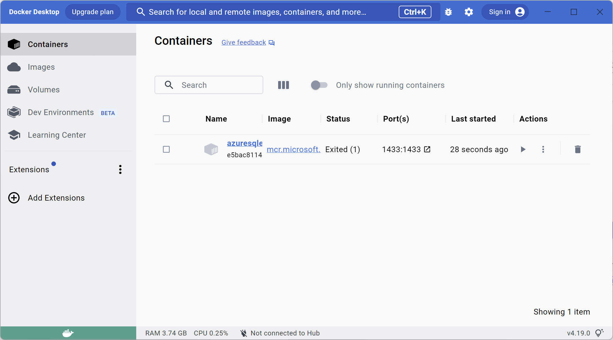
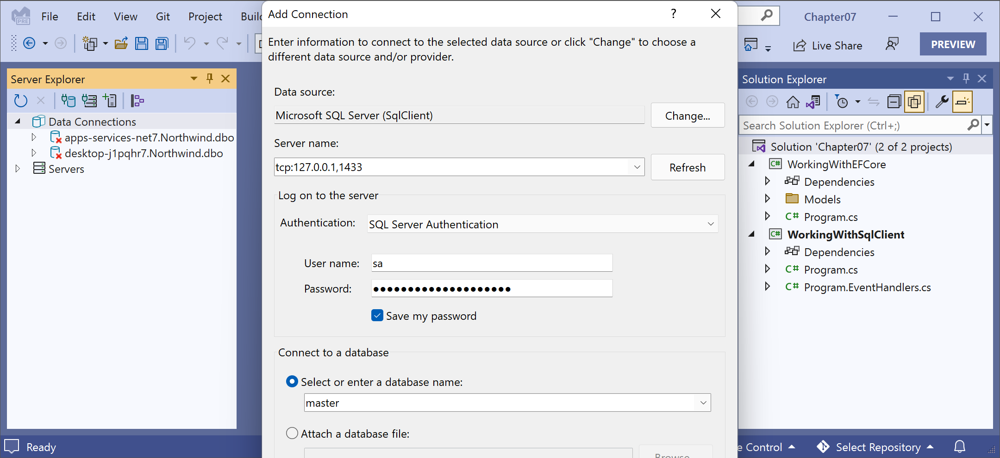

**Installing Azure SQL Edge in Docker**

- [Installing Docker and the Azure SQL Edge container image](#installing-docker-and-the-azure-sql-edge-container-image)
- [Run the Azure SQL Edge container image](#run-the-azure-sql-edge-container-image)
- [Connecting to Azure SQL Edge in a Docker container](#connecting-to-azure-sql-edge-in-a-docker-container)
- [Removing Docker resources](#removing-docker-resources)


# Installing Docker and the Azure SQL Edge container image

If you do not have a Windows computer, and you do not want to pay for Azure resources, then you can install Docker and use a container that has Azure SQL Edge, a cross-platform minimal featured version of SQL Server that only includes the database engine. 

The Docker image we will use has Azure SQL Edge based on Ubuntu 18.4. It is supported with the Docker Engine 1.8 or later on Linux, or on Docker for Mac or Windows. Azure SQL Edge requires a 64-bit processor (either x64 or ARM64), with a minimum of one processor and 1 GB RAM on the host.

1.	Install **Docker Desktop** from the following link: https://docs.docker.com/engine/install/.
2.	Start **Docker Desktop**, as shown in Figure 2A.1:


*Figure 2A.1: Docker Desktop on Windows*

3.	At the command prompt or terminal, pull down the latest container image for Azure SQL Edge, as shown in the following command:
```
docker pull mcr.microsoft.com/azure-sql-edge:latest
```
4.	Wait for the image as it is downloading, as shown in the following output:
```
latest: Pulling from azure-sql-edge
a055bf07b5b0: Pull complete
cb84717c05a1: Pull complete
35d9c30b7f54: Downloading [========================>                          ]  20.46MB/42.55MB
46be68282524: Downloading [============>                                      ]  45.94MB/186MB
5eee3e29ad15: Downloading [======================================>            ]  15.97MB/20.52MB
15bd653c6216: Waiting
d8d6247303da: Waiting
c31fafd6718a: Waiting
fa1c91dcb9c8: Waiting
1ccbfe988be8: Waiting
```
5.	Note the results, as shown in the following output:
```
latest: Pulling from azure-sql-edge
2f94e549220a: Pull complete
830b1adc1e72: Pull complete
f6caea6b4bd2: Pull complete
ef3b33eb5a27: Pull complete
8a42011e5477: Pull complete
f173534aa1e4: Pull complete
6c1894e17f11: Pull complete
a81c43e790ea: Pull complete
c3982946560a: Pull complete
25f31208d245: Pull complete
Digest: sha256:7c203ad8b240ef3bff81ca9794f31936c9b864cc165dd187c23c5bfe06cf0340
Status: Downloaded newer image for mcr.microsoft.com/azure-sql-edge:latest
mcr.microsoft.com/azure-sql-edge:latest
```

# Run the Azure SQL Edge container image

1.	At the command prompt or terminal, run the container image for Azure SQL Edge with a strong password and name the container `azuresqledge`, as shown in the following command:
```
docker run --cap-add SYS_PTRACE -e 'ACCEPT_EULA=1' -e 'MSSQL_SA_PASSWORD=s3cret-Ninja' -p 1433:1433 --name azuresqledge -d mcr.microsoft.com/azure-sql-edge
```

> **Good Practice**: The password must be at least 8 characters long and contain characters from three of the following four sets: uppercase letters, lowercase letters, digits, and symbols; otherwise, the container cannot set up the SQL Edge engine and will stop working.

2.	If your operating system firewall blocks access, then allow access.
3.	In **Docker Desktop**, in the **Containers** section, confirm that the image is running, as shown in *Figure 2A.2*:


*Figure 2A.2: SQL Edge running in Docker Desktop on Windows*

9.	At the command prompt or terminal, ask Docker to list all containers, both running and stopped, as shown in the following command:
```
docker ps -a
```

10.	Note the container is **"Up"** and listening externally on port 1433, which is mapped to its internal port 1433, as shown highlighted in the following output:
```
CONTAINER ID   IMAGE                              COMMAND                  CREATED         STATUS         PORTS                              NAMES
183f02e84b2a   mcr.microsoft.com/azure-sql-edge   "/opt/mssql/bin/perm…"   8 minutes ago   Up 8 minutes   1401/tcp, 0.0.0.0:1433->1433/tcp   azuresqledge
```

> You can learn more about the docker ps command at the following link: https://docs.docker.com/engine/reference/commandline/ps/.

# Connecting to Azure SQL Edge in a Docker container

1.	Use your preferred database tool to connect to the SQL server, as shown in *Figure 2A.3*:


*Figure 2A.3: Connecting to your Azure SQL Edge server from Visual Studio*

2.	Right-click the data connection and choose **New Query**.
3.	Copy and paste the contents of the `Northwind4AzureSQLedge.sql` file into the query window and execute it.
4.	Wait to see the `Command completed successfully` message.
5.	In **Server Explorer**, refresh the data connection if needed, right-click **Tables** and select **Refresh**, and note that 13 tables have been created, for example, `Categories`, `Customers`, and `Products`. Also note that dozens of views and stored procedures have also been created.

You now have a running instance of Azure SQL Edge containing the Northwind database that you can connect to from a console app.

# Removing Docker resources

If you have completed all the chapters in the book, or plan to use full SQL Server or Azure SQL Database, and now want to remove all the Docker resources, then follow these steps:

1.	At the command prompt or terminal, stop the `azuresqledge` container, as shown in the following command:
```
docker stop azuresqledge
```

2.	At the command prompt or terminal, remove the `azuresqledge` container, as shown in the following command:
```
docker rm azuresqledge
```

> Removing the container will delete all data inside it.

3.	At the command prompt or terminal, remove the `azure-sql-edge` image to release its disk space, as shown in the following command:
```
docker rmi mcr.microsoft.com/azure-sql-edge
```
