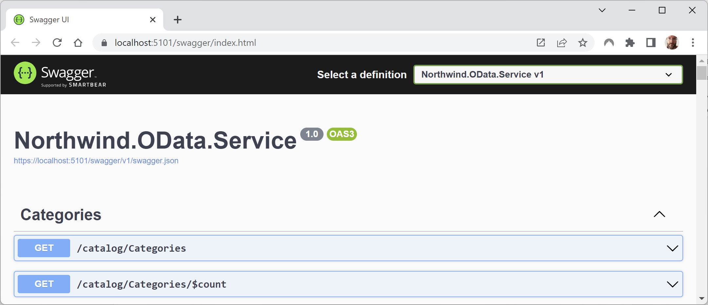
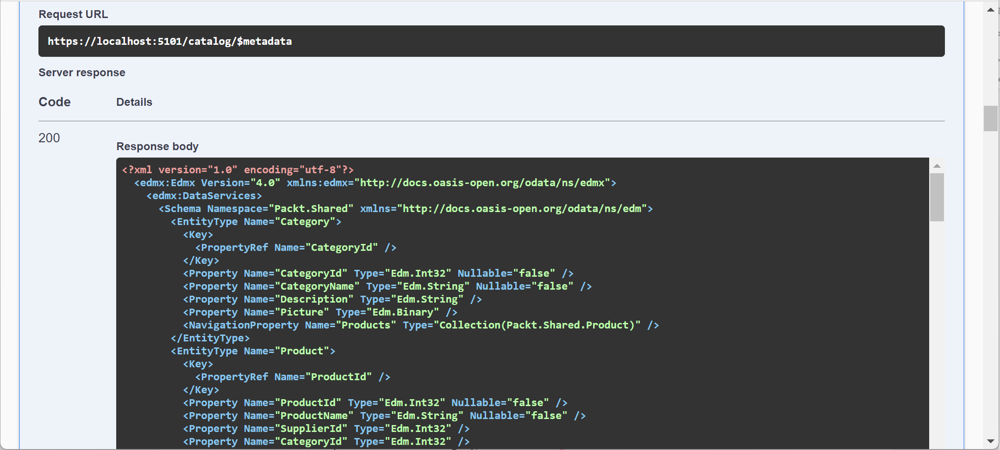
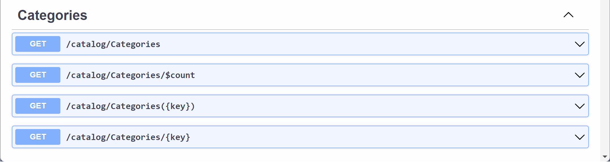
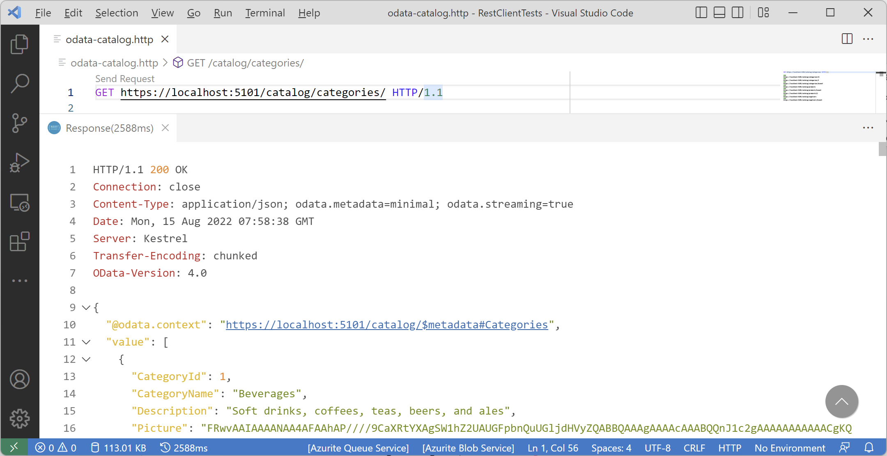
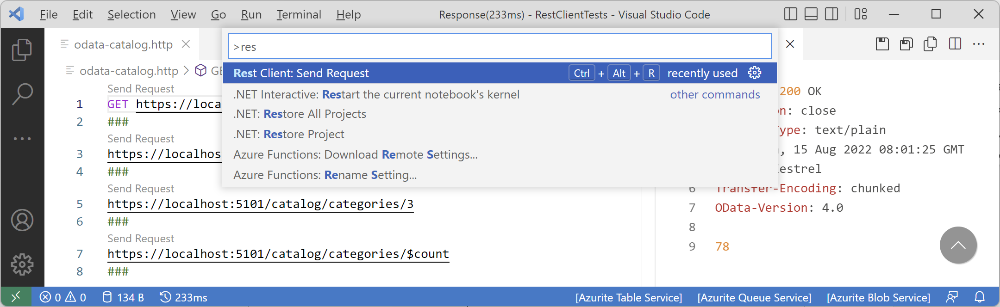
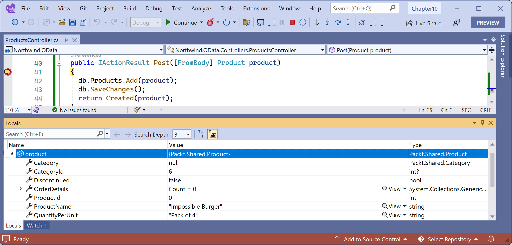
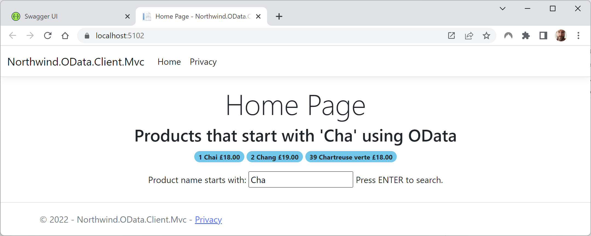

**Exposing Data via the Web Using OData Services**

In this online-only section, you will be introduced to **OData**, a standard that makes it easy to expose data via the Web to make it accessible to any client that can make an HTTP request.

This chapter will cover the following topics:

- [Understanding OData](#understanding-odata)
  - [Understanding the OData standard](#understanding-the-odata-standard)
  - [Understanding OData queries](#understanding-odata-queries)
- [Building a web service that supports OData](#building-a-web-service-that-supports-odata)
  - [Defining OData models for the EF Core models](#defining-odata-models-for-the-ef-core-models)
  - [Testing the OData models](#testing-the-odata-models)
  - [Creating and testing OData controllers](#creating-and-testing-odata-controllers)
- [Testing OData services using code editor tools](#testing-odata-services-using-code-editor-tools)
  - [Querying OData services using the `.http` file tool](#querying-odata-services-using-the-http-file-tool)
    - [Understanding OData standard query options](#understanding-odata-standard-query-options)
    - [Understanding OData operators](#understanding-odata-operators)
    - [Understanding OData functions](#understanding-odata-functions)
    - [Exploring OData queries](#exploring-odata-queries)
  - [Using logs to review the efficiency of OData requests](#using-logs-to-review-the-efficiency-of-odata-requests)
- [Versioning OData controllers](#versioning-odata-controllers)
- [Enabling entity inserts, updates, and deletes](#enabling-entity-inserts-updates-and-deletes)
- [Building clients for OData services](#building-clients-for-odata-services)
  - [Calling services in the Northwind MVC website](#calling-services-in-the-northwind-mvc-website)
  - [Revisiting the introductory query](#revisiting-the-introductory-query)
- [Practicing and exploring](#practicing-and-exploring)
  - [Exercise 8B.1 – Test your knowledge](#exercise-8b1--test-your-knowledge)
  - [Exercise 8B.2 – Explore topics](#exercise-8b2--explore-topics)
- [Summary](#summary)


# Understanding OData

One of the most common uses of a web service is to expose a database to clients that do not understand how to work directly with the native database. Another common use is to provide a simplified or abstracted API that exposes an authenticated interface to a subset of the data to control access.

In *Chapter 3, Building Entity Models for SQL Server Using EF Core*, you learned how to create an EF Core model to expose an SQL Server database to any .NET project. But what about non-.NET projects? I know it's crazy to imagine, but not every developer uses .NET!

Luckily, all development platforms support HTTP, so all development platforms can call web services, and ASP.NET Core has a package for making that easy and powerful using a standard named **OData**.

## Understanding the OData standard

**OData (Open Data Protocol)** is an ISO/IEC-approved, OASIS standard that defines a set of best practices for building and consuming RESTful APIs. Microsoft created it in 2007 and released versions 1.0, 2.0, and 3.0 under its Microsoft Open Specification Promise. Version 4.0 was then standardized at OASIS and released in 2014. OData is based on HTTP and has multiple endpoints to support multiple versions and entity sets.

> ASP.NET Core OData implements OData version 4.0.

## Understanding OData queries

Unlike traditional Web APIs where the service defines all the methods and what gets returned, OData uses **URL query strings** to define its queries. This enables the client to have more control over what is returned and minimizes round trips. Of course, the OData service controls the scope of those queries, but within that scope, the client has complete control.

For example, when querying the Northwind database that we created in *Chapter 2* for SQL Server, a client might only need two fields of data, `ProductName` and `Cost`, and the related `Supplier` object, and only for products where the `ProductName` contains the word `burger` and the cost is less than `4.95`, with the results sorted by country and then cost. The client would construct their query as a URL query string using standard named parameters, as shown in the following request:
```
GET https://example.com/v1/products?
  $filter=contains(ProductName, 'burger') and UnitPrice lt 4.95&
  $orderby=Shipper/Country,UnitPrice&
  $select=ProductName,UnitPrice&
  $expand=Supplier
```

# Building a web service that supports OData

There is no `dotnet new` project template for ASP.NET Core OData, but it uses controller classes, so we will use the ASP.NET Core Web API project template with the option to **Use controllers**, and then add package references to add the OData capabilities:

1.	Use your preferred code editor to create a new project, as defined in the following list:
    - Project template: **ASP.NET Core Web API** / `webapi`
    - Solution file and folder: `Chapter08`
    - Project file and folder: `Northwind.OData.Service`
    - **Authentication Type**: None.
    - **Configure for HTTPS**: Selected.
    - **Enable Docker**: Cleared.
    - **Use controllers (uncheck to use minimal APIs)**: Checked.
    - **Enable OpenAPI support**: Selected.
    - **Do not use top-level statements**: Cleared.

2.	Configure the project to treat warnings as errors, set invariant globalization to `false`, and add a package reference for ASP.NET Core OData alongside the existing package references for OpenApi and Swashbuckle, as shown highlighted in the following markup:
```xml
<Project Sdk="Microsoft.NET.Sdk.Web">

  <PropertyGroup>
    <TargetFramework>net8.0</TargetFramework>
    <Nullable>enable</Nullable>
    <ImplicitUsings>enable</ImplicitUsings>
    <InvariantGlobalization>false</InvariantGlobalization>
    <TreatWarningsAsErrors>true</TreatWarningsAsErrors>
  </PropertyGroup>

  <ItemGroup>
    <PackageReference Include="Microsoft.AspNetCore.OData" Version="8.2.0" />
    <PackageReference Include="Microsoft.AspNetCore.OpenApi" Version="8.0.0" />
    <PackageReference Include="Swashbuckle.AspNetCore" Version="6.4.0" />
  </ItemGroup>

</Project>
```

> **Good Practice**: The version numbers of the NuGet packages above are likely to increase after the book is published. As a general guide, you will want to use the latest package version.

> **More Information**: Although it is the most popular downloaded package for OData, do not reference `Microsoft.Data.OData` because it only supports versions 1 to 3 and it is not being maintained. The other popular packages for OData are `Microsoft.OData.Core` and `Microsoft.OData.Edm`, which are both dependencies of the package you just referenced so they will be included in your project automatically.

3.	Add a project reference to the Northwind database context project for SQL Server that you created in *Chapter 3, Building Entity Models for SQL Server Using EF Core*, as shown in the following markup:
```xml
<ItemGroup>
  <ProjectReference Include="..\..\Chapter03\Northwind.Common.DataContext.SqlServer\Northwind.Common.DataContext.SqlServer.csproj" />
</ItemGroup>
```

> If you did not complete the task to create the class libraries in *Chapter 3*, then download the solution projects from the GitHub repository.

4.	At the command prompt or terminal, build the `Northwind.OData.Service` project to make sure the projects outside the current solution are properly compiled, as shown in the following command:
```
dotnet build
```

> **Warning!** If you are using Visual Studio 2022, if you try to build the OData project using the **Build** menu then you will get the following error: `error NU1105: Unable to find project information for 'C:\apps-services-net8\Chapter03\Northwind.Common.DataContext.SqlServer\Northwind.Common.DataContext.SqlServer.csproj'. If you are using Visual Studio, this may be because the project is unloaded or not part of the current solution so run a restore from the command-line.`

5.	In the `Northwind.OData.Service` folder, delete `WeatherForecast.cs`.
6.	In the `Controllers folder`, delete `WeatherForecastController.cs`.

## Defining OData models for the EF Core models

The first task is to define what we want to expose as OData models in the web service. You have complete control, so if you have an existing EF Core model as we do for Northwind, you do not have to expose all of it. 

You do not even have to use EF Core models. The data source can be anything. In this book, we will only look at using it with EF Core because that is the most common use for .NET developers.

Let's define two OData models: one to expose the Northwind product catalog, i.e. the categories and products tables; and one to expose the customers, their orders, and related tables:

1.	Add a new class file named `Program.Methods.cs`.
2.	In `Program.Methods.cs`, import some namespaces for working with OData and our entity models, and then add a method to define and return an OData model for the Northwind catalog that will only expose the entity sets, i.e. tables for `Categories`, `Products`, and `Suppliers`, as shown in the following code:
```cs
using Microsoft.OData.Edm; // To use IEdmModel.
using Microsoft.OData.ModelBuilder; // To use ODataConventionModelBuilder.
using Northwind.EntityModels; // To use Category and so on.

partial class Program
{
  static IEdmModel GetEdmModelForCatalog()
  {
    ODataConventionModelBuilder builder = new();
    builder.EntitySet<Category>("Categories");
    builder.EntitySet<Product>("Products");
    builder.EntitySet<Supplier>("Suppliers");
    return builder.GetEdmModel();
  }
}
```

3.	Add a method to define an OData model for the Northwind customer orders, and note that the same entity set can appear in multiple OData models like `Products` does, as shown in the following code:
```cs
static IEdmModel GetEdmModelForOrderSystem()
{
  ODataConventionModelBuilder builder = new();
  builder.EntitySet<Customer>("Customers");
  builder.EntitySet<Order>("Orders");
  builder.EntitySet<Employee>("Employees");
  builder.EntitySet<Product>("Products");
  builder.EntitySet<Shipper>("Shippers");
  return builder.GetEdmModel();
}
```

4.	In `Program.cs`, import the namespace for working with OData and the namespace for the database context registration extension method, as shown in the following code:
```cs
using Microsoft.AspNetCore.OData; // To use AddOData extension method.
using Northwind.EntityModels; // To use AddNorthwindContext extension method.
```

5.	In the services configuration section, before the call to `AddControllers`, add a statement to register the Northwind database context, as shown in the following code:
```cs
builder.Services.AddNorthwindContext();
```

6.	In the services configuration section, after the call to `AddControllers`, chain a call to the `AddOData` extension method to define two OData models and enable features like projection, filtering, and sorting, as shown highlighted in the following code:
```cs
builder.Services.AddControllers()
  .AddOData(options => options

    // Register two OData models.
    .AddRouteComponents(routePrefix: "catalog", 
      model: GetEdmModelForCatalog())

    .AddRouteComponents(routePrefix: "ordersystem",
      model: GetEdmModelForOrderSystem())

    // Enable query options:
    .Select()       // $select for projection.
    .Expand()       // $expand to navigate to related entities.
    .Filter()       // $filter.
    .OrderBy()      // $orderby to sort.
    .SetMaxTop(100) // $top.
    .Count()        // $count.
  );
```

7.	In the `Properties` folder, open `launchSettings.json`.
8.	In the `Northwind.OData.Service` profile, modify the `applicationUrl` to use port `5084` for HTTPS, as shown in the following markup:
```xml
"applicationUrl": "https://localhost:5084",
```

## Testing the OData models

Now we can check that the OData models have been defined correctly:

1.	Start the `Northwind.OData.Service` project using the `https` launch profile without debugging.

> If the **Windows Defender Firewall** blocks some features then click **Allow access**.

2.	Start Chrome if it does not start automatically.
3.	Navigate to https://localhost:5084/swagger and note the **Northwind.OData.Service v1** service is documented, as shown in *Figure 9.1A*:
 

*Figure 9.1A: Swagger documentation for the Northwind.OData.Service project*

4.	In the **Metadata** section, click **GET /catalog**, click **Try it out**, click **Execute**, and note the response body that shows the names and URLs of the three entity sets in the catalog OData model, as shown in the following output:
```json
{
  "@odata.context": "https://localhost:5084/catalog/$metadata",
  "value": [
    {
      "name": "Categories",
      "kind": "EntitySet",
      "url": "Categories"
    },
    {
      "name": "Products",
      "kind": "EntitySet",
      "url": "Products"
    },
    {
      "name": "Suppliers",
      "kind": "EntitySet",
      "url": "Suppliers"
    }
  ]
}
```

5.	Click **GET /catalog** to collapse that section.
6.	Click **GET /catalog/$metadata**, click **Try it out**, click **Execute**, and note the model describes the entities like `Category` in detail with properties and keys, including navigation properties for the products in each category, as shown in *Figure 9.2A*:
 

*Figure 9.2A: OData model metadata for the Northwind catalog*

7.	Click **GET /catalog/$metadata** to collapse that section.
8.	Close Chrome and shut down the web server.

## Creating and testing OData controllers

Next, we must create OData controllers, one for each type of entity, to retrieve data:

1.	In the `Controllers` folder, add an empty controller class file named `CategoriesController.cs`.
2.	Modify its contents to inherit from `ODataController`, get an instance of the Northwind database context using constructor parameter injection, and define two `Get` methods to retrieve all categories or one category using a unique key, as shown in the following code:
```cs
using Microsoft.AspNetCore.Mvc; // To use IActionResult.
using Microsoft.AspNetCore.OData.Query; // To use [EnableQuery].
using Microsoft.AspNetCore.OData.Routing.Controllers; // To use ODataController.
using Northwind.EntityModels; // To use NorthwindContext.

namespace Northwind.OData.Service.Controllers;

public class CategoriesController : ODataController
{
  protected readonly NorthwindContext db;

  public CategoriesController(NorthwindContext db)
  {
    this.db = db;
  }

  [EnableQuery]
  public IActionResult Get()
  {
    return Ok(db.Categories);
  }

  [EnableQuery]
  public IActionResult Get(int key)
  {
    return Ok(db.Categories.Where(
      category => category.CategoryId == key));
  }
}
```

> **Warning!** For readers familiar with ASP.NET Core MVC or Web API, they might mistakenly name the parameter `id`. This is because with an MVC or Web API project, a default route is configured. For MVC, the default route is [described here](https://github.com/markjprice/cs12dotnet8/blob/main/docs/aspnetcoremvc-02.md#the-default-mvc-route). For Web API it is: `{http_method} http://.../{controller}/{id}` that will (1) instantiate the class named `{controller}Controller`, call the method with a matching name for the HTTP method e.g. `GET`, `POST` and so on, and (3) pass a parameter value named `{id}`. But an OData project is not a traditional Web API project. Controller classes that derive from `ODataController` are registered using different routes. Instead, the route is configured with a parameter named `key` so that is what the method parameter must be named to allow automatic route mapping to pass that parameter. A fuller explanation can be found at the following link: https://learn.microsoft.com/en-us/odata/webapi/routing-abstract.

3.	Repeat the above step for `Products` and `Suppliers`.

> I will leave it as an optional task for the reader to do the same for the other entities to enable the order system OData model if you choose. Note the `CustomerId` is a `string` instead of an `int`.

4.	Start the `Northwind.OData.Service` web service without debugging.
5.	Start Chrome, navigate to https://localhost:5084/swagger, and note the `Categories`, `Products`, and `Suppliers` entity sets are now documented because you created OData controllers for them, as shown in *Figure 9.3A*:


*Figure 9.3A: The Categories entity set is now documented*

6.	Click **GET /catalog/Categories**, click **Try it out**, click **Execute**, and note the response body that shows a JSON document containing all categories in the entity set, as partially shown in the following output:
```json
{
  "@odata.context": "https://localhost:5084/catalog/$metadata#Categories",
  "value": [
    {
      "CategoryId": 1,
      "CategoryName": "Beverages",
      "Description": "Soft drinks, coffees, teas, beers, and ales",
      "Picture": "FRwvAAIAAAANAA4AFAAhAP////9CaX..."
    },
    {
      "CategoryId": 2,
      "CategoryName": "Condiments",
      "Description": "Sweet and savory sauces, relishes, spreads, and seasonings",
      "Picture": "FRwvAAIAAAANAA4AFAAhAP////9CaX..."
    },
    ...
  ]
}
```
7.	At the command prompt or terminal, note the output from logging the SQL command that was executed, as shown in the following output:
```
info: Microsoft.EntityFrameworkCore.Infrastructure[10403]
      Entity Framework Core 8.0.0 initialized 'NorthwindContext' using provider 'Microsoft.EntityFrameworkCore.SqlServer:8.0.0' with options: None
dbug: 22/05/2023 15:07:15.131 RelationalEventId.CommandExecuting[20100] (Microsoft.EntityFrameworkCore.Database.Command)
      Executing DbCommand [Parameters=[], CommandType='Text', CommandTimeout='30']
      SELECT [c].[CategoryId], [c].[CategoryName], [c].[Description], [c].[Picture]
      FROM [Categories] AS [c]
```

We are noting the SQL statement now so that you can see that all columns and all rows are requested by the OData service when it receives a `GET` request to the `catalog/categories` path. 

Later, we will use EF Core logs again to see how OData queries are automatically translated into efficient SQL queries. OData services do not have to return all columns and rows from the database to the service and then perform the filtering inside the service.

8.	Close Chrome and shut down the web server.

# Testing OData services using code editor tools

Using the Swagger user interface to test OData controllers can quickly get clumsy. Better tools are the Visual Studio 2022 **Endpoints Explorer** and its `.http` file support and the Visual Studio Code extension named REST Client:

1.	If you have not already installed **REST Client** by Huachao Mao (`humao.rest-client`), then install it in Visual Studio Code now.
2.	In your preferred code editor, start the `Northwind.OData.Service` project web service and leave it running.
3.	In the `apps-services-net8` folder, if it does not already exist, create a `HttpRequests` folder, and then open the folder.
4.	In the `HttpRequests` folder, create a file named `odata-catalog.http` and modify its contents to contain a request to get all categories, as shown in the following code:
```
### Configure a variable for the web service base address.
@base_address = https://localhost:5084/catalog/

### Get all categories.
GET {{base_address}}categories HTTP/1.1
```

> **Good Practice**: Specifying the HTTP version at the end of the request is optional because both code editor `.http` file tools will default to using `1.1`.The `GET` verb is optional with Visual Studio Code's REST Client extension but sadly this is not the case with Visual Studio 2022 and its `.http` file tool. So we must continue to explicitly specify `GET`.

5.	Click **Send Request**, and note the response is the same as what was returned by Swagger, a JSON document containing all categories, as shown in *Figure 9.4A*:


*Figure 9.4A: REST Client getting the categories from the OData service*

6.	In `odata-catalog.http`, add more requests separated by `###`, as shown in the following table:

Request|Response
---|---
`GET {{base_address}}categories(3)`|<code>{<br>  "@odata.context": "https://localhost:5084/catalog/$metadata#Categories/$entity",<br>  "CategoryId": 3,<br>  "CategoryName": "Confections",<br>  "Description": "Desserts, candies, and sweet breads",<br>  "Picture": "FRwvAA..."<br>}</code>
`GET {{base_address}}categories/3`|Same as above.
`GET {{base_address}}categories/$count`|8
`GET {{base_address}}products`|JSON document containing all products.
`GET {{base_address}}products/$count`|77
`GET {{base_address}}products(2)`|<code>{<br>"@odata.context": "https://localhost:5084/catalog/$metadata#Products/$entity",<br>  "ProductId": 2,<br>  "ProductName": "Chang",<br>  "SupplierId": 1,<br>  "CategoryId": 1,<br>  "QuantityPerUnit": "24 - 12 oz bottles",<br>  "UnitPrice": 19.0000,<br>  "UnitsInStock": 17,<br>  "UnitsOnOrder": 40,<br>  "ReorderLevel": 25,<br>  "Discontinued": false<br>}</code>
`GET {{base_address}}suppliers`|JSON document containing all suppliers.
`GET {{base_address}}suppliers/$count`|29

7.	Note that you can execute an HTTP request by clicking **Send Request** above each query, or by navigating to **View** | **Command Palette** and selecting the **Rest Client: Send Request** command or using its keyboard shortcut for your operating system, as shown in *Figure 9.5A*:

 
*Figure 10.5: Queries in REST Client*

## Querying OData services using the `.http` file tool

To execute arbitrary queries against an OData model, we earlier enabled selecting, filtering, and ordering.

> **More Information**: For the official documentation of OData URL conventions and standard queries, see the following link: http://docs.oasis-open.org/odata/odata/v4.01/odata-v4.01-part2-url-conventions.html#_Toc31360954.

### Understanding OData standard query options

One of the benefits of OData is that it defines standard query options, as shown in the following table:

Option|Description|Example
---|---|---
`$select`|Selects properties for each entity.|`$select=CategoryId,CategoryName`
`$expand`|Selects related entities via navigation properties.|`$expand=Products`
`$filter`|The expression is evaluated for each resource, and only entities where the expression is true are included in the response.|`$filter=startswith(ProductName,'ch') or (UnitPrice gt 50)`
`$orderby`|Sorts the entities by the properties listed in ascending (default) or descending order.|`$orderby=UnitPrice desc,ProductName`
`$skip`, `$top`|Skips the specified number of items. Takes the specified number of items.|`$skip=40&$top=10`

For performance reasons, batching with `$skip` and `$top` is disabled by default. 

### Understanding OData operators

OData has operators for use with the $filter option, as shown in the following table:

Operator|Description
---|---
`eq`|Equals
`ne`|Not equals
`lt`|Less than
`gt`|Greater than
`le`|Less than or equal to
`ge`|Greater than or equal to
`and`|And
`or`|Or
`not`|Not
`add`|Arithmetic add for numbers and date/time values
`sub`|Arithmetic subtract for numbers and date/time values
`mul`|Arithmetic multiply for numbers
`div`|Arithmetic division for numbers
`mod`|Arithmetic modulus division for numbers

### Understanding OData functions

OData has functions for use with the `$filter` option, as shown in the following table:

Operator|Description
---|---
`startswith(stringToSearch, string)`|Text values that start with the specified value.
`endswith(stringToSearch, string)`|Text values that end with the specified value.
`concat(string1, string2)`|Concatenate two text values.
`contains(stringToSearch, string)`|Text values that contain the specified value.
`indexof(stringToSearch, string)`|Returns the position of a text value.
`length(string)`|Returns the length of a text value.
`substring(string, index, length)`|Extracts a substring from a text value.
`tolower(string)`|Converts to lower case.
`toupper(string)`|Converts to upper case.
`trim(string)`|Trims whitespace before and after text value.
`now`|The current date and time.
`day(datetime)`, `month(datetime)`, `year(datetime)`|Extracts date components.
`hour(datetime)`, `minute(datetime)`, `second(datetime)`|Extracts time components.

### Exploring OData queries

Let's experiment with some OData queries:

1.	In the `HttpRequests` folder, create a file named `odata-catalog-queries.http`, and modify its contents to contain a request to get all categories, as shown in the following code:
```
### Configure a variable for the web service base address.
@base_address = https://localhost:5084/catalog/

###
GET {{base_address}}categories/
  ?$select=CategoryId,CategoryName
```

> **Good Practice**: Put the query string part on a new line to make the queries easier to read, as shown in the previous example.

2.	Click **Send Request** and note that the response is a JSON document containing all categories, but only the `CategoryId` and `CategoryName` properties.
3.	Separated by `###`, add and send a request to get products with names that start with `Ch`, like `Chai` and `Chef Anton's Gumbo Mix`, or have a unit price of more than `50`, like `Mishi Kobe Niku` or `Sir Rodney's Marmalade`, as shown in the following request:
```
GET {{base_address}}products/
  ?$filter=startswith(ProductName,'Ch') or (UnitPrice gt 50)
```

4.	Add and send a request to get products sorted with most expensive at the top, and then sorted within a price by product name, and only include the ID, name, and price properties, as shown in the following request:
```
GET {{base_address}}products/
  ?$orderby=UnitPrice desc,ProductName
  &$select=ProductId,ProductName,UnitPrice
```

5.	Add and send a request to get a specific product, and only include the ID, name, and price properties, as shown in the following request:
```
GET {{base_address}}products(77)/
  ?$select=ProductId,ProductName,UnitPrice
```

6.	Add and send a request to get categories and their related products, as shown in the following request:
```
GET {{base_address}}categories/
  ?$select=CategoryId,CategoryName
  &$expand=Products
```

7.	Add and send a request to get a specific category and its related products, as shown in the following request:
```
GET {{base_address}}categories(8)/
  ?$select=CategoryId,CategoryName
  &$expand=Products
```
8.	Shut down the web server.

## Using logs to review the efficiency of OData requests

How does OData querying work? Let's find out by using the logging in the Northwind database context to see the actual SQL statements that are executed:

1.	Start the `Northwind.OData.Service` web service.
2.	Start Chrome and navigate to `https://localhost:5084/catalog/products/?$filter=startswith(ProductName,'Ch') or (UnitPrice gt 50)&$select=ProductId,ProductName,UnitPrice`

3.	In Chrome, note the result, as shown in the following output:
```json
{"@odata.context":"https://localhost:5084/catalog/$metadata#Products(ProductId,ProductName,UnitPrice)","value":[{"ProductId":1,"ProductName":"Chai","UnitPrice":18.0000},{"ProductId":2,"ProductName":"Chang","UnitPrice":19.0000},{"ProductId":4,"ProductName":"Chef Anton's Cajun Seasoning","UnitPrice":22.0000},{"ProductId":5,"ProductName":"Chef Anton's Gumbo Mix","UnitPrice":21.3500},{"ProductId":9,"ProductName":"Mishi Kobe Niku","UnitPrice":97.0000},{"ProductId":18,"ProductName":"Carnarvon Tigers","UnitPrice":62.5000},{"ProductId":20,"ProductName":"Sir Rodney's Marmalade","UnitPrice":81.0000},{"ProductId":29,"ProductName":"Th\u00fcringer Rostbratwurst","UnitPrice":123.7900},{"ProductId":38,"ProductName":"C\u00f4te de Blaye","UnitPrice":263.5000},{"ProductId":39,"ProductName":"Chartreuse verte","UnitPrice":18.0000},{"ProductId":48,"ProductName":"Chocolade","UnitPrice":12.7500},{"ProductId":51,"ProductName":"Manjimup Dried Apples","UnitPrice":53.0000},{"ProductId":59,"ProductName":"Raclette Courdavault","UnitPrice":55.0000}]}
```

4.	At the command prompt or terminal, note the logged SQL statement that was executed, as shown in the following output:
```
info: Microsoft.EntityFrameworkCore.Database.Command[20101]
      Executed DbCommand (57ms) [Parameters=[@__TypedProperty_0='?' (Size = 4000), @__TypedProperty_0_1='?' (Size = 40), @__TypedProperty_1='?' (Precision = 2) (DbType = Decimal)], CommandType='Text', CommandTimeout='30']
      SELECT [p].[ProductId], [p].[ProductName], [p].[UnitPrice]
      FROM [Products] AS [p]
      WHERE @__TypedProperty_0 = N'' OR LEFT([p].[ProductName], LEN(@__TypedProperty_0_1)) = @__TypedProperty_0 OR [p].[UnitPrice] > @__TypedProperty_1
```

It might look like the `Get` action method on the `ProductsController` returns the entire `Products` table, but it actually returns an `IQueryable<Products>` object. In other words, it returns a LINQ query, not yet the results. 

We decorated the `Get` action method with the `[EnableQuery]` attribute. This enables OData to extend the LINQ query with filters, projections, sorting, and so on, and only then does it execute the query, serialize the results, and return them to the client. This makes OData services as flexible and efficient as possible when it translates from its query language to LINQ and then into SQL statements.

5.	Close the browser and shut down the web server.

# Versioning OData controllers

It is good practice to plan for future versions of your OData models that might have different schemas and behavior.

To maintain backward compatibility, you can use OData URL prefixes to specify a version number:

1.	In the `Northwind.OData.Service` project, in `Program.cs`, in the services configuration section, after adding the two OData models for catalog and orders, add a third OData model that has a version number and uses the same GetEdmModelForCatalog method, as shown in the following code:
```cs
.AddRouteComponents(routePrefix: "catalog/v{version}", 
  model: GetEdmModelForCatalog())
```

2.	In `ProductsController.cs`, modify the `Get` methods to add a `string` parameter named version that defaults to `"1"`, and use it to change the behavior of the methods if version 2 is specified in a request, as shown highlighted in the following code:
```cs
[EnableQuery]
public IActionResult Get(string version = "1")
{
  Console.WriteLine($"*** ProductsController version {version}.");
  return Ok(db.Products);
}

[EnableQuery]
public IActionResult Get(int key, string version = "1")
{
  Console.WriteLine($"*** ProductsController version {version}.");

  IQueryable<Product> products = db.Products.Where(
    product => product.ProductId == key);

  Product? p = products.FirstOrDefault();

  if ((products is null) || (p is null))
  {
    return NotFound($"Product with id {key} not found.");
  }

  if (version == "2")
  {
    p.ProductName += " version 2.0";
  }

  return Ok(p);
}
```

3.	In your preferred code editor, start the `Northwind.OData.Service` project web service.
4.	In `odata-catalog-queries.http`, add a request to get the product with ID 50 using the v2 OData model, as shown in the following code:
```
GET {{base_address}}v2/products(50)
```

5.	Click **Send Request**, and note the response is the product with its name appended with `version 2.0`, as shown highlighted in the following output:
```json
{
  "@odata.context": "https://localhost:5084/v2/$metadata#Products/$entity",
  "ProductId": 50,
  "ProductName": "Valkoinen suklaa version 2.0",
  "SupplierId": 23,
  "CategoryId": 3,
  "QuantityPerUnit": "12 - 100 g bars",
  "UnitPrice": 16.2500,
  "UnitsInStock": 65,
  "UnitsOnOrder": 0,
  "ReorderLevel": 30,
  "Discontinued": false
}
```

6.	At the command prompt or terminal, note version 2 is used, as shown in the following output:
```
*** ProductsController version 2.
```

7.	In `odata-catalog-queries.http`, add a request to get the product with ID 50 using the default (v1) OData model, as shown in the following code:
```
GET {{base_address}}products(50)
```

8.	Click **Send Request**, and note the response is the product with its name unmodified.
9.	At the command prompt or terminal, note version 1 is used, as shown in the following output:
```
*** ProductsController version 1.
```

10.	Shut down the web server.

# Enabling entity inserts, updates, and deletes

Although the most common use for OData is to provide a Web API that supports custom queries, you might also want to support CRUD operations like inserts. Let's see how to do that:

1.	In `ProductsController.cs`, add an action method to respond to `POST` requests, as shown in the following code:
```cs
public IActionResult Post([FromBody] Product product)
{
  db.Products.Add(product);
  db.SaveChanges();
  return Created(product);
}
```

2.	Set a breakpoint on the open brace of the method.
3.	Start the OData web service with debugging.
4.	In Visual Studio Code, in the `HttpRequests` folder, create a new file named `odata-catalog-insert-product.http`, as shown in the following HTTP request:
```
POST https://localhost:5084/catalog/products
Content-Type: application/json
Content-Length: 234

{
  "ProductName": "Impossible Burger",
  "SupplierId": 7,
  "CategoryId": 6,
  "QuantityPerUnit": "Pack of 4",
  "UnitPrice": 40.25,
  "UnitsInStock": 50,
  "UnitsOnOrder": 0,
  "ReorderLevel": 30,
  "Discontinued": false
}
```

5.	Click **Send Request**.
6.	In your code editor, note the breakpoint is hit, and you can use the debugging tools to see the product parameter successfully deserialized from the body of the HTTP POST request, as shown in *Figure 9.6A*:


*Figure 9.6A: Debugging the OData POST request method handler*

7.	Allow the code to continue executing.
8.	In Visual Studio Code, note the successful response, as shown in the following markup:
```
HTTP/1.1 201 Created
Connection: close
Content-Type: application/json; odata.metadata=minimal; odata.streaming=true
Date: Sun, 22 May 2023 15:13:11 GMT
Server: Kestrel
Location: https://localhost:5084/catalog/Products(78)
Transfer-Encoding: chunked
OData-Version: 4.0

{
  "@odata.context": "https://localhost:5084/catalog/$metadata#Products/$entity",
  "ProductId": 78,
  "ProductName": "Impossible Burger",
  "SupplierId": 7,
  "CategoryId": 6,
  "QuantityPerUnit": "Pack of 4",
  "UnitPrice": 40.25,
  "UnitsInStock": 50,
  "UnitsOnOrder": 0,
  "ReorderLevel": 30,
  "Discontinued": false
}
```

9.	Optionally, implement two more methods to enable updates using an HTTP `PUT` request and deletes using an HTTP `DELETE` request.

# Building clients for OData services

Finally, let's see how a .NET client might call the OData web service. Let's review how clients interact with an OData service.

If we want to query the OData service for products that start with the letters `Cha`, then we would need to send a `GET` request with a relative URL path similar to the following:
```
catalog/products/?$filter=startswith(ProductName, 'Cha')&$select=ProductId,ProductName,UnitPrice
```

OData returns data in a JSON document with a property named value that contains the resulting products as an array, as shown in the following JSON document:
```json
{
  "@odata.context": "https://localhost:5084/catalog/$metadata#Products",
  "value": [
    {
      "ProductId": 1,
      "ProductName": "Chai",
      "SupplierId": 1,
      "CategoryId": 1,
      "QuantityPerUnit": "10 boxes x 20 bags",
      "UnitPrice": 18,
      "UnitsInStock": 39,
      "UnitsOnOrder": 0,
      "ReorderLevel": 10,
      "Discontinued": false
    },
```

We will create an ASP.NET Core website project to act as a client, and a model class to make it easy to deserialize the HTTP response:

1.	Use your preferred code editor to add an MVC website project, as defined in the following list:
    - Project template: **ASP.NET Core Web App (Model-View-Controller) [C#]** / `mvc`
    - Project file and folder: `Northwind.OData.Client.Mvc`
    - Solution file and folder: `Chapter08`
    - Additional information - **Authentication type**: None 
    - For Visual Studio, leave all other options as their defaults.

2.	If you are using Visual Studio 2022, set the startup project to the current selection.
3.	Add a project reference to the `Northwind.Common.EntityModels.SqlServer` project in the `Chapter03` folder, as shown in the following markup:
```xml
<ItemGroup>
	<ProjectReference Include="..\..\Chapter03\Northwind.Common.EntityModels.SqlServer\Northwind.Common.EntityModels.SqlServer.csproj" />
</ItemGroup>
```
4.	Build the `Northwind.OData.Client.Mvc` project at the command prompt or terminal.
5.	In the `Properties` folder, open `launchSettings.json`.
6.	In the `Northwind.OData.Client.Mvc` profile, modify the `applicationUrl` to use port `5085` for HTTPS, as shown in the following markup:
```
"applicationUrl": "https://localhost:5085",
```

7.	In the `Northwind.OData.Client.Mvc` project, in the `Models` folder, add a new class file named `ODataProducts.cs`, as shown in the following code:
```cs
using Northwind.EntityModels; // To use Product.

namespace Northwind.OData.Client.Mvc.Models;

public class ODataProducts
{
  public Product[]? Value { get; set; }
}
```

8.	In `Program.cs`, add a statement to import the namespace for setting media types in an HTTP header, as shown in the following code:
```cs
using System.Net.Http.Headers; // To use MediaTypeWithQualityHeaderValue.
```

9.	In `Program.cs`, after the call to `AddControllersWithViews`, add statements to register an HTTP client for the OData service that will request JSON for the response data format, as shown in the following code:
```cs
builder.Services.AddHttpClient(name: "Northwind.OData.Service",
  configureClient: options =>
  {
    options.BaseAddress = new Uri("https://localhost:5084/");
    options.DefaultRequestHeaders.Accept.Add(
      new MediaTypeWithQualityHeaderValue(
      "application/json", 1.0));
  });
```

## Calling services in the Northwind MVC website

Next, we will call the service on the home page:

1.	In the `Controllers` folder, in `HomeController.cs`, declare a field to store the registered HTTP client factory service, as shown in the following code:
```cs
protected readonly IHttpClientFactory _clientFactory;
```

2.	In the class constructor, add statements to pass and store the registered HTTP client factory service, as shown highlighted in the following code:
```cs
public HomeController(ILogger<HomeController> logger, 
  IHttpClientFactory clientFactory)
{
  _logger = logger;
  _clientFactory = clientFactory;
}
```

3.	Make the `Index` method asynchronous, and then add statements that call the OData service to get products that start with `Cha` and store the result in the `ViewData` dictionary, as shown highlighted in the following code:
```cs
public async Task<IActionResult> Index(string startsWith = "Cha")
{
  try
  {
    HttpClient client = _clientFactory.CreateClient(
      name: "Northwind.OData.Service");

    HttpRequestMessage request = new(
      method: HttpMethod.Get, requestUri: 
      "catalog/products/?$filter=startswith(ProductName, " + 
      $"'{startsWith}')&$select=ProductId,ProductName,UnitPrice");

    HttpResponseMessage response = await client.SendAsync(request);

    ViewData["startsWith"] = startsWith;
    ViewData["products"] = (await response.Content
      .ReadFromJsonAsync<ODataProducts>())?.Value;
  }
  catch (Exception ex)
  {
    _logger.LogWarning($"Northwind.OData.Service exception: {ex.Message}");
  }

  return View();
}
```

4.	In `Views/Home`, in `Index.cshtml`, delete its existing markup and then add markup to render the products with a form for the visitor to enter the start of a product name, as shown in the following markup:
```html
@using Northwind.EntityModels
@{
  ViewData["Title"] = "Home Page";
  Product[]? products = ViewData["products"] as Product[];
}
<div class="text-center">
  <h1 class="display-4">@ViewData["Title"]</h1>
  @if (products is not null)
  {
    <h2>Products that start with '@ViewData["startsWith"]' using OData</h2>
    <p>
      @if (products.Length == 0)
      {
        <span class="badge rounded-pill bg-danger">No products found.</span>
      }
      else
      {
        @foreach (Product p in products)
        {
          <span class="badge rounded-pill bg-info text-dark">
            @p.ProductId 
            @p.ProductName 
            @(p.UnitPrice is null ? "" : p.UnitPrice.Value.ToString("c"))
          </span>
        }
      }
    </p>
  }
  <form method="get">
    Product name starts with:
    <input name="startsWith" value="@ViewData["startsWith"]" />
    Press ENTER to search.
  </form>
</div>
```

5.	Start the `Northwind.OData.Service` project without debugging.
6.	Start the `Northwind.OData.Client.Mvc` project without debugging.
7.	Start Chrome and navigate to https://localhost:5085/.
8.	Note that three products are returned from the OData service, as shown in *Figure 9.7A*:


*Figure 9.7A: Three product names starting with Cha returned from the OData service*

9.	At the command prompt or terminal for the OData service, note the SQL command used, as shown in the following output:
```
info: Microsoft.EntityFrameworkCore.Database.Command[20101]
      Executed DbCommand (28ms) [Parameters=[@__TypedProperty_0='?' (Size = 4000), @__TypedProperty_0_1='?' (Size = 40)], CommandType='Text', CommandTimeout='30']
      SELECT [p].[ProductId], [p].[ProductName], [p].[UnitPrice]
      FROM [Products] AS [p]
      WHERE @__TypedProperty_0 = N'' OR LEFT([p].[ProductName], LEN(@__TypedProperty_0_1)) = @__TypedProperty_0
```

10.	At the command prompt or terminal for the MVC website, note the HTTP request made and its response, as shown in the following output:
```
info: System.Net.Http.HttpClient.Northwind.OData.Service.LogicalHandler[100]
      Start processing HTTP request GET https://localhost:5084/catalog/products/?$filter=startswith(ProductName,'Cha')&$select=ProductId,ProductName,UnitPrice
info: System.Net.Http.HttpClient.Northwind.OData.Service.ClientHandler[100]
      Sending HTTP request GET https://localhost:5084/catalog/products/?$filter=startswith(ProductName,'Cha')&$select=ProductId,ProductName,UnitPrice
info: System.Net.Http.HttpClient.Northwind.OData.Service.ClientHandler[101]
      Received HTTP response headers after 998.5241ms - 200
info: System.Net.Http.HttpClient.Northwind.OData.Service.LogicalHandler[101]
      End processing HTTP request after 1004.9182ms - 200
```

11.	Type `b` in the text box, press *Enter*, and note the results only include the one product that starts with the letter b, `Boston Crab Meat`.
12.	Type `d` in the text box, press *Enter*, and note the error message saying that no products were found.
13.	Close Chrome and shut down both the web servers.

## Revisiting the introductory query

At the start of this chapter, I introduced an example of a query you could run against an OData service. Let's see if it works with our service:

1.	In Visual Studio Code, in the `HttpRequests` folder, create a new file named `odata-final-query.http`, as shown in the following HTTP request:
```
GET https://localhost:5084/catalog/products
  ?$filter=contains(ProductName, 'ch') and UnitPrice lt 44.95
  &$orderby=Supplier/Country,UnitPrice
  &$select=ProductName,UnitPrice
  &$expand=Supplier
```

2.	Click **Send Request** and note the response contains products and their suppliers, sorted by country first and then, within each country, sorted by unit price, as shown in the following partial output:

> The parts of the output that I clipped out to save space are indicated with ellipses (…).

```
HTTP/1.1 200 OK
Connection: close
Content-Type: application/json; odata.metadata=minimal; odata.streaming=true
Date: Thu, 21 Jul 2022 20:34:34 GMT
Server: Kestrel
Transfer-Encoding: chunked
OData-Version: 4.0

{
  "@odata.context": "https://localhost:5084/catalog/$metadata#Products(ProductName,UnitPrice,Supplier())",
  "value": [
    ...
    {
      "ProductName": "Chartreuse verte",
      "UnitPrice": 18.0000,
      "Supplier": {
        ...
        "Country": "France",
        ...
      }
    },
    ...
    {
      "ProductName": "Gnocchi di nonna Alice",
      "UnitPrice": 38.0000,
      "Supplier": {
        ...
        "Country": "Italy",
        ...
      }
    },
    {
      "ProductName": "Chocolade",
      "UnitPrice": 12.7500,
      "Supplier": {
        ...
        "Country": "Netherlands",
        ...
      }
    },
    ...
    {
      "ProductName": "Chai",
      "UnitPrice": 18.0000,
      "Supplier": {
        ...
        "Country": "UK",
        ...
      }
    },
    {
      "ProductName": "Chang",
      "UnitPrice": 19.0000,
      "Supplier": {
        ...
        "Country": "UK",
        ...
      }
    },
    ...
  ]
}
```

# Practicing and exploring

Test your knowledge and understanding by answering some questions, getting some hands-on practice, and exploring this chapter's topics with deeper research.

## Exercise 8B.1 – Test your knowledge

Answer the following questions:
1.	What transport protocol does an OData service use?
2.	Why is an OData service more flexible than a traditional ASP.NET Core Web API service?
3.	What must you do to an action method in an OData controller to enable query strings to customize what it returns?
4.	What URL path would return customers in Germany who have made more than one order?
5.	How do you get related entities?

## Exercise 8B.2 – Explore topics

Use the links on the following page to learn more detail about the topics covered in this chapter:
https://github.com/markjprice/apps-services-net8/blob/main/docs/book-links.md#exposing-data-via-the-web-using-odata

# Summary

In this online-only section, you learned:
- The concepts around OData services.
- How to build an OData service using ASP.NET Core and a Microsoft NuGet package.
- How to query an OData service.
- How to perform data modifications.
- How to build an OData client.
