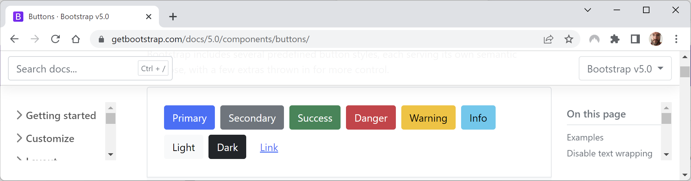
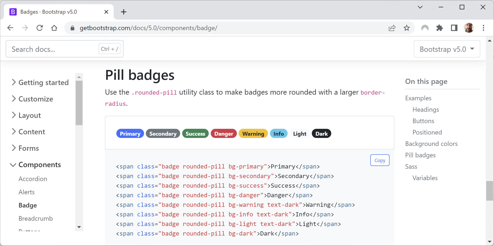

**Prototyping with Bootstrap**

- [Introduction to Bootstrap](#introduction-to-bootstrap)
- [Layouts with breakpoints and containers](#layouts-with-breakpoints-and-containers)
- [Rows and columns](#rows-and-columns)
- [Color themes](#color-themes)
- [Tables](#tables)
- [Buttons and links](#buttons-and-links)
- [Badges](#badges)
- [Alerts](#alerts)
- [Good practice for Bootstrap](#good-practice-for-bootstrap)

# Introduction to Bootstrap

Bootstrap is the world's most popular framework for building responsive, mobile-first websites. It combines CSS stylesheets with JavaScript libraries to implement its functionality. It is a good choice for prototyping a website user interface, although before going public you might want to hire a web designer to build a custom Bootstrap theme or replace it with a completely custom set of CSS stylesheets to give your website a distinct brand.

Bootstrap can be divided into four parts: Layout, Content, Components, and Utilities. You do not have to use Bootstrap for everything you do. You can use only the parts you need.

# Layouts with breakpoints and containers

The first thing to understand about Bootstrap is its predefined **breakpoints** which affect layout:
- X-Small (no inline suffix): <576px.
- Small (`sm`): >=576px.
- Medium (`md`): >=768px.
- Large (`lg`): >=992px.
- Extra large (`xl`): >=1200px.
- Extra extra large (`xxl`): >=1400px.

Containers are the foundation of the Bootstrap grid layout system. Imagine you have a `<div>` element that uses the Bootstrap container class, as shown in the following markup:
```html
<div class="container">
  Some content.
</div>
```

As you can see in the table below, when the width of the browser is less than 576 pixels wide, the `<div>` will stretch to fill 100% of the available width. When width of the browser is greater than or equal to 576 pixels, the width of the `<div>` becomes fixed at 540 pixels wide, until the width of browser is greater than or equal to 768 pixels, at which point the width of the `<div>` becomes fixed at 720 pixels wide. This repeats as the width of the browser increases; at each breakpoint, the fixed width of the `<div>` snaps to a larger value.

| |X-Small <576px|Small >=576px|Medium >=768|Large >=992px|Extra large >=1200px|XXL >=1400px|
|---|---|---|---|---|---|---|
|.container|100%|540px|720px|960px|1140px|1320px
|.container-sm|100%|540px|720px|960px|1140px|1320px
|.container-md|100%|100%|720px|960px|1140px|1320px
|.container-lg|100%|100%|100%|960px|1140px|1320px
|.container-xl|100%|100%|100%|100%|1140px|1320px
|.container-xxl|100%|100%|100%|100%|100%|1320px
|.container-fluid|100%|100%|100%|100%|100%|100%

Imagine that you now have a `<div>` element that uses the `container-lg` class, as shown in the following markup:
```html
<div class="container-lg">
  Some content.
</div>
```

As you can see in the table above, when the width of the browser is less than 992 pixels wide, the `<div>` will always take up 100% of the available browser width. At 992 pixels and above, the `<div>` width snaps to the breakpoints 960px, 1140px, and 1320px.

If you use the class `container-fluid`, the `<div>` always takes up 100% of the available width.

# Rows and columns

A Bootstrap container can be divided into rows and columns, for example, one row with three columns, as shown in the following markup:
```html
<div class="container">
  <div class="row">
    <div class="col">
      Column
    </div>
    <div class="col">
      Column
    </div>
    <div class="col">
      Column
    </div>
  </div>
</div>
```

If you use the `col` class, then each column will have equal width. But each row is also divided into 12 virtual columns. If you specify a number suffix between 1 and 12 then that column will use that number of twelfths and the others will divide the rest equally. For example, you could say the left column should use 2 twelfths, and right column should use 4 twelfths, and the middle column uses the rest, as shown in the following markup:
```html
<div class="container">
  <div class="row">
    <div class="col-2">
      Column
    </div>
    <div class="col">
      Column
    </div>
    <div class="col-4">
      Column
    </div>
  </div>
</div>
```

> The grid system is powerful but can get complicated quickly. To learn more, you can visit the following link: https://getbootstrap.com/docs/5.3/layout/grid/

# Color themes

Bootstrap has eight built-in color themes in addition to the default (black on white), as shown in the following list and *Figure 14B.1*:

- `primary`: Bright blue theme. For example, white text on a bright blue background, or bright blue text and outline on a white background.
- `secondary`: Gray theme. For example, white text on a gray background, or grey text and outline on a white background.
- `success`: Green theme. For example, white text on a dark green background, or dark green text and outline on a white background.
- `danger`: Red theme. For example, white text on a red background, or red text and outline on a white background.
- `warning`: Yellow theme. For example, black text on a yellow background, or yellow text and outline on a white background.
- `info`: Light blue theme. For example, black text on a light blue background, or light blue text and outline on a white background.
- `light`: Light gray theme. For example, black text on a light gray background, or light grey text and outline on a white background.
- `dark`: Dark gray theme. For example, white text on a dark gray background, or dark grey text and outline on a white background.


*Figure 14B.1: Bootstrap color themes*

# Tables

Bootstrap styles for tables are not automatically applied. You must opt-in by applying the table class. You can then apply additional style classes.

- `table`: Required to enable table styling.
- `table-primary`, `table-warning`, and so on: Alternative enabling of table styling with color theme.
- `table-sm`: To use half the default padding so the table is more compact.
- `table-striped`: Add zebra-striping to any table row within the `<tbody>`.
- `table-hover`: Enable a hover state to change highlights as the mouse moves over table rows within a `<tbody>`.
- `table-bordered`: Add a border on all sides of the table and its cells.

Let's see an example, as shown in the following markup:
```html
<table class="table table-striped table-hover table-bordered">
  <thead>
    <tr>
      <th>
      ...
  </thead>
  <tbody>
    <tr>
      <td>
      ...
  </tbody>
</table>
```

The contents in cells in `<thead>` align to the bottom by default. The contents in cells in `<tbody>` align to the top by default. Override these defaults and control other alignment by using the following classes:
- `align-top`: Align the contents of the row or cell to the top.
- `vertical-align-middle`: Align the contents of the row or cell to the middle vertically.
- `align-bottom`: Align the contents of the row or cell to the bottom.
- `align-left`: Align the contents of the row or cell to the left.
- `align-middle`: Align the contents of the row or cell to the middle horizontally.
- `align-right`: Align the contents of the row or cell to the right.

# Buttons and links

Bootstrap has button styles that can be applied to actual `<button>` and `<input type="button">` elements as well as hyperlinks, as shown in the following markup:
```html
<button class="btn btn-primary" type="button">Click Me</button>
<input class="btn btn-primary" type="button" value="Click Me">
<a class="btn btn-primary" href="#" role="button">Click Me</a>
```

All three elements above would look like a bright blue button with the label **Click Me**.

If you do not want the text in the button label to wrap, add the `text-nowrap` class.

Use `btn-outline-primary` (or any of the other color themes) to have more subtle styling that uses the color for the outline and text with a white background until the mouse hovers over the button.

You can adjust the size of the button by adding `btn-sm` to make it smaller or `btn-lg` to make it larger.

# Badges

Badges are used to show small pieces of information, like the number of unread messages. For example:
```html
<button type="button" class="btn btn-primary">
  Messages <span class="badge bg-secondary">4</span>
</button>
```

You can reposition the badge and use the `rounded-pill` class to turn the default rectangle badge into a circular one like most apps do, to show the number of unread notifications or messages inside a red circle:
```html
<button type="button" class="btn btn-primary position-relative">
  Messages
  <span class="position-absolute top-0 start-100 translate-middle 
        badge rounded-pill bg-danger">
    12 <span class="visually-hidden">unread messages</span>
  </span>
</button>
```

You can use a more rounded corner to turn a badge into a pill, as shown in the following markup and in *Figure 14B.2*:
```html
<span class="badge rounded-pill bg-primary">Primary</span>
<span class="badge rounded-pill bg-secondary">Secondary</span>
<span class="badge rounded-pill bg-success">Success</span>
<span class="badge rounded-pill bg-danger">Danger</span>
<span class="badge rounded-pill bg-warning text-dark">Warning</span>
<span class="badge rounded-pill bg-info text-dark">Info</span>
<span class="badge rounded-pill bg-light text-dark">Light</span>
<span class="badge rounded-pill bg-dark">Dark</span>
```


*Figure 14B.2: Pill badges using Bootstrap*

# Alerts

You will often need to show messages to website visitors. Alerts must use one of the eight color themes. Any links within the alert element should use the `alert-link` class. The contents can be plain text or use additional elements like headings, as shown in the following markup:
```html
<div class="alert alert-success" role="alert">
  <h4 class="alert-heading">Order was accepted.</h4>
  <p>To view the order, click <a href="#" class="alert-link">here</a>.</p>
</div>
```

> For more examples of alerts, for example, adding icons inside the alert, see the official documentation at the following link: https://getbootstrap.com/docs/5.3/components/alerts/#icons 

# Good practice for Bootstrap

Bootstrap is like Marmite. Some developers love it; some hate it.

Good reasons to use Bootstrap include:
- It saves time. 
- It is customizable.
- It is open-source.
- It is well documented officially and has lots of answers about it on sites like Stack Overflow.

But implementing Bootstrap without care has the following negatives:
- Your website will look generic.
- It is heavy compared to a hand-crafted solution.

> **Good Practice**: As well as defining your own styles, base your styles on a common library, such as Bootstrap, that implements responsive design. However, if you are building a website that needs a distinct identity or brand, make sure you use its theming support. Do not just accept the defaults.
