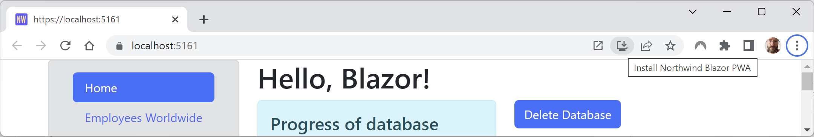
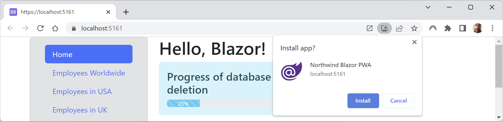
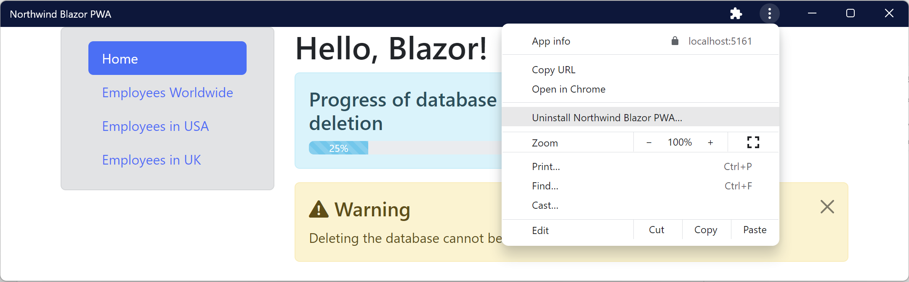
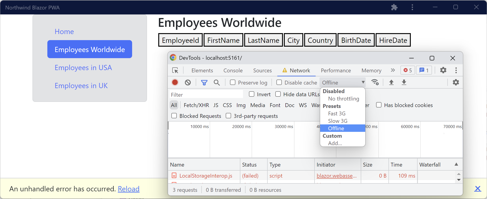
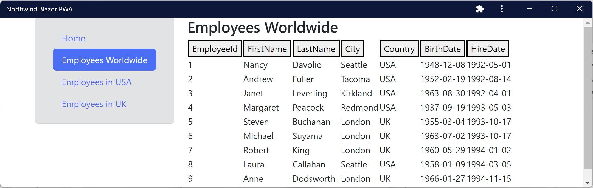

**Blazor Progressive Web Apps topics**

- [Understanding the browser compatibility analyzer for Blazor WebAssembly](#understanding-the-browser-compatibility-analyzer-for-blazor-webassembly)
- [Deployment choices for Blazor WebAssembly apps](#deployment-choices-for-blazor-webassembly-apps)

# Building Progressive Web Apps

**Progressive Web Apps (PWAs)** are SPAs that work like desktop apps. They can run in their own window instead of in a browser window, and then be started from the desktop or home screen on a mobile device. They automatically update in the background.

They are named “progressive” because they can first be used as a website, perhaps only once or rarely, and then be installed if the user finds they use it more frequently and want some of the benefits of a more integrated experience that works offline.

PWA support in Blazor projects means that the web app gains the following benefits:
- It acts as a normal web page until the visitor explicitly decides to progress to a full app experience, with better integrations with native platform features like notifications, full access to the filesystem, and so on.
- After the app is installed, it can be launched from the OS's start menu or desktop.
- It visually appears in its own app window instead of a browser tab.
- It works offline.
- It automatically updates.

When we created the project for this chapter, we chose the PWA option so the `Northwind.Blazor` project already has PWA support. Now let's review what effect that choice had on the projects and the capabilities the Blazor app has:
1.	In the `Northwind.Blazor` project, in the `wwwroot` folder, open the `manifest.json` file, and note that it is used to control things like the colors and icons used by the app, as shown in the following code:
```json
{
  "name": "Northwind.BlazorWasm",
  "short_name": "Northwind.BlazorWasm",
  "start_url": "./",
  "display": "standalone",
  "background_color": "#ffffff",
  "theme_color": "#03173d",
  "prefer_related_applications": false,
  "icons": [
    {
      "src": "icon-512.png",
      "type": "image/png",
      "sizes": "512x512"
    }
  ]
}
```

> You can learn more about the `manifest.json` file at the following link: https://developer.mozilla.org/en-US/docs/Web/Manifest.

2.	Change the name to `Northwind Blazor PWA` and the `short_name` to `Northwind PWA`. The name is used for window titles and the short name might be used to label the icon on the desktop or phone home screen.
3.	Start the `Northwind.Blazor` project using its `https` profile without debugging.
4.	Start Chrome and navigate to https://localhost:5151/.
5.	In Chrome, in the address bar on the right, click the icon with the tooltip **Install Northwind Blazor PWA**, as shown in *Figure 15B.1*:


*Figure 15B.1: Chrome button to install the Northwind Blazor PWA as an app*

6.	Click the **Install** button, as shown in *Figure 15B.2*:


*Figure 15B.2: Chrome dialog box to install the Northwind Blazor PWA as an app*

7.	The app immediately appears in its own window. Close the app window and close Chrome.
8.	Launch the **Northwind Blazor PWA** app from your Windows Start menu or macOS Launchpad and note that it has a full app experience. Search for `northwind` if it does not appear in the recent apps list.
9.	On the right of the title bar, click the three dots menu and note that you can uninstall the app, as shown in *Figure 15B.3*, but do not uninstall the app yet:

 
*Figure 15B.3: App menu with the option to uninstall*

10.	Navigate to **Developer Tools**. On Windows, you can press *F12* or *Ctrl* + *Shift* + *I*. On macOS, you can press *Cmd* + *Shift* + *I*.
11.	Select the **Network** tab and then, in the **Throttling** dropdown, select the **Offline** preset.
12.	In the left navigation menu, click **Home** and then click **Worldwide**, and note the failure to load any employees and the error message at the bottom of the app window, as shown in *Figure 15B.4*:

 
*Figure 15.15: Failure to load any employees when the network is offline*

13.	In **Developer Tools**, set **Throttling** back to **Disabled: No throttling**.
14.	Click the **Reload** link in the yellow error bar at the bottom of the app and note that functionality returns, as shown in *Figure 15B.5*:

 
*Figure 15.16: Employees are loaded successfully when back online*

15.	You could now uninstall the PWA app or just close it.

# Implementing offline support for PWAs

We could improve the experience by caching HTTP `GET` responses from the Web API service locally, storing new, modified, or deleted customers locally, and then synchronizing with the server later by making the stored HTTP requests once network connectivity is restored. But that takes a lot of effort to implement well, and often changes in the architecture and design of an app, so it is beyond the scope of the 2022 editions of my books. I do plan to add coverage of offline support in the third edition of my book, *Apps and Services with .NET 10*, planned to be published in November 2025, if enough readers tell me they want that.
