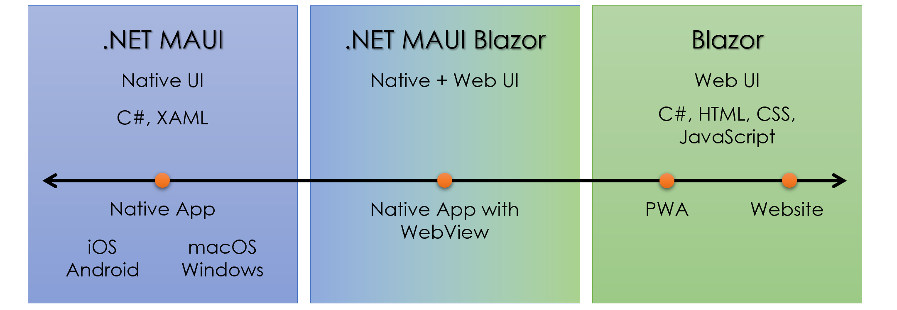
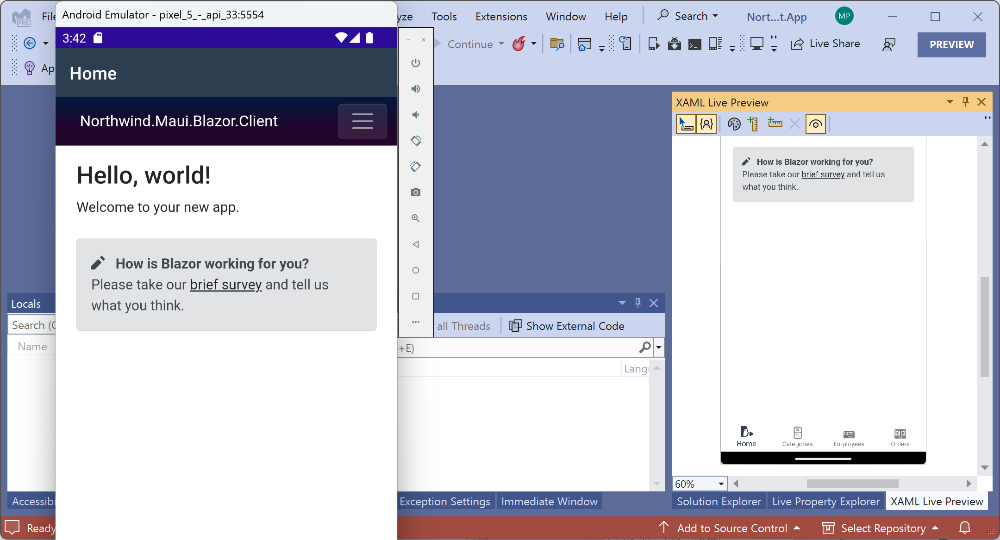
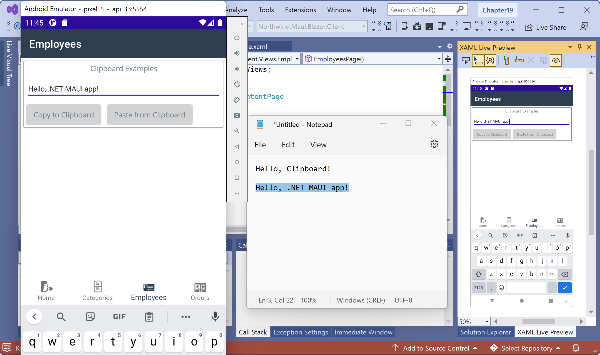

**Integrating .NET MAUI Apps with Blazor and Native Platforms**

This online-only section is about integrating .NET MAUI apps with Blazor components and native platform features to build hybrid apps that make the most of the operating system they run on.

In *Chapter 15, Building Web Components Using Blazor*, you saw how easy it is to create components using web user interface technologies, including HTML and CSS, and common user interface style libraries like Bootstrap.

In *Chapter 16, Building Mobile and Desktop Apps Using .NET MAUI*, you saw that .NET MAUI enables you to build cross-platform apps that work using native controls on each device and its operating system.

In this online-only section, you will see how to get the best of both those worlds by building .NET MAUI apps that host Blazor components and retain the ability to closely integrate with native features, including the look and feel.

By the end of this online-only section, you will be able to make sensible decisions about what technology to use for an app, from purely native using .NET MAUI with the user interface defined using XAML, to purely web using Blazor with the user interface defined, using HTML and CSS, as shown in *Figure 16B.1*:


*Figure 16B.1: A spectrum of choices for app development*

- [Building .NET MAUI Blazor Hybrid apps](#building-net-maui-blazor-hybrid-apps)
  - [Creating a .NET MAUI Blazor project](#creating-a-net-maui-blazor-project)
  - [Adding a shell and .NET MAUI pages](#adding-a-shell-and-net-maui-pages)
  - [Testing the MAUI views](#testing-the-maui-views)
- [Integrating with native platforms](#integrating-with-native-platforms)
  - [Working with the system clipboard](#working-with-the-system-clipboard)
  - [Picking files from the local filesystem](#picking-files-from-the-local-filesystem)
    - [Enabling media and file picking on Windows](#enabling-media-and-file-picking-on-windows)
- [Practicing and exploring](#practicing-and-exploring)
  - [Exercise 16B.1 – Test your knowledge](#exercise-16b1--test-your-knowledge)
  - [Exercise 16B.2 – Implement a carousel for categories](#exercise-16b2--implement-a-carousel-for-categories)
  - [Exercise 16B.3 – Explore code samples](#exercise-16b3--explore-code-samples)
- [Summary](#summary)


# Building .NET MAUI Blazor Hybrid apps

In *Chapter 16, Building Mobile and Desktop Apps Using .NET MAUI*, you learned how to build .NET MAUI apps with native controls. By native, I mean the controls provided by the operating system. So, when Apple updates the look and feel of iOS, your apps will update too because .NET MAUI uses those native controls. Supported operating systems and their native control libraries are shown in the following list:

- Windows: Windows App SDK, and WinUI 3
- macOS: Catalyst, UIKit, and AppKit
- iOS: UIKit, ARKit, AVKit, CarPlay, and so on
- Android: android.widget and AndroidX libraries

In this section, you will learn how to build a hybrid app that combines the best of .NET MAUI app capabilities with the best of Blazor web components. This means you are not limited to building a user interface using .NET MAUI controls that use native OS capabilities. You can also leverage all the great component libraries for Blazor and simpler web user interfaces. But you still get all the benefits of close native integrations with platform features like geolocation, sensors, access to the local filesystem, notifications, and so on.

## Creating a .NET MAUI Blazor project

We will now create a project for a cross-platform mobile and desktop app that can have Blazor components embedded in it. We will use the project template that enables mixing .NET MAUI controls
and Blazor components in the same project.

Let’s go!

1. In Visual Studio 2022 for Windows, add a new project, as defined in the following list:
- Project template: **.NET MAUI Blazor App** / `maui-blazor`
- Workspace/solution file and folder: `Chapter16`
- Project file and folder: `Northwind.Maui.Blazor.Client`

2. In the `Resources` folder, in the `Images` folder, add images for some icons that we will use for tab items in the navigation we are about to add.

> You can download the images from the GitHub repository at the following link: https://github.com/markjprice/apps-services-net8/tree/main/code/Chapter18/Northwind.Maui.Blazor.Client/Resources/Images

3. In the `Northwind.Maui.Blazor.Client` project, in `MauiProgram.cs`, note the extra statements compared to the equivalent project template for just .NET MAUI. The statements enable embedding Blazor components by adding support for a web view and registering a local weather
service, as shown in the following code:
```cs
using Microsoft.Extensions.Logging;
using Northwind.Maui.Blazor.Client.Data;

namespace Northwind.Maui.Blazor.Client;

public static class MauiProgram
{
  public static MauiApp CreateMauiApp()
  {
    var builder = MauiApp.CreateBuilder();

    builder
      .UseMauiApp<App>()
      .ConfigureFonts(fonts =>
      {
        fonts.AddFont("OpenSans-Regular.ttf", "OpenSansRegular");
      });

    builder.Services.AddMauiBlazorWebView();

    #if DEBUG
    builder.Services.AddBlazorWebViewDeveloperTools();
    builder.Logging.AddDebug();
    #endif

    builder.Services.AddSingleton<WeatherForecastService>();

    return builder.Build();
  }
}
```

## Adding a shell and .NET MAUI pages

By default, the .NET MAUI Blazor project template assumes only Blazor will be used for the user interface, but we want a mix of MAUI and Blazor, so immediately after creating the project, we will add
a shell and four page views and configure a tab bar for navigation between those pages.

We will add a `Views` folder to keep the .NET MAUI pages separate from the Razor files used by Blazor, which are stored in the `Pages` folder by default. We will also create subfolders for each .NET MAUI page with all the files needed for that page, including models and view models. The .NET MAUI page views will be assigned to the project Views namespace to make them easier to reference in the shell.

Let’s go:

1. In the `Northwind.Maui.Blazor.Client` project, add a new folder named `Views`.
2. In the `Views` folder, create new subfolders named `Categories`, `Employees`, `Home`, and `Orders`.

> Although we have created subfolders for each view for organizational purposes, we want all views to be in the same namespace for namespace import purposes, so we will do that manually for each view we define.

3. In the `Views/Categories` folder, add a new **.NET MAUI ContentPage (XAML)** project item named `CategoriesPage.xaml`.
4. In `CategoriesPage.xaml`, modify the `x:Class` attribute so that the class that is automatically generated from the XAML will be in the Views namespace rather than the subfolder `Views.Categories` namespace, as shown highlighted in the following markup:
```xml
<ContentPage xmlns="http://schemas.microsoft.com/dotnet/2021/maui"
xmlns:x="http://schemas.microsoft.com/winfx/2009/xaml"
x:Class="Northwind.Maui.Blazor.Client.Views.CategoriesPage"
```

5. In `CategoriesPage.xaml.cs`, modify the namespace, as shown in the following code:
```cs
namespace Northwind.Maui.Blazor.Client.Views;
```

6. In the `Views/Categories` folder, add a new **.NET MAUI ContentPage (XAML)** project item named `CategoryPage.xaml`, and repeat the namespace changes on the markup and code-behind files. This page view will be used to show a single category for editing purposes.
1. In the `Views/Employees` folder, add a new **.NET MAUI ContentPage (XAML)** project item named `EmployeesPage.xaml`, and repeat the namespace changes on the markup and code-behind files.
1. In the `Views/Orders` folder, add a new **.NET MAUI ContentPage (XAML)** project item named `OrdersPage.xaml`, and repeat the namespace changes on the markup and code-behind files.
1. Move the `MainPage.xaml` file from the project folder to the `Views/Home` folder, and then make the appropriate namespace changes to the markup and code-behind files.
1.  In `MainPage.xaml`, set the `Title` to `Home`, as shown highlighted in the following markup:
```xml
<?xml version="1.0" encoding="utf-8" ?>
<ContentPage xmlns="http://schemas.microsoft.com/dotnet/2021/maui"
             xmlns:x="http://schemas.microsoft.com/winfx/2009/xaml"
             xmlns:local="clr-namespace:Northwind.Maui.Blazor.Client"
             x:Class="Northwind.Maui.Blazor.Client.Views.MainPage"
             Title="Home"
             BackgroundColor="{DynamicResource PageBackgroundColor}">
  <BlazorWebView x:Name="blazorWebView" HostPage="wwwroot/index.html">
    <BlazorWebView.RootComponents>
      <RootComponent Selector="#app" ComponentType="{x:Type local:Main}" />
    </BlazorWebView.RootComponents>
  </BlazorWebView>
</ContentPage>
```

11.  In the project folder, add a new **.NET MAUI ContentPage (XAML)** project item named `AppShell.xaml`.
12.  In `AppShell.xaml`:
 - Delete the `<VerticalStackLayout>` element.
 - Change the root element to `<Shell>` and delete the title.
 - Import the project `Views` namespace using the `views` prefix.
 - Add a `<TabBar>` element with some `<Tab>` items and shell content for the main, categories, employees, and orders pages, as shown in the following markup:
```xml
<?xml version="1.0" encoding="UTF-8" ?>
<Shell xmlns="http://schemas.microsoft.com/dotnet/2021/maui"
       xmlns:x="http://schemas.microsoft.com/winfx/2009/xaml"
       x:Class="Northwind.Maui.Blazor.Client.AppShell"
       xmlns:views="clr-namespace:Northwind.Maui.Blazor.Client.Views">
  <TabBar>
    <Tab Title="Home" Icon="wind_face_high_contrast.svg">
      <ShellContent Route="home"
        ContentTemplate="{DataTemplate views:MainPage}" />
    </Tab>
    <Tab Title="Categories" Icon="file_cabinet_high_contrast.svg">
      <ShellContent Route="categories"
        ContentTemplate="{DataTemplate views:CategoriesPage}" />
    </Tab>
    <Tab Title="Employees" Icon="identification_card_high_contrast.svg">
      <ShellContent Route="employees"
        ContentTemplate="{DataTemplate views:EmployeesPage}" />
    </Tab>
    <Tab Title="Orders" Icon="euro_banknote_high_contrast.svg">
      <ShellContent Route="orders"
        ContentTemplate="{DataTemplate views:OrdersPage}" />
    </Tab>
  </TabBar>
</Shell>
```

13.  In `AppShell.xaml.cs`, change the class to inherit from `ContentPage` to `Shell`, as shown highlighted in the following code:
```cs
public partial class AppShell : Shell
```

14.  In **Solution Explorer**, expand `App.xaml`, open `App.xaml.cs`, and change the main page property to an instance of the `AppShell` class, as shown in the following code:
```cs
MainPage = new AppShell();
```

## Testing the MAUI views

Now we can make sure that the .NET MAUI views and navigation work correctly:

1. To the right of the **Run** button in the toolbar, set the **Framework** to **net8.0-android**, and select the **Pixel 5 - API 33 (Android 13.0 - API 33)** emulator image.
1. Click the **Run** button in the toolbar and wait for the device emulator to start the Android operating system and launch your mobile app.
2. In the app, note the title bar labeled **Home** at the top and the tab bar at the bottom that has four labeled icons provided by the .NET MAUI native controls. The **Home** page titled **Northwind.Maui.Blazor.Client** with its hamburger menu has a web user interface provided by Blazor, and a tab bar at the bottom with four icons visible in the **XAML Live Preview** in Visual Studio 2022, as shown in *Figure 16B.2*:


*Figure 16B.2: The app with a main page UI built with Blazor running on Android*

4. In the Blazor hamburger menu, click **Counter**.
2. On the **Counter** page, click the **Click me** button to increment the counter three times.
3. In the Blazor hamburger menu, click **Fetch data** and note the table of weather forecasts.
4. Click the icons in the bottom tab bar to navigate to the other blank MAUI views.
5. Close the Android device emulator.
6. In Visual Studio 2022, to the right of the **Run** button in the toolbar, select **Windows Machine**.
7.  Make sure that the **Debug** configuration is selected and then click the green triangle start button labeled **Windows Machine**.
1.  After a few moments, note that the Windows app appears, with the tab bar at the top of the window instead of at the bottom, showing text labels instead of icons.
1.  Navigate to the **Counter** page.
2.  On the **Counter** page, click the **Click me** button to increment the counter three times.
3.  In the Blazor hamburger menu, click **Fetch data** and note the table of weather forecasts.
4.  Click the text labels like **Categories** and **Employees** in the top tab bar to navigate to the other blank MAUI views.
1.  Close the Windows app.

You could now replace the **Counter** or **Fetch data** Razor components with any of your own Blazor components, which you learned how to build in *Chapter 15, Building Web Components Using Blazor WebAssembly*.

# Integrating with native platforms

.NET MAUI provides cross-platform APIs for native device features. Examples include:
- Working with the system clipboard
- Picking files and media from the local filesystem
- Storing data securely in a local dictionary for key-value storage
- Getting information about the device like the operating system version
- Reading sensors like an accelerometer or compass
- Checking network connectivity
- Using native user interface interactions like menu systems and toast notifications

Let’s look at example code for some of these native platform integrations.

## Working with the system clipboard

You often need to integrate your app with the clipboard on the local device. For example, a user might have a description of a category in another app like a word processor or notes app. While editing a
category, they might want to copy and paste the description from that other app. The clipboard integration only works with text.

Let’s enable integration with the clipboard:

1. In the `Views/Employees` folder, in `EmployeesPage.xaml`, change the title, set the vertical spacing in the stack to `10`, and replace the existing label element with a frame, an entry, and a pair of buttons to copy and paste to and from the box whatever text is currently in the clipboard, as shown highlighted in the following markup:
```xml
<?xml version="1.0" encoding="utf-8" ?>
<ContentPage xmlns="http://schemas.microsoft.com/dotnet/2021/maui"
             xmlns:x="http://schemas.microsoft.com/winfx/2009/xaml"
             x:Class="Northwind.Maui.Blazor.Client.Views.EmployeesPage"
             Title="Employees">
  <VerticalStackLayout Spacing="10">
    <Frame BorderColor="{StaticResource PrimaryTextColor}"
           Margin="5" Padding="5">
      <VerticalStackLayout Spacing="10">
        <Label Text="Clipboard Examples"
               VerticalOptions="Center"
               HorizontalOptions="Center" />
        <Entry x:Name="NotesTextBox"
               HorizontalOptions="Fill" />
        <HorizontalStackLayout Spacing="10">
          <Button Text="Copy to Clipboard"Chapter 18 9
                  x:Name="CopyToClipboardButton"
                  Clicked="CopyToClipboardButton_Clicked"
                  HorizontalOptions="Center" />
          <Button Text="Paste from Clipboard"
                  x:Name="PasteFromClipboardButton"
                  Clicked="PasteFromClipboardButton_Clicked"
                  HorizontalOptions="Center" />
        </HorizontalStackayout>
      </VerticalStackLayout>
    </Frame>
  </VerticalStackLayout>
</ContentPage>
```

2. In `EmployeesPage.xaml.cs`, add statements to the event handlers to call the default clipboard methods for setting and getting text, as shown highlighted in the following code:
```cs
namespace Northwind.Maui.Blazor.Client.Views;

public partial class EmployeesPage : ContentPage
{
  public EmployeesPage()
  {
    InitializeComponent();
  }

  private async void CopyToClipboardButton_Clicked(
    object sender, EventArgs e)
  {
    await Clipboard.Default.SetTextAsync(NotesTextBox.Text);
  }

  private async void PasteFromClipboardButton_Clicked(
    object sender, EventArgs e)
  {
    if (Clipboard.HasText)
    {
      NotesTextBox.Text = await Clipboard.Default.GetTextAsync();
    }
  }
}
```

3. Start the project in the Android emulator.
2. Navigate to the **Employees** page.
3. Enter some text into the entry box, for example, `Hello, Clipboard!`.
4. Click the **Copy to Clipboard** button.
5. Start Notepad on Windows. (The Android emulator integrates automatically with the Windows clipboard.)
1. Paste, and note the text is whatever you typed into the entry box.
2. Type some new text into Notepad, for example, `Hello, .NET MAUI app!`, and then select it and copy it to the clipboard.
1.  In the app, click the **Paste from Clipboard** button and note that the correct text appears in the entry box, as shown in Figure 16B.3:


*Figure 16B.3: Pasting from the system clipboard on Android*

1.  Close the Android emulator.
2.  Repeat this test of the app on a Windows machine and note that it has the same functionality.

## Picking files from the local filesystem

You often need to allow the app user to access the local filesystem on their device to select a file, for example, a photo that they have taken.

To access the media and file picker functionality in a .NET MAUI app, platform-specific configuration is required.

### Enabling media and file picking on Windows

To enable media and file picking on Windows:
1. In the Platforms/Windows folder, open Package.appxmanifest.
2. In Package.appxmanifest, add entries to the <Capabilities> section, as shown highlighted
in the following markup:
<Capabilities>
<rescap:Capability Name="runFullTrust" />
<DeviceCapability Name="microphone"/>
<DeviceCapability Name="webcam"/>
</Capabilities>
Enabling media and file picking on Android
To enable media and file picking on Android:
1. In the Platforms/Android folder, open AndroidManifest.xml.
2. In AndroidManifest.xml, add <uses-permission> entries in the <manifest> node, as shown
in the following markup:
<uses-permission android:name="android.permission
.MANAGE_EXTERNAL_STORAGE" />
<uses-permission android:name="android.permission
.READ_EXTERNAL_STORAGE" />
<uses-permission android:name="android.permission
.WRITE_EXTERNAL_STORAGE" />
<uses-permission android:name="android.permission.MANAGE_MEDIA" />
<uses-permission android:name="android.permission.CAMERA" />
1. For Android 11 with API 30 or later, you must also add an intent for image capture, as shown
in the following markup:
<queries>
<intent>
<action android:name="android.media.action.IMAGE_CAPTURE" />
</intent>
</queries>
By default, Visual Studio 2022 opens a graphical editor for the Package.appxmanifest
file in which you can check the boxes for Microphone and Webcam. To modify the XML
directly, you must choose to open the file with the XML (Text) Editor.12 Integrating .NET MAUI Apps with Blazor and Native Platforms
Enabling media and file picking on iOS
To enable media and file picking on iOS:
1. In the Platforms/iOS folder, open Info.plist.
2. In Info.plist, add keys and values to the root <dict> element, as shown in the following
markup:
<key>NSCameraUsageDescription</key>
<string>This app needs access to the camera to take photos.</string>
<key>NSMicrophoneUsageDescription</key>
<string>This app needs access to the microphone for taking videos.</
string>
<key>NSPhotoLibraryAddUsageDescription</key>
<string>This app needs access to the photo gallery for adding photos and
videos.</string>
<key>NSPhotoLibraryUsageDescription</key>
<string>This app needs access to the photos gallery for picking photos
and videos.</string>
Integrating with the media and file picker
Let’s enable the user to select a new image for a category:
1. In the Views/Employees folder, in EmployeesPage.xaml, after the existing frame element,
add another frame, a label, an image, and a pair of buttons to pick a text file or an image file
and show them in the label or image control, as shown highlighted in the following markup:
<?xml version="1.0" encoding="utf-8" ?>
<ContentPage ...
Title="Employees">
<VerticalStackLayout Spacing="10">
...
<Frame BorderColor="{StaticResource PrimaryTextColor}"
Margin="5" Padding="5">
<VerticalStackLayout Spacing="10">
<Label Text="Picker Examples"
VerticalOptions="Center"
By default, Visual Studio 2022 opens a graphical editor for the Info.plist file. To modify
the XML directly, you must choose to open the file with the XML (Text) Editor.Chapter 18 13
HorizontalOptions="Center" />
<HorizontalStackLayout Spacing="10">
<Button Text="Pick Text File"
x:Name="PickTextFileButton"
Clicked="PickTextFileButton_Clicked"
HorizontalOptions="Center" />
<Button Text="Pick Image"
x:Name="PickImageButton"
Clicked="PickImageButton_Clicked"
HorizontalOptions="Center" />
<Button Text="Take a Photo"
x:Name="TakePhotoButton"
Clicked="TakePhotoButton_Clicked"
HorizontalOptions="Center" />
</HorizontalStackLayout>
<Label x:Name="FilePathLabel"
HorizontalOptions="Fill" />
<Label x:Name="FileContentsLabel"
HorizontalOptions="Fill" />
<Image x:Name="FileImage"
HeightRequest="375"
WidthRequest="250"/>
</VerticalStackLayout>
</Frame>
</VerticalStackLayout>
</ContentPage>
1. In EmployeesPage.xaml.cs, add statements to the event handlers. When the user clicks the
Pick Text File button, use the default file picker with a list of file types to define plain text for
each platform, and then read the file into the label. When the user clicks the Pick Image button, use the default media picker to read an image file and then load it into the image control.
When the user clicks the Take a Photo button, use the default media picker to capture a photo
and then load it into the image control, as shown in the following partial code:
namespace Northwind.Maui.Blazor.Client.Views;
public partial class EmployeesPage : ContentPage
{
...14 Integrating .NET MAUI Apps with Blazor and Native Platforms
private async void PickTextFileButton_Clicked(object sender,
EventArgs e)
{
try
{
FilePickerFileType textFileTypes = new(
new Dictionary<DevicePlatform, IEnumerable<string>>
{
{ DevicePlatform.iOS, new[] { "public.plain-text" } },
{ DevicePlatform.Android, new[] { "text/plain" } },
{ DevicePlatform.WinUI, new[] { ".txt" } },
{ DevicePlatform.Tizen, new[] { "*/*" } },
{ DevicePlatform.macOS, new[] { "txt" } }
});
PickOptions options = new()
{
PickerTitle = "Pick a text file",
FileTypes = textFileTypes
};
FileResult result = await FilePicker.Default.PickAsync(options);
if (result != null)
{
await using var stream = await result.OpenReadAsync();
FileContentsLabel.Text = new StreamReader(stream).ReadToEnd();
}
FilePathLabel.Text = result.FullPath;
}
catch (Exception ex)
{
await DisplayAlert(title: "Exception",
message: ex.Message, cancel: "OK");
}
}
private async void PickImageButton_Clicked(object sender, EventArgs e)
{
FileResult photo = await MediaPicker.Default.PickPhotoAsync();Chapter 18 15
if (photo != null)
{
FileImage.Source = ImageSource.FromFile(photo.FullPath);
FilePathLabel.Text = photo.FullPath;
}
else
{
await DisplayAlert(title: "Exception",
message: "Photo was null.", cancel: "OK");
}
}
private async void TakePhotoButton_Clicked(object sender, EventArgs e)
{
if (MediaPicker.Default.IsCaptureSupported)
{
FileResult photo = await MediaPicker.Default.CapturePhotoAsync();
if (photo != null)
{
FileImage.Source = ImageSource.FromFile(photo.FullPath);
FilePathLabel.Text = photo.FullPath;
}
else
{
await DisplayAlert(title: "Exception",
message: "Photo was null.", cancel: "OK");
}
}
else
{
await DisplayAlert(title: "Sorry",
message: "Image capture is not supported on this device.",
cancel: "OK");
}
}
}16 Integrating .NET MAUI Apps with Blazor and Native Platforms
1. Start the project in the Android emulator.
2. In the .NET MAUI app, navigate to the Employees page.
3. In the emulator, start the Chrome browser.
4. Navigate to https://raw.githubusercontent.com/markjprice/apps-services-net8/main/
docs/sample.txt.
1. Download the sample.txt file. In Chrome for Android, you can click the dots menu and then
click the down-pointing arrow in the mini toolbar.
1. Switch back to the .NET MAUI app.
2. Tap Pick Text File.
3.  Select the sample.txt file, and note that the local path to the file and its contents are displayed
in the two labels, as shown in Figure 18.4:
Figure 18.4: Showing the file path and contents for a picked text file
1.  Switch to the Chrome browser.
2.  Navigate to https://github.com/markjprice/apps-services-net8/blob/main/images/
Categories-small/categories-small.jpeg.
1.  Download the small image of categories, as shown in Figure 18.5:Chapter 18 17
Figure 18.5: Downloading an image of categories in the Android emulator
1.  When the notification appears indicating the image has downloaded, tap it to view it. This will
add the image to the most recent list of images.
1.  Tap Pick Image and select the small picture of categories from the list of recent images, as
shown in Figure 18.6:
Figure 18.6: The native image picker on Android18 Integrating .NET MAUI Apps with Blazor and Native Platforms
1.  The image is shown at the bottom of the app, as shown in Figure 18.7:
Figure 18.7: The selected image visible in the .NET MAUI app
1.  Tap Take a Photo and note the permission request.
2.  Close the app.
Creating new windows
The defining characteristic of the Windows operating system is... windows!
The old Xamarin.Forms technology did not support creating windows because mobile device operating systems do not support windows. But .NET MAUI can target desktop operating systems, so .NET
MAUI adds the capability of creating a new window.
Let’s go!
1. In the Views\Orders folder, in OrdersPage.xaml, change the title, set the spacing in the vertical
stack to 10, and then replace the existing label with a frame containing a label and button, as
shown highlighted in the following markup:
<?xml version="1.0" encoding="utf-8" ?>
<ContentPage xmlns="http://schemas.microsoft.com/dotnet/2021/maui"
xmlns:x="http://schemas.microsoft.com/winfx/2009/xaml"
x:Class="Northwind.Maui.Blazor.Client.Views.OrdersPage"
Title="Orders">
<VerticalStackLayout Spacing="10">
<Frame BorderColor="{StaticResource PrimaryTextColor}"
Margin="5" Padding="5">
<VerticalStackLayout Spacing="10">Chapter 18 19
<Label Text="Windowing"
VerticalOptions="Center"
HorizontalOptions="Center" />
<Button Text="New Window" x:Name="NewWindowButton"
Clicked="NewWindowButton_Clicked"
HorizontalOptions="Center" />
</VerticalStackLayout>
</Frame>
</VerticalStackLayout>
</ContentPage>
1. In OrdersPage.xaml.cs, add a handler for the button event that creates a new window with a
starting page that is a new instance of AppShell and opens it, as shown in the following code:
private void NewWindowButton_Clicked(object sender, EventArgs e)
{
Window window = new() { Page = new AppShell() };
Application.Current.OpenWindow(window);
}
1. Start the app on Windows Machine.
2. Navigate to the Orders page, click the New Window button, and note that a new window appears.
3. Close the new window and then close the Windows app.
Getting device information
You often need to get information about the device that the app is running on, including about network
connectivity and sensor readings.
Adding device information to the app
Let’s show some useful information about the device:
1. In the Platforms/Android folder, to AndroidManifest.xml, add an entry to say this app uses
battery statistics, as shown in the following code:
<uses-permission android:name="android.permission.BATTERY_STATS" />
Mobile devices do not support windows. For example, if you click the New Window button on an Android device, it will close and restart the app. It would be better to disable
this button on mobile devices using the following markup: IsEnabled="{OnPlatform
False, WinUI=True}".20 Integrating .NET MAUI Apps with Blazor and Native Platforms
To get information about the battery on Windows or iOS, you do not need to ask for permission,
but on Android you must notify the user that you will use that permission.
1. In the Views/Orders folder, add a new class named DeviceInfoViewModel.cs, and define some
properties to bind to, as shown in the following code:
namespace Northwind.Maui.Blazor.Client.Views.Orders;
internal class DeviceInfoViewModel
{
public string DisplayPixelWidth =>
$"{DeviceDisplay.Current.MainDisplayInfo.Width} pixel width";
public string DisplayDensity =>
$"{DeviceDisplay.Current.MainDisplayInfo.Density} pixel density";
public string DisplayOrientation =>
$"Orientation is {DeviceDisplay.Current.MainDisplayInfo.
Orientation}";
public string DisplayRotation =>
$"Rotation is {DeviceDisplay.Current.MainDisplayInfo.Rotation}";
public string DisplayRefreshRate =>
$"{DeviceDisplay.Current.MainDisplayInfo.RefreshRate} Hz refresh
rate";
public string DeviceModel => DeviceInfo.Current.Model;
public string DeviceType =>
$"{DeviceInfo.Current.DeviceType} {DeviceInfo.Current.Idiom} device";
public string DeviceVersion => DeviceInfo.Current.VersionString;
public string DevicePlatform =>
$"Platform is {DeviceInfo.Current.Platform}";
}
1. In OrdersPage.xaml, instantiate the class to bind to, as shown highlighted in the following
markup:
<?xml version="1.0" encoding="utf-8" ?>
<ContentPage xmlns="http://schemas.microsoft.com/dotnet/2021/maui"Chapter 18 21
xmlns:x="http://schemas.microsoft.com/winfx/2009/xaml"
xmlns:orders=
"clr-namespace:Northwind.Maui
.Blazor.Client.Views.Orders"
x:Class="Northwind.Maui.Blazor.Client.Views.OrdersPage"
Title="Orders">
<ContentPage.BindingContext>
<orders:DeviceInfoViewModel />
</ContentPage.BindingContext>
1. In OrdersPage.xaml, add markup in the ContentPage element below the existing frame to
define a frame for showing device information, as shown in the following markup:
<Frame BorderColor="{StaticResource PrimaryTextColor}"
Margin="5" Padding="5">
<VerticalStackLayout Spacing="10">
<Label Text="Device Information"
VerticalOptions="Center"
HorizontalOptions="Center" />
<HorizontalStackLayout Spacing="20">
<Label Text="Listen to battery events"
VerticalOptions="Center" />
<Switch Toggled="BatterySwitch_Toggled"
x:Name="BatterySwitch"
VerticalOptions="Center"/>
</HorizontalStackLayout>
<Label x:Name="BatteryStateLabel" />
<Label x:Name="BatteryLevelLabel" />
<Label Text="{Binding DeviceModel}" />
<Label Text="{Binding DeviceType}" />
<Label Text="{Binding DevicePlatform}" />
<Label Text="{Binding DeviceVersion}" />
<Label Text="{Binding DisplayOrientation}" />
<Label Text="{Binding DisplayRotation}" />
<Label Text="{Binding DisplayDensity}" />
<Label Text="{Binding DisplayPixelWidth}" />
<Label Text="{Binding DisplayRefreshRate}" />
</VerticalStackLayout>
</Frame>22 Integrating .NET MAUI Apps with Blazor and Native Platforms
1. In OrdersPage.xaml.cs, add an event handler for when the battery information has changed
and call it in the constructor so that the page immediately shows the information when it first
loads, as shown highlighted in the following code:
namespace Northwind.Maui.Blazor.Client.Views;
public partial class OrdersPage : ContentPage
{
public OrdersPage()
{
InitializeComponent();
UpdateBatteryInfo(Battery.Default);
}
private void NewWindowButton_Clicked(object sender, EventArgs e)
{
Window window = new() { Page = new AppShell() };
Application.Current.OpenWindow(window);
}
private void Battery_BatteryInfoChanged(object sender,
BatteryInfoChangedEventArgs e)
{
UpdateBatteryInfo(Battery.Default);
}
private void UpdateBatteryInfo(IBattery battery)
{
BatteryStateLabel.Text = battery.State switch
{
BatteryState.Charging => "Battery is currently charging",
BatteryState.Discharging =>Chapter 18 23
"Charger is not connected and the battery is discharging",
BatteryState.Full => "Battery is full",
BatteryState.NotCharging => "The battery isn't charging.",
BatteryState.NotPresent => "Battery is not available.",
BatteryState.Unknown => "Battery is unknown",
_ => "Battery is unknown"
};
BatteryLevelLabel.Text =
$"Battery is {battery.ChargeLevel * 100}% charged.";
}
private void BatterySwitch_Toggled(object sender,
ToggledEventArgs e) =>
WatchBattery(Battery.Default);
private bool _isBatteryWatched;
private void WatchBattery(IBattery battery)
{
if (!_isBatteryWatched)
{
battery.BatteryInfoChanged += Battery_BatteryInfoChanged;
}
else
{
battery.BatteryInfoChanged -= Battery_BatteryInfoChanged;
}
_isBatteryWatched = !_isBatteryWatched;
}
}
1. Start the app on Windows Machine.24 Integrating .NET MAUI Apps with Blazor and Native Platforms
2. Navigate to the Orders page, switch on listening for battery events, unplug your laptop charger
cable (if you have a laptop; do not unplug a desktop computer!), and note the battery information and other device information, as shown in Figure 18.8:
Figure 18.8: Showing the battery and device information on a Windows 11 laptop
On a desktop computer, the battery information will show Battery is not available.
1. Close the Windows app.
2. Start the app on the Android emulator.
3.  Navigate to the Orders page, switch on listening for battery events, click the more (three dots)
menu in the emulator toolbar, select Battery in the Extended Controls dialog box, and then
change the settings, including Battery status. Note the battery information updates in the .NET
MAUI app, as shown in Figure 18.9:Chapter 18 25
Figure 18.9: Showing battery and device information on an emulated Android device
1.  Close the app.
Integrating with desktop menu bars
For desktop operating systems, users will expect menu bars to access functionality. We will implement
this functionality using both traditional events and relay commands to see the difference.
Let’s add a small menu bar to the app for use on Windows:
1. In the Northwind.Maui.Blazor.Client.csproj project file, add package references for the
two community toolkits to the existing <ItemGroup> for packages, as shown highlighted in
the following markup:
<ItemGroup>
<PackageReference Include="Microsoft.Maui.Controls"
Version="$(MauiVersion)" />
<PackageReference Include="Microsoft.Maui.Controls.Compatibility"
Version="$(MauiVersion)" />
<PackageReference Include="Microsoft.Extensions.Logging.Debug"
Version="8.0.0" />
<PackageReference Include="CommunityToolkit.Mvvm" Version="8.2.2" />
<PackageReference Include="CommunityToolkit.Maui" Version="6.0.0" />
</ItemGroup>26 Integrating .NET MAUI Apps with Blazor and Native Platforms
1. Build the project to restore packages and note the following warning message:
MCT001 `.UseMauiCommunityToolkit()` must be chained to `.UseMauiApp<T>()`
1. In MauiProgram.cs, import the namespace for the .NET MAUI Community Toolkit, as shown
in the following code:
using CommunityToolkit.Maui; // To use UseMauiCommunityToolkit method.
1. In MauiProgram.cs, add a call to use the .NET MAUI Community Toolkit, as shown highlighted
in the following code:
builder
.UseMauiApp<App>()
.UseMauiCommunityToolkit()
.ConfigureFonts(fonts =>
{
fonts.AddFont("OpenSans-Regular.ttf", "OpenSansRegular");
fonts.AddFont("OpenSans-Semibold.ttf", "OpenSansSemibold");
});
1. In the Views\Orders folder, in DeviceInfoViewModel.cs, import the namespaces for working
with MVVM observable objects and defining relay commands, as shown in the following code:
using CommunityToolkit.Mvvm.ComponentModel; // To use ObservableObject.
using CommunityToolkit.Mvvm.Input; // To use [RelayCommand].
1. In DeviceInfoViewModel.cs, make the class a partial observable object, as shown highlighted
in the following code:
internal partial class DeviceInfoViewModel : ObservableObject
1. In DeviceInfoViewModel.cs, add statements to define a command to navigate between pages,
as shown in the following code:
[RelayCommand]
private async Task NavigateToAsync(string pageName)
{
await Shell.Current.GoToAsync($"//{pageName}");
}Chapter 18 27
1. In OrdersPage.xaml.cs, add statements to define an event handler to navigate between pages,
as shown in the following code:
private async void Menu_Clicked(object sender, EventArgs e)
{
MenuFlyoutItem menu = sender as MenuFlyoutItem;
if (menu != null)
{
await Shell.Current.GoToAsync($"//{menu.CommandParameter}");
}
}
1. In OrdersPage.xaml, after the binding context, add markup in the ContentPage element to
define a menu bar, as shown highlighted in the following markup:
<ContentPage.BindingContext>
<orders:DeviceInfoViewModel />
</ContentPage.BindingContext>
<ContentPage.MenuBarItems>
<MenuBarItem Text="File">
<MenuFlyoutItem Text="Exit" />
</MenuBarItem>
<MenuBarItem Text="View">
<MenuFlyoutItem Text="Home" Clicked="Menu_Clicked"
Command="{Binding NavigateToCommand}"
CommandParameter="home" />
<MenuFlyoutItem Text="Categories" Clicked="Menu_Clicked"
Command="{Binding NavigateToCommand}"
CommandParameter="categories" />
<MenuFlyoutItem Text="Employees" Clicked="Menu_Clicked"
Command="{Binding NavigateToCommand}"
CommandParameter="employees" />
<MenuFlyoutItem Text="Orders" Clicked="Menu_Clicked"
Command="{Binding NavigateToCommand}"
CommandParameter="orders" />
<MenuFlyoutItem Text="Refresh" />
</MenuBarItem>
</ContentPage.MenuBarItems>28 Integrating .NET MAUI Apps with Blazor and Native Platforms
1.  Start the app on Windows Machine.
2.  Navigate to the Orders page, and note the menu bar, as shown in Figure 18.10:
Figure 18.10: On a desktop OS, the app has a menu bar
1.  Navigate to View | Employees and note that you are taken to the Employees page.
2.  Navigate back to the Orders page to see the menu.
3.  Navigate to View | Home and note that you are taken to the Home page.
4.  Close the Windows app.
Popping up a toast notification
The .NET MAUI Community Toolkit makes some tasks for integrating with the native platform easier,
for example, if you want to show a pop-up toast notification.
Let’s get the app to show a toast notification on the native platform:
1. In DeviceInfoViewModel.cs, import the namespaces for working with toasts, as shown in
the following code:
using CommunityToolkit.Maui.Alerts; // To use Toast.
using CommunityToolkit.Maui.Core; // To use IToast, ToastDuration.
1. In DeviceInfoViewModel.cs, add a relay command to show a toast, as shown in the following
code:
[RelayCommand]
private async Task PopupToastAsync()
{
IToast toast = Toast.Make(message: "This toast pops up.",
duration: ToastDuration.Short, textSize: 18);
await toast.Show();
}
1. In OrdersPage.xaml.cs, import the namespaces for working with toasts, as shown in the
following code:Chapter 18 29
using CommunityToolkit.Maui.Alerts; // To use Toast.
using CommunityToolkit.Maui.Core; // To use IToast, ToastDuration.
1. In OrdersPage.xaml.cs, add statements to define an event handler to show toasts, as shown
in the following code:
private async void ToastMenu_Clicked(object sender, EventArgs e)
{
MenuFlyoutItem menu = sender as MenuFlyoutItem;
if (menu != null)
{
IToast toast = Toast.Make(message: "This toast pops up.",
duration: ToastDuration.Short, textSize: 18);
await toast.Show();
}
}
1. In OrdersPage.xaml, at the bottom of the menu bar, add a new menu, as shown in the following markup:
<MenuBarItem Text="Notify">
<MenuFlyoutItem Text="Popup Toast" Clicked="ToastMenu_Clicked"
Command="{Binding PopupToastCommand}" />
</MenuBarItem>
1. Start the app on Windows Machine.
2. Navigate to the Orders page, click Popup Toast in the Notify menu, and note that the toast
notification appears, as shown in Figure 18.11:
Figure 18.11: Toast notification pops up on Windows
1. Close the Windows app.30 Integrating .NET MAUI Apps with Blazor and Native Platforms
Using third-party control libraries
There are not as many free or open-source third-party libraries for .NET MAUI as there are for Blazor.
This is probably because creating Blazor components is easier. You only need to concern yourself with
supporting one user interface target, the web. When building a .NET MAUI control library, you would
want to implement each control for native iOS, Android, Windows, macOS, and hopefully Linux in
the future. That is a lot of tricky work.
The only major component library software manufacturer that gives away a control library for .NET
MAUI for free is DevExpress, and its library only supports the two mobile platforms, iOS and Android.
It is also not open source.
Other .NET MAUI component library software manufacturers charge license fees for their libraries, for
example, Progress Telerik ($999 for a single developer license with priority support) and Syncfusion
($2,495 for a single developer license for the first year, $900 for the second year). Both have free trials.

# Practicing and exploring

Test your knowledge and understanding by answering some questions, getting some hands-on practice, and exploring this chapter’s topics with deeper research.

## Exercise 16B.1 – Test your knowledge

Answer the following questions:

1. Modern .NET is cross-platform. Windows Forms and WPF apps can run on modern .NET. Can those apps therefore run on macOS and Linux?
1. Is .NET MAUI a .NET developer’s only choice for creating cross-platform graphical user interfaces?
2. How do you enable a .NET MAUI app that targets iOS and Android to allow unsecured HTTP connections, i.e., use http as well as https?
1. What does the .NET MAUI Community Toolkit do to make sure you have configured it?
2. What domain must a .NET MAUI app use to connect to a locally hosted web service when testing in (a) the Android emulator and (b) the iOS simulator?
1. In a .NET MAUI app, how would you store the text “Hello, World!” in the system clipboard?
2. To use file and media pickers, as well as writing code, what must you do?
3. When picking a file in a .NET MAUI app, how do you set a filter to limit the types of files that can be selected?
1. What information about a device can you access in a .NET MAUI app?
2.  What are some benefits of using the .NET MAUI Community Toolkit?
You can learn more about the DevExpress library at the following link: https://www.devexpress.com/maui/.

## Exercise 16B.2 – Implement a carousel for categories

For more practice fetching data from a web service and presenting it to the user in a .NET MAUI app, you can complete the optional tasks found at the following link:
https://github.com/markjprice/apps-services-net8/blob/main/docs/ch16-maui-carousel.md.

## Exercise 16B.3 – Explore code samples

Review the official .NET MAUI code samples at the following link:
https://learn.microsoft.com/en-us/samples/browse/?expanded=dotnet&products=dotnet-maui.

# Summary

In this online-only section, you learned:

- How to create a hybrid .NET MAUI and Blazor app.
- How to use the MVVM Community Toolkit to implement the Model-View-ViewModel pattern with bindable properties and commands.
- How to use the carousel view with current position indicators.
- How to integrate apps with platform features like the clipboard, picking files, and getting device information.
- How to use desktop features like menu bars and new windows.
- How to use the .NET MAUI Community Toolkit to add notifications.
