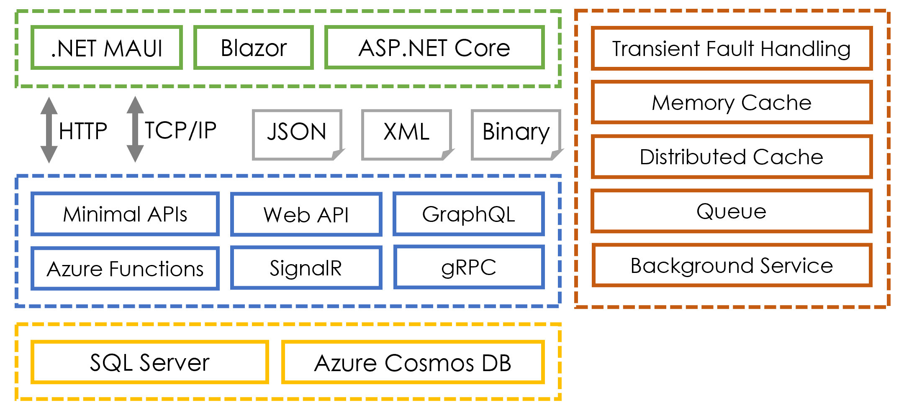
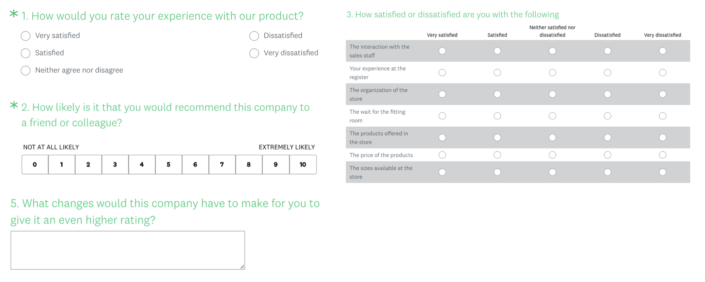
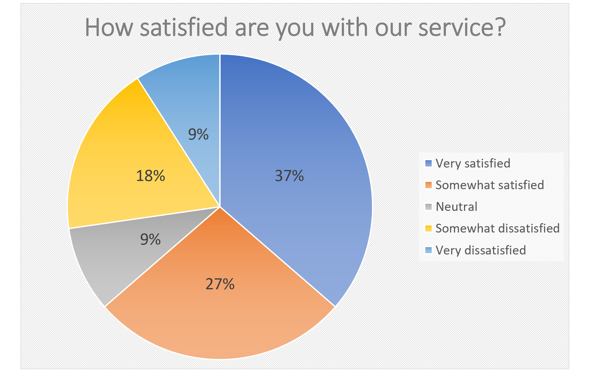

**Introducing the Survey Project Challenge**

This online-only section is about the **Survey Project Challenge**, an optional complete solution to a common set of problems that will give you a real-world set of projects to build.

This section will cover the following topics:
- [Technologies covered in this book](#technologies-covered-in-this-book)
- [Why a survey project?](#why-a-survey-project)
  - [What is the best way to learn?](#what-is-the-best-way-to-learn)
  - [Attributes of a good learning project](#attributes-of-a-good-learning-project)
  - [Alternative project ideas](#alternative-project-ideas)
  - [Features of survey and polling tools](#features-of-survey-and-polling-tools)
  - [Question types](#question-types)
  - [Polling and quizzes](#polling-and-quizzes)
  - [Analyzing the responses](#analyzing-the-responses)
- [What are the product requirements?](#what-are-the-product-requirements)
  - [Minimal requirements overview](#minimal-requirements-overview)
  - [Minimal website requirements](#minimal-website-requirements)
  - [Minimal question item types](#minimal-question-item-types)
  - [Minimal survey design requirements](#minimal-survey-design-requirements)
  - [Minimal data storage requirements](#minimal-data-storage-requirements)
  - [Minimal analysis app requirements](#minimal-analysis-app-requirements)
  - [Ideas for extended requirements](#ideas-for-extended-requirements)
  - [Extended website requirements](#extended-website-requirements)
  - [Extended question item types](#extended-question-item-types)
  - [Extended survey design requirements](#extended-survey-design-requirements)
  - [Extended data storage requirements](#extended-data-storage-requirements)
  - [Extended analysis app requirements](#extended-analysis-app-requirements)
- [Promote your abilities](#promote-your-abilities)
- [Summary](#summary)

# Technologies covered in this book

In this book, you have learned about many of the most important and popular technologies for building apps and services with .NET, as shown in *Figure 17.1A*:

*Figure 17.1A: Technologies for building apps and services with .NET*

The technologies can be divided into layers:
- **Presentation** (green, at the top left): This layer presents information and handles interactions with the user like editing and showing notifications.
- **Transport and data exchange format** (gray, second from the top): This layer transports data between other layers. There are two main factors that affect efficiency: the transport protocol, and the data exchange format. Text-based formats like JSON and XML are easier to debug since they are human-readable. Binary formats are more efficient for larger amounts of data. Older protocols like HTTP/1.1 are more interoperable but less efficient. Newer protocols like HTTP/2 are faster but less well-supported.
- **Services** (blue, third from the top): This layer implements core functionality like business logic, acts as an interaction layer to expose data that clients might not be able to directly talk to themselves, and enables users to switch between devices while working on a task, for example, from mobile to desktop to websites, while checking their email.
- **Cross-functional** (orange, right side): This section spans multiple layers and contains components that enable apps and services to handle common challenges like transient faults, smoothing peaks in workload, and improving overall performance, scalability, and reliability.
- **Data** (yellow, at the bottom): This layer stores and manages data. Data stores often have their own special protocols for communicating with them, like Tabular Data Stream (TDS) for SQL Server. More modern data stores like Azure Cosmos DB use more open protocols like HTTP.

Important decisions about which technology would best solve a specific development problem are tricky because they do not just involve the technology itself, like .NET MAUI, but also the technologies relating to it, like the transport protocol used to communicate with other layers of the solution and the format of data documents that are exchanged between layers.

# Why a survey project?

Before I explain the survey project challenge, let’s talk about the best way to learn any new skill or technology.

## What is the best way to learn?

The best way to learn how to build apps and services with .NET is to work on real projects that you would use yourself or that at least spark an interest in you.

If you are a student or a professional developer who has no choice over the projects or technologies that you implement, how can you work on a real project that needs the technologies you are interested in learning about?

In this online-only section, I will introduce my idea for how to achieve that goal.

## Attributes of a good learning project

To help us learn all the different technologies that .NET developers need to know these days, we need a project that:
- Genuinely needs a mix of technologies and skills.
- Is cool, fun, and practical, so it will stretch our skills both from an engineering perspective as well as creatively.
- Is as real as possible and we would use ourselves.
- Has already been implemented by others with public products that we can be inspired by, preferably with some open-source examples so we can even review code implementations, but if not, a product with screenshots of all their features so we can scope out a product requirements document (PRD).
> A PRD contains a listing of the features of a product to allow someone to understand what it should do. It does not say how it should do it. That would be defined in a functional specification that is more detailed.
- Has a small enough Minimal Viable Product (MVP) that we have an achievable short-term goal to aim for.
- Has a large enough potential that it stretches to something much more complex long-term.

When you’re struggling with a bug, you need to stay motivated. The best way to stay motivated is to work on a project that you will use yourself. Eat your own dog food, as they say.

## Alternative project ideas

A common suggestion for this type of project is to build your own Content Management System (CMS). This is a thriving market with everything from the “big boys” like Optimizely and Adobe to SaaS solutions like Squarespace, via open-source solutions like Piranha and Umbraco.

> You can learn more about CMS solutions at the following link: https://github.com/markjprice/apps-services-net8/blob/main/docs/cms.md.

## Features of survey and polling tools

Personally, I have used survey and polling software to gain insight into my students and readers. For example, the most popular survey product is probably SurveyMonkey, although there are dozens of alternatives, as shown in the following list:

- SurveyMonkey: https://www.surveymonkey.com/
- Google Forms: https://www.google.com/forms/about/
- Microsoft Forms: https://www.microsoft.com/en-us/microsoft-365/online-surveyspolls-quizzes
- Poll Everywhere: https://www.polleverywhere.com/
- TechRadar’s best list: https://www.techradar.com/best/best-survey-tools

Most survey tools have a free tier so you can try them out. For example, SurveyMonkey has a Basic plan that is free. Their best value paid plan, Advantage Annual, is £384/$453 per year for an individual,
or £99 per month if you want to stop paying at any time. For an individual with only occasional survey
and polling needs, that gets expensive fast!

Their free Basic plan has the following limitations:
- 10 questions per survey.
- 40 responses per survey.
- No response exports.
- Limited question types (no star ratings, no freeform rich text).

So, I am motivated to create my own survey solution and I have the skills to do it!

## Question types

There are dozens of question types, from multiple choice to scale selection via matrix and freeform
text, as shown in *Figure 17A.2*:

*Figure 19.2: Types of survey questions in SurveyMonkey*

Some of these question types should be easy enough to implement, like the plain text response or selecting one option from many. Others are likely to be harder to implement once you think about all the potential possibilities.

## Polling and quizzes

Survey tools have similar features to other tools like live polling and quiz builders. They all need some way to build the survey, poll, and quiz, some way to take it, and finally, ways to analyze the results.

I often deliver live training sessions and webinars. It is useful to ask the audience a bit about themselves, like where in the world they are, what their current experience is, and what they expect to get out of the session. The main difference between a survey and a live poll is the duration for which question items are available to answer. The main difference with a quiz is the concept of a correct answer and scoring at the end.

Quizzes also share a lot of similarities. The main difference is the breadth of question item types. You can imagine that a quiz builder for learning mathematics or physics could have some quite elaborate components with complex implements.

## Analyzing the responses

Another major feature of survey tools is the ability to analyze the results, using everything from basic charts to complex machine learning artificial intelligence algorithms to spot unusual patterns.

# What are the product requirements?

A PRD is the result of analyzing a business problem. It defines a set of suggested features that solve the problems that the software is supposed to address.

## Minimal requirements overview

An MVP for a survey tool would include:
- A website to take a survey anonymously.
- An app to view the survey results.
- Data storage for the survey question items.
- Data storage for the responses.
- Services to integrate the above functionality.

## Minimal website requirements

To take a survey, the solution should provide a public website where the first page of the survey will be hosted and to which a survey link can point. This is to make the surveys as accessible to as many people as possible. Every device has a web browser so a website will have the broadest reach. We can also easily share surveys using hyperlinks.

The website should respond to a request to take a survey identified by a unique value, as shown in the following link: https://www.survey.com/123456.

The website should allow anonymous visitors, present the question items to them, and record their responses. To keep it simple, there could be no restrictions on taking the survey multiple times. There 
would be no registering or authentication checks.

## Minimal question item types

The website should support the following question types:
- Single-line plain text.
- Multi-line plain text.
- Rating (1–10).
- Multiple choice (one selection). Shows radio buttons.

Each item type should allow a plain text question.

## Minimal survey design requirements

An interactive survey design tool would be a lot of work. For the MVP, we will limit it to a basic JSON editor. The structure of the JSON document will be defined for the minimal question item types, but a plain text editor with templates for each item type is the only option for creating and editing them.

## Minimal data storage requirements

How should a survey and its responses be stored? It needs to be simple yet flexible. A document-based data storage solution would be best. A relational database would require normalization, and therefore, unnecessary complexity and potential performance issues. A simple document database structure would include design decisions as shown in the following list:

- Each survey could be stored as a single document, with nested items.
- Each visitor who completes a survey could also be stored as a document.

Analyzing the results would benefit from duplicating some information from the individual responses, for example, so we could show a chart of how many respondents selected each radio button in a
multiple-choice item.

## Minimal analysis app requirements

The analysis app should show a list of all surveys and their status, for example, if they are active, if they are complete, how many have taken them, the details of their answers, and summaries of the results. Numeric results should appear as tabular data as well as charts, as shown in *Figure 17A.3*:

*Figure 17A.3: A chart of survey responses*

## Ideas for extended requirements

One of my favorite aspects of a survey tool is that there are many areas where you can choose to extend the minimal product:
- A website that a visitor can register with and track the surveys they have completed.
- Dozens of different question types.
- Dozens of ways to analyze the results.
- Multiple ways to store the questions and results, from a fully normalized database to document-based cloud storage.
- Multiple ways to process the results and provide a service layer above the data stores.

## Extended website requirements

A visitor should be able to register with the website and store basic profile information, like a contact email address, demographic details, and a list of the surveys that they have taken. This information should follow good practice in allowing the visitor to update and delete their data at any time.

## Extended question item types

The website could support the following additional question types:
- Multi-line rich text (either provide a toolbar or allow Markdown syntax).
- Multiple choice (one selection). Shows radio buttons or a drop-down list.
- Multiple choice (multiple selection). Shows checkboxes or a drop-down list of checkboxes.
- Rating (five stars with half values).
- Rating (customizable shape and maximum number of values). The choice to show as graphics or a slider.
-  Matrix of radio buttons.
- Clicking a position on an image.
- Ranking a list of items.

Each item type should allow a rich text question for each item and allow arbitrary rich text and images throughout a survey.

SurveyMonkey keeps the cool item types for the paid tiers, as shown in *Figure 17A.4*:

*Figure 17A.4: Upgrade SurveyMonkey to unlock most item types*

## Extended survey design requirements

The minimal product stores the surveys and their question items but does not provide an easy way to create or edit them. We could provide a website or an app to enable someone to register an account
and manage their own surveys and question items.

This will require authentication and authorization checks. The create and edit functionality could get quite complex because showing a question item is easier than providing an editing experience for one.

Either a website or app should provide a friendly survey creation and editing experience that closely matches what the survey taker would experience. In other words, a what-you-see-is-what-you-get (WYSIWYG) editing experience.

For a survey tool that will be sold commercially, the organizations will want to brand their surveys with logos, images, colors, and so on.

## Extended data storage requirements

Even with a minimal product, the data storage requirements need to be flexible enough to store multiple different item types, a flexible number of items per survey, and the responses when someone takes a survey.

The main extended addition might be storing pre-created analysis data to improve performance, especially in a NoSQL cloud data storage example where each survey response is stored as a separate
document.

## Extended analysis app requirements

If you have data science skills, then you could integrate the ML.NET libraries to add machine learning algorithms to process survey results to reveal interesting insights that humans might overlook.

> You can learn more about ML.NET at the following link: https://dotnet.microsoft.com/en-us/apps/machinelearning-ai/ml-dotnet.

# Promote your abilities

Pick one of the parts of the survey project to implement.

If you are more visually creative, then design and build a question item or a graphical analytics component. Even if you cannot build it yourself, you could sketch out your idea, and someone else might be inspired to implement it.

If you are more engineering-oriented, then perhaps optimizing the plumbing appeals to you more. You could define service requirements and then implement them using multiple technologies. Then you could create tests to compare the performance of each.

You can share ideas, discuss potential solutions, and get help from fellow readers and even me on the Discord channel for this book, found at the following link: https://packt.link/apps_and_services_dotnet8.

Publish your work in a public GitHub repository to share your achievement with the world. I am excited to see what my readers produce!

# Summary

In this online-only section, you learned about the survey project challenge. Hopefully, you were inspired to have a go at implementing one or more of its components, if not a full solution, and to share your hard work with the world.
