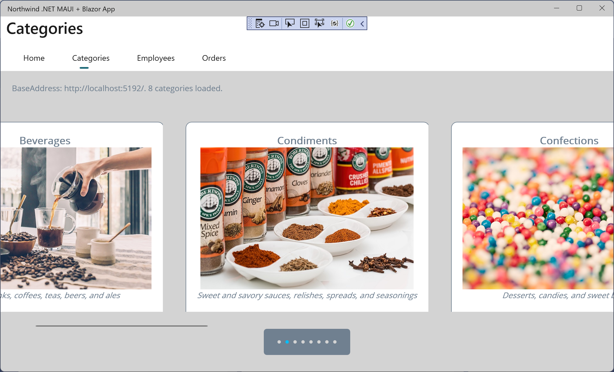

**Create a categories page with the carousel control**

In this online-only section, you will implement a web service to provide CRUD operations for categories in the Northwind database and then call the web service to display categories including photos in a rotating carousel.

- [Creating a minimal API web service for categories](#creating-a-minimal-api-web-service-for-categories)
- [Configuring the .NET MAUI app to allow unsecure connections](#configuring-the-net-maui-app-to-allow-unsecure-connections)
- [Implementing the Model-View-ViewModel pattern](#implementing-the-model-view-viewmodel-pattern)
- [Getting categories from the web service](#getting-categories-from-the-web-service)

# Creating a minimal API web service for categories

We will create a web service for working with categories in the Northwind database:

1.	Using your preferred code editor, add a web service project, as defined in the following list:
    - Project template: **ASP.NET Core Web API** / `webapi --use-minimal-apis`.
    - Workspace/solution file and folder: `Chapter18`.
    - Project file and folder: `Northwind.Maui.WebApi.Service`.
    - Authentication type: None.
    - Configure for HTTPS: Selected.
    - Enable Docker: Cleared.
    - Use controllers (uncheck to use minimal APIs): Cleared.
    - Enable OpenAPI support: Selected.
    - Do not use top-level statements: Cleared.

2.	Add a project reference to the Northwind database context project for SQL Server, as shown in the following markup:
```xml
<ItemGroup>
  <ProjectReference Include="..\..\Chapter03\Northwind.Common.DataContext.SqlServer\Northwind.Common.DataContext.SqlServer.csproj" />
</ItemGroup>
```

3.	At the command prompt or terminal, build the `Northwind.Maui.WebApi.Service` project to make sure the entity model class library projects outside the current solution are properly compiled, as shown in the following command: `dotnet build`.
4.	In the `Properties` folder, in `launchSettings.json`, for the `https` profile, modify the `applicationUrl` to use port `5181` for `https` and port `5182` for `http`, as shown highlighted in the following configuration:
```json
"applicationUrl": "https://localhost:5181;http://localhost:5182",
```

5.	In `launchSettings.json`, for the `http` profile, modify the `applicationUrl` to use port `5182` for `http`, as shown highlighted in the following configuration:
```json
"applicationUrl": "http://localhost:5182",
```

6.	In `Program.cs`, delete the statements about the weather service and replace them with statements to disable HTTPS redirection while developing and to configure minimal API endpoints for data operations on categories, as shown highlighted in the following code:
```cs
using Microsoft.AspNetCore.Mvc; // To use [FromServices].
using Northwind.EntityModels; // To use AddNorthwindContext method.

var builder = WebApplication.CreateBuilder(args);

// Add services to the container.
// Learn more about configuring Swagger/OpenAPI at https://aka.ms/aspnetcore/swashbuckle
builder.Services.AddEndpointsApiExplorer();
builder.Services.AddSwaggerGen();

builder.Services.AddNorthwindContext();

var app = builder.Build();

// Configure the HTTP request pipeline.
if (app.Environment.IsDevelopment())
{
  app.UseSwagger();
  app.UseSwaggerUI();
}
else
{
  app.UseHttpsRedirection();
}

app.MapGet("api/categories", (
  [FromServices] NorthwindContext db) => db.Categories)
  .WithName("GetCategories")
  .Produces<Category[]>(StatusCodes.Status200OK);

app.MapGet("api/categories/{id:int}", (
  [FromRoute] int id,
  [FromServices] NorthwindContext db) => 
    db.Categories.Where(category => category.CategoryId == id))
  .WithName("GetCategory")
  .Produces<Category[]>(StatusCodes.Status200OK);

app.MapPost("api/categories", async (
  [FromBody] Category category,
  [FromServices] NorthwindContext db) =>
{
  db.Categories.Add(category);
  await db.SaveChangesAsync();
  return Results.Created($"api/categories/{category.CategoryId}", category);
}).WithOpenApi()
  .Produces<Category>(StatusCodes.Status201Created);

app.MapPut("api/categories/{id:int}", async (
  [FromRoute] int id,
  [FromBody] Category category,
  [FromServices] NorthwindContext db) =>
{
  Category? foundCategory = await db.Categories.FindAsync(id);

  if (foundCategory is null) return Results.NotFound();

  foundCategory.CategoryName = category.CategoryName;
  foundCategory.Description = category.Description;
  foundCategory.Picture = category.Picture;

  await db.SaveChangesAsync();

  return Results.NoContent();
}).WithOpenApi()
  .Produces(StatusCodes.Status404NotFound)
  .Produces(StatusCodes.Status204NoContent);

app.MapDelete("api/categories/{id:int}", async (
  [FromRoute] int id,
  [FromServices] NorthwindContext db) =>
{
  if (await db.Categories.FindAsync(id) is Category category)
  {
    db.Categories.Remove(category);
    await db.SaveChangesAsync();
    return Results.NoContent();
  }
  return Results.NotFound();
}).WithOpenApi()
  .Produces(StatusCodes.Status404NotFound)
  .Produces(StatusCodes.Status204NoContent);

app.Run();
```
7.	Start the web service project and note the Swagger documentation.
8.	Click **GET /api/categories** to expand that section.
9.	Click the **Try it out** button, click the **Execute** button, and note that category entities are returned.
10.	Close the browser and shut down the web server.

# Configuring the .NET MAUI app to allow unsecure connections

Now you will configure the `Northwind.Maui.Blazor.Client` project to allow unsecure HTTP requests to the web service:

1.	In the `Northwind.Maui.Blazor.Client` project, in the `Platforms/iOS` folder, open the `Info.plist` file by right-clicking and opening it with the **XML (Text) Editor**.
2.	At the bottom of the dictionary, add a new key named `NSAppTransportSecurity` that is a dictionary, and in it, add a key named `NSAllowsArbitraryLoads` that has a value of `true`, as shown in the following partial markup:
```xml
<?xml version="1.0" encoding="UTF-8"?>
<!DOCTYPE plist PUBLIC "-//Apple//DTD PLIST 1.0//EN" 
          "http://www.apple.com/DTDs/PropertyList-1.0.dtd">
<plist version="1.0">
<dict>
  <key>LSRequiresIPhoneOS</key>
  <true/>
  ...
  <key>NSAppTransportSecurity</key>
  <dict>
    <key>NSAllowsArbitraryLoads</key>
    <true/>
  </dict>
</dict>
</plist>
```

3.	Save and close `Info.plist`.
4.	In the `Platforms/Android` folder, in the `Resources` folder, add a new folder named `xml`.
5.	In the `xml` folder, add a new XML file named `network_security_config.xml`, and add entries to enable cleartext when connecting over the virtual router's special IP address that maps out to localhost, as shown in the following markup:
```xml
<?xml version="1.0" encoding="utf-8" ?>
<network-security-config>
  <domain-config cleartextTrafficPermitted="true">
    <domain includeSubdomains="true">10.0.2.2</domain>
  </domain-config>
</network-security-config>
```

6.	In the `Android` folder, in `AndroidManifest.xml`, add an attribute to the `<application>` element to reference the new XML file, as shown in the following markup:
```xml
<?xml version="1.0" encoding="utf-8"?>
<manifest xmlns:android="http://schemas.android.com/apk/res/android">
  <application android:allowBackup="true" 
               android:icon="@mipmap/appicon" 
               android:networkSecurityConfig="@xml/network_security_config" 
               android:roundIcon="@mipmap/appicon_round" 
               android:supportsRtl="true">
  </application>
  <uses-permission android:name="android.permission.ACCESS_NETWORK_STATE" />
  <uses-permission android:name="android.permission.INTERNET" />
</manifest>
```

7.	Save all the changes.

# Implementing the Model-View-ViewModel pattern

Now, let's define a model and a view model for working with categories:

1.	In the `Northwind.Maui.Blazor.Client` project file, add package references for the .NET MAUI Community Toolkit and for the MVVM Community Toolkit, as shown in the following markup:
```xml
<PackageReference Include="CommunityToolkit.Maui" Version="5.2.0" />
<PackageReference Include="CommunityToolkit.Mvvm" Version="8.2.0" />
```

2.	Build the project to restore packages.

> Note that you will see a warning because the .NET MAUI Community Toolkit runs a code analyzer that checks to see if you have called the extension method to use the toolkit. You will do that in the next step.

3.	In `MauiProgram.cs`, add a call to an extension method to enable the .NET MAUI Community Toolkit, as shown highlighted in the following code:
```cs
var builder = MauiApp.CreateBuilder();
builder
  .UseMauiApp<App>()
  .UseMauiCommunityToolkit()
  .ConfigureFonts(fonts =>
```

4.	In the `Views/Categories` folder, add a new class named `Category.cs`. Modify it to use the MVVM Community Toolkit to implement an observable category model that matches the `Category` entity models defined in the SQL Server EF Core models, but with an extra property to generate a path to a picture of each category as an alternative to the bytes stored in the database, as shown in the following code:
```cs
// To use ObservableObject, [ObservableProperty].
using CommunityToolkit.Mvvm.ComponentModel;

namespace Northwind.Maui.Blazor.Client.Views.Categories;

internal partial class Category : ObservableObject
{
  // The field names must be private and camelCase or _camelCase because the 
  // source-generated public property names will be TitleCase.

  [ObservableProperty]
  [NotifyPropertyChangedFor(nameof(PicturePath))]
  private int categoryId;

  [ObservableProperty]
  private string categoryName;

  [ObservableProperty]
  private string description;

  [ObservableProperty]
  private byte[] picture;

  [ObservableProperty]
  private string picturePath;
}
```

> The `PicturePath` property will use the pattern `categoryX_small.jpeg`, where `X` is the category ID. Therefore, if the category ID changes, we must inform any data bindings that anything bound to the `PicturePath` will also need to be updated. We do this by decorating the `categoryId` field with `[NotifyPropertyChangedFor]`.

5.	In the `Views/Categories` folder, add a new class named `CategoriesViewModel.cs`, and modify it to inherit from `ObservableCollection<T>`, have some commands, and get the categories from the web service, as shown in the following code:
```cs
using CommunityToolkit.Mvvm.Input; // To use [RelayCommand].
using System.Collections.ObjectModel; // To use ObservableCollection<T>.
using System.Net.Http.Headers; // To use MediaTypeWithQualityHeaderValue.
using System.Net.Http.Json; // To use ReadFromJsonAsync<T>.

namespace Northwind.Maui.Blazor.Client.Views.Categories;

internal partial class CategoriesViewModel : ObservableCollection<Category>
{
  // These properties do not need to support two-way binding
  // because they are set programmatically to show to user.

  public string InfoMessage { get; set; } = string.Empty;
  public string ErrorMessage { get; set; } = string.Empty;
  public bool ErrorMessageVisible { get; set; }

  public CategoriesViewModel()
  {
    try
    {
      string domain = DeviceInfo.Platform 
        == DevicePlatform.Android ? "10.0.2.2" : "localhost";

      HttpClient client = new()
        { BaseAddress = new Uri($"http://{domain}:5182") };

      InfoMessage = $"BaseAddress: {client.BaseAddress}. ";

      client.DefaultRequestHeaders.Accept.Add(
        new MediaTypeWithQualityHeaderValue("application/json"));

      HttpResponseMessage response = client
        .GetAsync("api/categories").Result;

      response.EnsureSuccessStatusCode();

      IEnumerable<Category> categories =
        response.Content.ReadFromJsonAsync
        <IEnumerable<Category>>().Result;

      foreach (Category category in categories)
      {
        category.Picture = category.Picture.AsSpan(
          offset, category.Picture.Length - offset).ToArray();

        category.PicturePath = $"category{category.CategoryId}_small.jpeg";

        Add(category);
      }

      InfoMessage += $"{Count} categories loaded.";
    }
    catch (Exception ex)
    {
      ErrorMessage = ex.Message;
      ErrorMessageVisible = true;
    }
  }

  [RelayCommand]
  private void AddCategoryToFavorites()
  {
    Console.WriteLine("Add category to favorites");
  }

  [RelayCommand]
  private void DeleteCategory()
  {
    Console.WriteLine("Delete category");
  }
}
```

# Getting categories from the web service

Now, we can modify the categories page to show the categories in a carousel:

1.	In `App.xaml`, modify the resources for the `PageBackgroundColor` and `PrimaryTextColor`, and the `BackgroundColor` for buttons, as shown in the following markup:
```xml
<?xml version="1.0" encoding="UTF-8" ?>
<Application xmlns="http://schemas.microsoft.com/dotnet/2021/maui"
             xmlns:x="http://schemas.microsoft.com/winfx/2009/xaml"
             xmlns:local="clr-namespace:Northwind.Maui.Blazor.Client"
             x:Class="Northwind.Maui.Blazor.Client.App">
  <Application.Resources>
    <ResourceDictionary>

      <Color x:Key="PageBackgroundColor">LightGray</Color>
      <Color x:Key="PrimaryTextColor">SlateGray</Color>

      <Style TargetType="Label">
        <Setter Property="TextColor" 
                Value="{DynamicResource PrimaryTextColor}" />
        <Setter Property="FontFamily" Value="OpenSansRegular" />
      </Style>

      <Style TargetType="Button">
        <Setter Property="TextColor" 
                Value="{DynamicResource PrimaryTextColor}" />
        <Setter Property="FontFamily" Value="OpenSansRegular" />
        <Setter Property="BackgroundColor" 
                Value="{DynamicResource PageBackgroundColor}" />
        <Setter Property="Padding" Value="14,10" />
      </Style>

    </ResourceDictionary>
  </Application.Resources>
</Application>
```

2.	In `CategoriesPage.xaml`, import namespaces for working with types defined at the project level using the prefix local and types in the `Categories` folder using the prefix `categories`, then create an instance of the categories view model for the binding context of the content page, and then in the vertical stack layout, add a label to show information about the web service endpoint, a label to show any error message, and a carousel with indicator lights, as shown highlighted in the following markup:
```xml
<?xml version="1.0" encoding="utf-8" ?>
<ContentPage xmlns="http://schemas.microsoft.com/dotnet/2021/maui"
             xmlns:x="http://schemas.microsoft.com/winfx/2009/xaml"
             x:Class="Northwind.Maui.Blazor.Client.Views.CategoriesPage"
             xmlns:local="clr-namespace:Northwind.Maui.Blazor.Client"
             xmlns:categories=
               "clr-namespace:Northwind.Maui.Blazor.Client.Views.Categories"
             xmlns:toolkit=
               "http://schemas.microsoft.com/dotnet/2022/maui/toolkit"
             Title="Categories"
             BackgroundColor="{StaticResource PageBackgroundColor}">

  <ContentPage.BindingContext>
    <categories:CategoriesViewModel />
  </ContentPage.BindingContext>

  <VerticalStackLayout>

    <HorizontalStackLayout Spacing="20" Padding="20">
      <Label Text="{Binding InfoMessage}" />
      <Label Text="{Binding ErrorMessage}" TextColor="Red"
             IsVisible="{Binding ErrorMessageVisible}" />
    </HorizontalStackLayout>

    <CarouselView x:Name="carouselView" 
                  ItemsSource="{Binding .}" 
                  IndicatorView="indicatorView"
                  PeekAreaInsets="10"
                  Loop="False">

      <CarouselView.EmptyView>
        <ContentView>
          <VerticalStackLayout HorizontalOptions="Center"
                               VerticalOptions="Center">
            <Label Text="No results matched your filter."
                   Margin="10,25,10,10"
                   FontAttributes="Bold" 
                   FontSize="18"
                   HorizontalOptions="Fill"
                   HorizontalTextAlignment="Center" />
          </VerticalStackLayout>
        </ContentView>
      </CarouselView.EmptyView>

      <CarouselView.ItemTemplate>
        <DataTemplate>
          <VerticalStackLayout>
            <Frame HasShadow="True"
                   BorderColor="{StaticResource PrimaryTextColor}"
                   CornerRadius="10"
                   Margin="20"
                   HeightRequest="450"
                   HorizontalOptions="Center"
                   VerticalOptions="Center">

              <VerticalStackLayout>
                <Label Text="{Binding CategoryName}"
                       FontAttributes="Bold"
                       FontSize="18"
                       HorizontalOptions="Center"
                       VerticalOptions="Center" />
                <Image Source="{Binding PicturePath}"
                       Aspect="AspectFill"
                       HeightRequest="250"
                       WidthRequest="375"
                       HorizontalOptions="Center" />
                <Label Text="{Binding Description}"
                       FontAttributes="Italic"
                       HorizontalOptions="Center"
                       MaxLines="5"
                       LineBreakMode="TailTruncation" />
              </VerticalStackLayout>

            </Frame>
          </VerticalStackLayout>
        </DataTemplate>
      </CarouselView.ItemTemplate>
    </CarouselView>

    <Frame BackgroundColor="{StaticResource PrimaryTextColor}" 
           CornerRadius="5" HorizontalOptions="Center">
      <IndicatorView x:Name="indicatorView"
                     IndicatorColor="{StaticResource PageBackgroundColor}"
                     SelectedIndicatorColor="DeepSkyBlue"
                     HorizontalOptions="Center" />
    </Frame>

  </VerticalStackLayout>

</ContentPage>
```

3.	Start the `Northwind.Maui.WebApi.Service` project using the `https` profile, and note the endpoints it is listening on, as shown highlighted in the following output:
```
info: Microsoft.Hosting.Lifetime[14]
      Now listening on: https://localhost:5181
info: Microsoft.Hosting.Lifetime[14]
      Now listening on: http://localhost:5182
info: Microsoft.Hosting.Lifetime[0]
      Application started. Press Ctrl+C to shut down.
info: Microsoft.Hosting.Lifetime[0]
      Hosting environment: Development
info: Microsoft.Hosting.Lifetime[0]
      Content root path: C:\apps-services-net8\Chapter18\Northwind.Maui.WebApi.Service
```

4.	Run the `Northwind.Maui.Blazor.Client` project using the Android emulator, navigate to the `Categories page`, and note that eight categories are loaded from the web service and displayed in the carousel, with indicator lights at the bottom of the page view, as shown in *Figure 18A.1*:


*Figure 18A.1: Categories in the carousel on Android*

5.	Note that the user can swipe left and right to flip between categories or click the dots in the indicator view to quickly jump to the matching category.
6.	Close the Android emulator.
7.	Run the Northwind.Maui.Blazor.Client project using the Windows machine, navigate to the Categories page, and note that eight categories are loaded from the web service and displayed in the carousel, with indicator lights at the bottom of the page view, as shown in *Figure 18A.2*:


*Figure 18A.2: Categories in the carousel on Windows*

8.	Note that the user can use the horizontal scrollbar at the bottom to scroll between categories or click the dots in the indicator view to quickly jump to the matching category.
9.	Close the Windows app.
