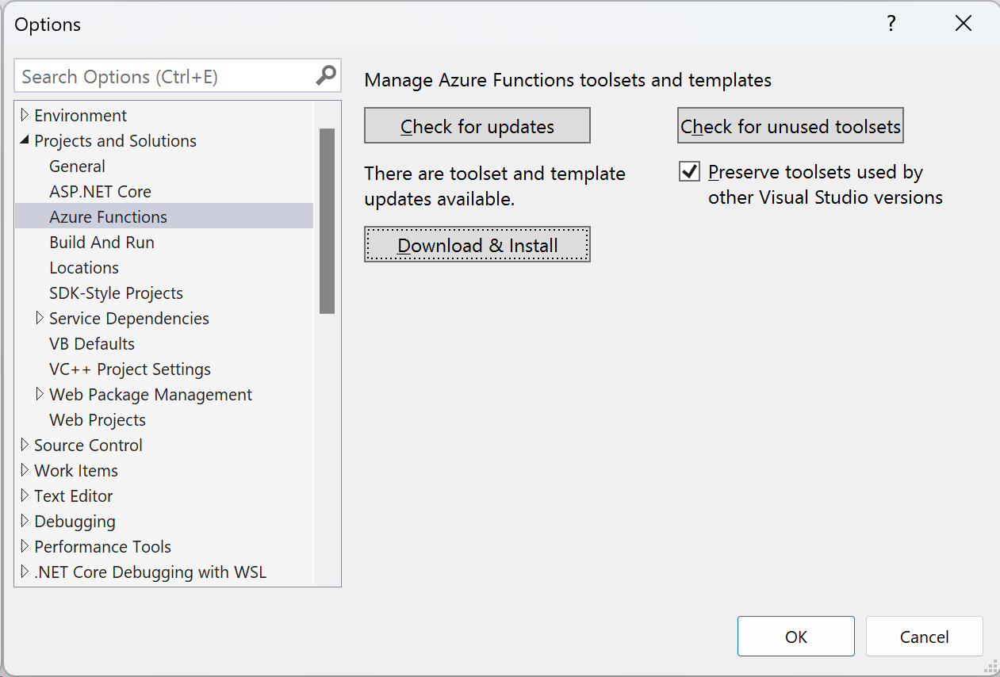

**Improvements** (14 items)

If you have suggestions for improvements, then please [raise an issue in this repository](https://github.com/markjprice/apps-services-net8/issues) or email me at markjprice (at) gmail.com.

- [Page 15 - Using Visual Studio Code for cross-platform development](#page-15---using-visual-studio-code-for-cross-platform-development)
- [Page 48 - T-SQL data types](#page-48---t-sql-data-types)
- [Page 169 - Nested and child tasks](#page-169---nested-and-child-tasks)
- [Page 178 - Starting tasks](#page-178---starting-tasks)
- [Page 235 - Making fluent assertions in unit testing](#page-235---making-fluent-assertions-in-unit-testing)
- [Page 245 - Creating class libraries to generate PDF documents](#page-245---creating-class-libraries-to-generate-pdf-documents)
- [Page 249 - Creating a console app to generate PDF documents](#page-249---creating-a-console-app-to-generate-pdf-documents)
- [Page 258 - Formatting date and time values](#page-258---formatting-date-and-time-values)
- [Page 312 - Setting up an ASP.NET Core Web API project](#page-312---setting-up-an-aspnet-core-web-api-project)
- [Page 318 - Testing web services using Swagger](#page-318---testing-web-services-using-swagger)
- [Page 395 - Building an MVC project to call the faulty web service](#page-395---building-an-mvc-project-to-call-the-faulty-web-service)
- [Page 445 - Installing Azure Functions Core Tools](#page-445---installing-azure-functions-core-tools)
- [Page 460 - Implementing a function that works with queues and BLOBs](#page-460---implementing-a-function-that-works-with-queues-and-blobs)
- [Page 648 - Exploring the Anchor Tag Helper](#page-648---exploring-the-anchor-tag-helper)

# Page 15 - Using Visual Studio Code for cross-platform development

> Thanks to [Emre Duman](https://github.com/Emopusta) who raised this issue on [June 27, 2024](https://github.com/markjprice/apps-services-net8/issues/20).

I provided a link to the Stack Overflow 2023 survey but a more direct link to the chart about Visual Studio Code being the preferred IDE would be: https://survey.stackoverflow.co/2023/#most-popular-technologies-new-collab-tools-prof

# Page 48 - T-SQL data types

> Thanks to `Obs` in the Discord channel for asking a question that prompted this improvement.

**Obs**: "While defining primary keys for EF Core entities, should I use `Id` or `<type name>Id`? `Id` seems easier cause I can just use polymorphism and only define it in the base entity all entities inherit from."

**Me**: Luckily the EF Core convention for auto-detecting keys looks for both styles of naming the primary key column so you can pick whichever you prefer. Keep in mind that not all tables will have the same data type for the primary key so you should not assume that all entities can inherit from a single base type. For example, in the Northwind database that I used in my books, the `Customers` table's `CustomerID` column is a five-character string. Most other tables use an auto-incrementing 32-bit integer. Modern databases often use GUIDs. Note that the Northwind database uses the naming convention `<table_name>ID`. This is to make it extra clear when defining relationships. If all primary keys are just named Id then it is more likely that a mistake could be made. So personally I prefer the naming convention `<entity_name>Id`. But you can clarify by specifying the table name like `Customers.Id` so I don't get fanatical about the choice.

**Obs**: "When starting from scratch, is it advised to use a `Guid` now instead of `int` Primary Key? (and why)"

**Me**: When choosing the primary key data type for a SQL relational database, the decision often depends on your application's requirements, scalability considerations, and the way you intend to use the data.

`INT` typically uses 4 bytes (32-bit) or 8 bytes (`BIGINT`, 64-bit), making it space-efficient. Numeric comparisons and indexing are faster than strings or GUIDs. Database operations (joins, lookups, and sorting) are efficient due to the compact size. Sequential numbers are easy for humans to understand and debug. But limited range (e.g., a signed `INT` maxes out at ~2.1 billion). Large-scale applications might outgrow this limit, though `BIGINT` can mitigate this. And if your database needs to support distributed systems (e.g., microservices or sharded databases), generating unique integers across systems can be tricky.

`GUID`s are 128-bit values designed to be unique across space and time, which is useful in distributed systems or multi-server environments. They eliminate the risk of collisions when merging data from different systems. `GUID`s can be generated by the application without needing a round trip to the database. Suitable for scenarios where primary key generation happens offline or on the client side. No practical limit on how many GUIDs you can generate. But a `GUID` is 16 bytes (128 bits), which is four times larger than an `INT`. This increases storage requirements and can slow down indexing and lookups, so comparisons and indexing are slower due to the larger size. GUIDs, particularly random ones, can lead to fragmentation in clustered indexes, degrading performance. GUIDs are long and cryptic (e.g., `9A6E6F15-4F99-4C94-89FB-30DB0D3F39AB`), making debugging more challenging.

**Key Considerations**
1. *Application Scale and Usage*
    - For small or medium-scale applications with a single database, `INT` (or `BIGINT`) is often sufficient.
    - For distributed or multi-database systems, `GUID` may be necessary to ensure global uniqueness.
2. *Performance, Storage and Indexing*
    - If performance is critical, avoid `GUID` as they can bloat indexes and slow down queries.
    - If the table is large or frequently queried, the smaller storage footprint of `INT` helps keep indexes compact and fast.

**Recommendations**
Prefer `INT` for most applications due to its simplicity, performance, and compactness. Use `BIGINT` if scalability beyond 2 billion rows is a concern.

Consider `GUID` if:
- You need global uniqueness across distributed systems.
- You anticipate frequent data merges from multiple systems.

Each choice has its place, and the "best" option ultimately depends on your specific use case and priorities.

# Page 169 - Nested and child tasks

> Thanks to Amer Cejudo for emailing about this item.

In this section about making one task the child of a parent task, I only showed output for one of two possible results, and had two notes to explain the other possible outputs. In the next edition, I will show both possible outputs before and after applying the `AttachedToParent` option.

In Step 3, you run the code and review the result, as shown in the following output:
```
Outer method starting...
Inner method starting...
Outer method finished.
Console app is stopping.
```

As the note at the top of page 170 says, you might not see any output from the `InnerMethod` at all, but I do not show that output. In the next edition, I will include it, as shown in the following output:
```
Outer method starting...
Outer method finished.
Console app is stopping.
```

In Step 4, you add the `AttachedToParent` option. 

In Step 5, you review the result, and the `OuterMethod` could start *and finish* before the `InnerMethod` starts but I do not show this possible output. I only show the scenario where both methods start before the methods finish, as shown in the following output:
```
Outer method starting...
Inner method starting...
Outer method finished.
Inner method finished.
Console app is stopping.
```
The addition of the `AttachedToParent` option means that the `InnerMethod` is guaranteed to both start and end before the console app ends. But it does not guarantee the order in which the methods finish. The `OuterMethod` could finish before the `InnerMethod` starts. Although I had a note about this after my output I did not show the actual output. In the next edition I will include it, as shown in the following output:
```
Outer method starting...
Outer method finished.
Inner method starting...
Inner method finished.
Console app is stopping.
```

# Page 178 - Starting tasks

> Thanks to `thebatman8150` in the book's Discord channel for asking a question that prompted this improvement.

In Step 2, I show output of the three methods in random order because there is nothing to make the main thread wait for each method to finish before starting the next. But that output is just one example of many that the reader could see. In the next edition, I will add a note to warn the reader that their output is extremely unlikely to look the same as the book. In particular, I will point out the order of the method outputs: A, C, B.

# Page 235 - Making fluent assertions in unit testing

In this section, I show how to use the `FluentAssertions` package. At the time of publishing, the latest version of this package was `6.12.0`. 

Since version `8.0.0`, released on January 14, 2025, there has been a license change, as described at the following links: https://fluentassertions.com/releases/#800 and https://github.com/fluentassertions/fluentassertions/pull/2943.

Comments from the owner `dennisdoomen`: "v7 will remain free indefinitely and will still receive critical fixes. v8 will only require a license when you use it in non-commercial projects." (https://github.com/fluentassertions/fluentassertions/pull/2943#issuecomment-2590187813 and https://github.com/fluentassertions/fluentassertions/pull/2943#issuecomment-2590286302)

In the next edition, I will recommend the use of v7.1 or later: https://www.nuget.org/packages/FluentAssertions/7.1.0

Alternatively, there is a v7-forked repo named `AwesomeAssertions`: https://www.nuget.org/packages/AwesomeAssertions/7.0.0. You should be able to replace the package reference and everything will continue to work.

# Page 245 - Creating class libraries to generate PDF documents

In Step 6, I wrote to "add a package reference for QuestPDF", as shown in the following markup:
```xml
<ItemGroup>
  <!-- The newest version with an MIT license. -->
  <PackageReference Include="QuestPDF" Version="2022.12.6" />
</ItemGroup>
```

In the next edition, I will give more examples, as shown in the following markup:
```xml
<ItemGroup>
  <!-- The newest version with an MIT license as of February 2024. -->
  <PackageReference Include="QuestPDF" Version="2022.12.15" />

  <!-- To auto-upgrade to the newest version with an MIT license. -->
  <!--<PackageReference Include="QuestPDF" Version="2022.12-*" />-->
    
  <!-- A 2023.* or later version requires setting the Settings.License property. -->
  <!--<PackageReference Include="QuestPDF" Version="2023.12.5" />-->
</ItemGroup>
```

# Page 249 - Creating a console app to generate PDF documents

In Step 6, I wrote statements to generate a PDF file, but one of those statements will not work with the old MIT licensed package that we referenced earlier. 

In the next edition, I will comment out the license type statements and add more comments to explain, as shown in the following code:
```cs
using GeneratingPdf.Document; // To use CatalogDocument.
using GeneratingPdf.Models; // To use Catalog, Category.
using QuestPDF.Fluent; // To use the GeneratePdf extension method.
// using QuestPDF.Infrastructure; // To use LicenseType.

// For evaluation purposes, feel free to use the QuestPDF Community 
// License in a non-production environment.
// Setting the license type is only required or possible with
// version 2023.4.0 or later.
// QuestPDF.Settings.License = LicenseType.Community;

string filename = "catalog.pdf";
```

# Page 258 - Formatting date and time values

In the next edition, I will add an extra row to *Table 7.3: Standard format code for date and time values* for the format code `m` or `M`. This uses a format that only shows day and month name, for example, **15 June**. I will also add a note that this format code only works when it is the only code. Combined with other codes it means minute (`m`) or month (`M`).

# Page 312 - Setting up an ASP.NET Core Web API project

In Step 3, I tell the reader to "Add a project reference to the Northwind database context project for SQL Server that you created in *Chapter 3, Building Entity Models for SQL Server Using EF Core*."

In Step 5, I tell the reader to compile the project at the command line using `dotnet build`, but some readers do not follow this instruction, and instead use the **Build** menu in Visual Studio. When I told the reader to do the same thing in Chapter 4 on page 146, I also added a warning, as shown in the following note:

> **Warning!** If you are using Visual Studio 2022 and you reference a project outside of the current solution, then using the Build menu gives the following error:
> `NU1105 Unable to find project information for 'C:\apps-servicesnet8\Chapter03\Northwind.Common.DataContext.SqlServer\Northwind.Common.DataContext.SqlServer.csproj'. If you are using Visual Studio, this may be because the project is unloaded or not part of the current solution.`
>You must enter a `dotnet build` command at the command prompt or terminal. In **Solution Explorer**, you can right-click the project and select **Open in Terminal**.

In the next edition, I will repeat this warning on page 312 after step 5 for those readers who have forgotten why they MUST use `dotnet build`.

# Page 318 - Testing web services using Swagger

The ASP.NET Core team has decided to remove the dependency on the Swashbuckle package (Swagger) in .NET 9, as described in the following link:
https://github.com/dotnet/aspnetcore/issues/54599

In the next edition, I will move the sections about Swagger online to the GitHub repository, add the extra step to show how to manually add a package reference and configure it manually, and add a note to explain why the ASP.NET Core team removed it. 

If the team adds their own equivalent testing UI then I will explain how to use it. But it looks like they will only add OpenAPI document generation support: "We will focus on the fundamental scenario of generating the OpenAPI document in JSON format in the .NET 9 timeframe and have already begun work."

Other references to Swagger will also be removed, for example, on pages 10, 313, 314, 321, 322, 325, 373, 377, 380.

# Page 395 - Building an MVC project to call the faulty web service

In Step 11, you implement the `Products` action method. After getting the response from the web service, you check if the status code is a success code, and if not then you store an error message for display in the view, as shown in the following code:
```cs
if (response.IsSuccessStatusCode)
{
  model.Products = await response.Content
    .ReadFromJsonAsync<IEnumerable<Product>>();
}
else
{
  model.Products = Enumerable.Empty<Product>();

  string content = await response.Content.ReadAsStringAsync();

  // Use the range operator .. to start from zero and
  // go to the first carriage return.
  string exceptionMessage = content[..content.IndexOf("\r")];
  model.ErrorMessage = string.Format("{0}: {1}:",
    response.ReasonPhrase, exceptionMessage);
}
```

The preceding code assumes that the content of the response contains a carriage return `\r` which will not always be the case. In the next edition, I will add a check to prevent an exception from occurring when there is no carriage return in the content of the response body, as shown in the following code:
```cs
// Use the range operator .. to start from zero and
// go to the first carriage return.
int posOfReturn = content.IndexOf("\r");
string exceptionMessage = posOfReturn == -1 ? content : content[..posOfReturn];
model.ErrorMessage = string.Format("{0}: {1}:",
  response.ReasonPhrase, exceptionMessage);
```

# Page 445 - Installing Azure Functions Core Tools

> Thanks to [Phil Edmunds](https://github.com/Pip1987) who raised this issue and provided a solution on [February 19, 2024](https://github.com/markjprice/apps-services-net8/issues/9).

In a note, I wrote, "Azure Functions Core Tools is included in the Azure development workload of Visual
Studio 2022, so you might already have it installed."

But you might not see .NET 8 shown as an option when creating an Azure Function if the tool is not up-to-date.

In the next edition, I will add additional instructions, as follows:

1. In Visual Studio, navigate to **Tools** | **Options**.
2. In the **Options** dialog box, navigate to **Project and Solutions** | **Azure Functions**. 
3. In the Manage Azure Functions toolsets and templates section, click the **Check for updates** button.
4. If an update is found then click the **Download & Install** button, as shown in *Figure 1*:


*Figure 1: Checking for tool updates for Azure Functions*

5. Click **OK**.

# Page 460 - Implementing a function that works with queues and BLOBs

> Thanks to [Jim Campbell](https://github.com/jimcbell) who raised this issue and provided solutions on [December 24, 2023](https://github.com/markjprice/apps-services-net7/issues/24).

In Step 9, I tell the reader to modify the statements in the `CheckGeneratorFunction.cs` class file. There is an issue if running on Mac or Linux because I hardcoded the path to the fonts with the Windows path separator, as shown in the following code:
```cs
FontFamily family = collection.Add(
  @"fonts\Caveat\static\Caveat-Regular.ttf");
```

I should have used cross-platform technique to build the path, as shown in the following code:
```cs
string pathToFont = System.IO.Path.Combine(
  "fonts", "Caveat", "static", "Caveat-Regular.ttf");

FontFamily family = collection.Add(pathToFont);
```

And to build the paths to the local folder to write the blob to, as shown in the following code:
```cs
if (System.Environment.GetEnvironmentVariable("IS_LOCAL") == "true")
{
  // Create blob in the local filesystem.
  string folder = System.IO.Path.Combine(
    System.Environment.CurrentDirectory, "blobs");

  if (!Directory.Exists(folder))
  {
    Directory.CreateDirectory(folder);
  }

  log.LogInformation($"Blobs folder: {folder}");

  string blobPath = System.IO.Path.Combine(folder,blobName);

  await image.SaveAsPngAsync(blobPath);
}
```

# Page 648 - Exploring the Anchor Tag Helper

> Thanks to [DocVD](https://github.com/DocVD) who raised this issue on [June 15, 2024](https://github.com/markjprice/apps-services-net8/issues/18).

In Step 13, I wrote, "In the `Views/Home` folder, add an empty Razor view named `Shipper.cshtml`."

In the next edition, I will add a warning box to remind readers that you must add a Razor view, not a Razor Page, and that on page 622 I show a table of the different Razor types to explain.
